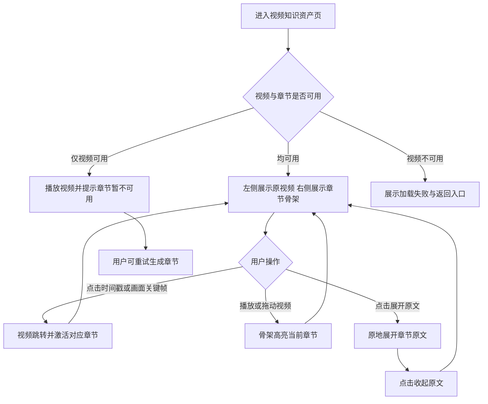

# 产品需求文档：SnapNote 视频知识资产页 - V3.0

> PRD 编号：PRD-001  
> 状态：已确认，进入实现  
> 日期：2026-08-14  
> 适用端：Web，桌面端优先  
> 核心形态：左侧原视频 + 右侧联动章节骨架

## 1. 综述 (Overview)

### 1.1 项目背景与核心问题

SnapNote 将视频转化为可快速定位和核验的知识资产。用户需要的不是另一份覆盖原视频的长篇 AI 笔记，而是在保留原视频主视觉的同时，快速了解视频讲了什么，并能回到准确时间与原话确认上下文。

本版本将右侧骨架收敛为章节级导航。骨架只包含四类内容：

1. 时间戳；
2. 画面关键帧；
3. 章节概要；
4. 点击后展开的章节原文。

本文统一使用“画面关键帧”。它可以来自 PPT、图表、Demo、网页、代码、白板或人物讲解等任意视频画面，不以特定内容载体限定名称。

### 1.2 产品目标

- 原视频始终作为页面主内容和事实来源。
- 用户进入页面后，可通过章节概要快速理解视频结构。
- 用户可通过时间戳或画面关键帧准确跳转到对应视频位置。
- 用户可按需展开原文，核验 AI 生成的章节概要。
- 视频播放时，右侧自动提示当前章节，形成双向联动。

### 1.3 非目标

首版不包含：知识节点、节点类型、进度条 Marker、关键知识点、复习问题、OCR 文本、摘要复制、骨架搜索、全文独立转写页、章节编辑、多关键帧画廊、评论协作和跨视频问答。

### 1.4 核心业务流程 / 用户旅程地图

1. **阶段一：进入资产** - 用户打开已处理完成的视频资产，首先看到左侧大视频与右侧章节骨架。
2. **阶段二：浏览结构** - 用户通过时间戳、画面关键帧和章节概要快速扫读视频内容。
3. **阶段三：定位播放** - 用户点击时间戳或画面关键帧跳转视频；视频播放同时更新当前章节。
4. **阶段四：核验原文** - 用户点击“展开原文”在当前章节内查看对应转写，完成核验后收起。

### 1.5 用户操作流



## 2. 页面信息架构与布局

### 2.1 信息架构

```text
视频知识资产页
├── 顶部信息栏
│   ├── 返回处理中心
│   ├── 视频标题 / 时长 / 生成状态
│   └── 重新生成 / 导出
└── 双栏工作区
    ├── 左侧：原视频区
    │   ├── 16:9 原视频播放器
    │   └── 浏览器原生播放控制
    └── 右侧：章节骨架
        ├── 骨架标题 / 章节数量
        └── 章节列表
            └── 时间戳 + 画面关键帧 + 章节概要 + 原文展开/收起
```

### 2.2 桌面端布局

- 页面内容区采用约 `64% : 36%` 双栏比例。
- 左栏最小宽度 640 px，右栏最小宽度 360 px。
- 左侧视频区在滚动时保持可见；右侧章节骨架独立纵向滚动。
- 原视频保持 16:9，避免被章节内容压缩为小播放器。
- 视口宽度低于 1024 px 时改为上下布局，视频在上、章节骨架在下。

### 2.3 页面布局线框图 (ASCII Wireframe)

```text
+------------------------------------------------------------------------------------------------+
| ← 返回处理中心     视频标题                         已完成       [重新生成] [导出 Markdown] |
+---------------------------------------------------------------+--------------------------------+
|                                                               |  章节骨架                 4 章 |
|                                                               +--------------------------------+
|                                                               |  ● 00:18                      |
|                        原视频播放器                           |  +--------------------------+  |
|                           16 : 9                              |  |      画面关键帧          |  |
|                                                               |  +--------------------------+  |
|                                                               |  注意力机制从固定窗口转向…    |
|                                                               |  [展开原文⌄]                  |
|                                                               +--------------------------------+
|                                                               |  ○ 01:33                      |
|                                                               |  +--------------------------+  |
|                                                               |  |      画面关键帧          |  |
|                                                               |  +--------------------------+  |
|                                                               |  Query、Key、Value 分别承担…  |
|                                                               |  [展开原文⌄]                  |
+---------------------------------------------------------------+--------------------------------+
```

## 3. 用户故事详述 (User Stories)

### 阶段一：进入并浏览视频资产

---

#### **US-01：作为视频学习者，我希望同时看到原视频和章节骨架，以便快速理解视频全貌。**

* **价值陈述 (Value Statement)**：
  * **作为** 需要复习课程、会议或教程的用户
  * **我希望** 原视频保持足够大，同时从右侧扫读章节内容
  * **以便于** 不完整观看视频也能判断内容结构和价值
* **业务规则与逻辑 (Business Logic)**：
  1. **前置条件**：视频任务处理完成，至少原视频地址可用。
  2. **操作流程 (Happy Path)**：页面加载后，左侧展示原视频，右侧按时间升序展示章节；首个与当前播放时间匹配的章节为激活态。
  3. **章节卡片字段**：仅展示时间戳、单张画面关键帧、章节概要和“展开原文”按钮。不得展示标题之外的知识节点结构、类型、Marker、知识点、复习问题或 OCR。
  4. **概要规则**：每章一段，建议 60–160 个中文字符，优先描述本章讨论内容和核心结论；最多展示 5 行，超出时自然截断或由生成端压缩。
  5. **异常处理 (Error Handling)**：画面关键帧缺失时显示“暂无画面关键帧”占位；概要缺失时显示“本章节暂无概要”；章节整体缺失时保留视频并显示生成失败提示与重新生成入口。
* **验收标准 (Acceptance Criteria)**：
  * **场景 1：正常加载**
    * **GIVEN** 视频与章节数据均可用
    * **WHEN** 用户进入资产页
    * **THEN** 页面呈现左视频右骨架，章节按时间升序排列，且每章只出现规定的四类内容
  * **场景 2：章节部分缺失**
    * **GIVEN** 某章节缺少关键帧或概要
    * **WHEN** 页面完成加载
    * **THEN** 仅对缺失字段降级展示，不影响原视频和其他章节
  * **场景 3：窄屏浏览**
    * **GIVEN** 视口宽度小于 1024 px
    * **WHEN** 用户进入资产页
    * **THEN** 页面切换为上视频、下骨架的单列布局，核心操作仍可用

---

### 阶段二：从骨架定位视频

---

#### **US-02：作为视频学习者，我希望从章节时间或画面跳回原视频，以便查看完整上下文。**

* **价值陈述 (Value Statement)**：
  * **作为** 正在查找特定内容的用户
  * **我希望** 点击时间戳或画面关键帧即可定位视频
  * **以便于** 快速从概要返回事实来源
* **业务规则与逻辑 (Business Logic)**：
  1. 点击时间戳：将视频定位到章节起始时间并开始播放。
  2. 点击画面关键帧：执行与时间戳相同的定位行为。
  3. 定位成功后，对应章节立即进入激活态；若右栏可滚动，应确保该章节处于可视区域。
  4. 视频播放或用户拖动进度时，根据 `[章节开始时间, 下一章节开始时间)` 更新唯一激活章节；最后一章持续至视频结束。
  5. 点击“展开原文”只切换原文可见性，不跳转、不播放视频。
  6. 视频定位失败时保留当前播放位置，并显示“暂时无法跳转，请重试”的非阻塞提示。
* **验收标准 (Acceptance Criteria)**：
  * **场景 1：骨架驱动视频**
    * **GIVEN** 某章节起始时间为 93 秒
    * **WHEN** 用户点击该章节时间戳或画面关键帧
    * **THEN** 视频定位至 93 秒附近、开始播放，且该章节进入激活态
  * **场景 2：视频驱动骨架**
    * **GIVEN** 视频正在播放
    * **WHEN** 播放时间跨入下一章节
    * **THEN** 500 ms 内仅下一章节呈现激活态
  * **场景 3：展开不改变播放**
    * **GIVEN** 视频停留在任意时间
    * **WHEN** 用户点击其他章节的“展开原文”
    * **THEN** 原文展开，但视频时间和播放状态均不变化

---

### 阶段三：核验章节原文

---

#### **US-03：作为谨慎的内容使用者，我希望按需展开章节原文，以便核验 AI 章节概要。**

* **价值陈述 (Value Statement)**：
  * **作为** 需要确认措辞、结论或上下文的用户
  * **我希望** 在当前章节卡片内查看对应转写原文
  * **以便于** 不离开页面即可验证概要是否可信
* **业务规则与逻辑 (Business Logic)**：
  1. 原文默认收起，按钮文案为“展开原文”；展开后文案变为“收起原文”。
  2. 原文范围为当前章节起始时间至下一章节起始时间之间的转写片段；最后一章覆盖至视频结束。
  3. 原文按转写顺序展示，可保留分段时间戳；原文中的时间戳可点击跳转视频。
  4. 允许同时展开多个章节，视频播放不得自动收起或展开章节。
  5. 原文为空时展示“该章节暂无可用原文”，按钮保持可收起。
  6. 原文较长时在章节内部展示，避免弹窗打断视频与章节的空间关系。
* **验收标准 (Acceptance Criteria)**：
  * **场景 1：展开原文**
    * **GIVEN** 章节存在对应转写片段
    * **WHEN** 用户点击“展开原文”
    * **THEN** 原文在该章节卡片内按时间顺序出现，按钮变为“收起原文”
  * **场景 2：多章节展开**
    * **GIVEN** 用户已展开一个章节
    * **WHEN** 用户展开另一个章节
    * **THEN** 两个章节原文均保持可见
  * **场景 3：无原文降级**
    * **GIVEN** 章节没有匹配到转写片段
    * **WHEN** 用户点击“展开原文”
    * **THEN** 页面显示明确空提示，不报错且不影响视频播放

## 4. 数据最小要求

每个章节至少包含：

```json
{
  "id": "chapter_id",
  "start_time": 93,
  "end_time": 188,
  "summary": "本章介绍 Query、Key、Value 的角色分工及其协作方式。",
  "keyframe_url": "/assets/frame.jpg",
  "keyframe_time": 93,
  "transcript_segments": [
    { "start": 93, "end": 108, "text": "接下来我们看 Query、Key 和 Value。" }
  ]
}
```

兼容当前数据时，优先使用整片分析结果中的 `narrative_structure`（兼容字段 `structure`）生成章节，并在每个章节时间范围内选择最接近章节起点的 `note_block` 作为画面关键帧；旧数据缺少章节结构时，才将 `note_block` 降级视为章节，不再派生知识节点层级。

## 5. 首版 MVP 范围

- 左侧大视频、右侧章节骨架双栏布局。
- 视频原生播放控制。
- 章节按时间升序展示。
- 时间戳与画面关键帧点击跳转。
- 章节概要展示。
- 章节原文原地展开/收起。
- 视频播放驱动唯一当前章节高亮。
- 画面、概要、原文缺失的局部降级。
- 1024 px 以下的单列响应式布局。

## 6. 页面状态

| 状态 | 用户可见表现 |
| --- | --- |
| 加载中 | 左右栏使用稳定占位，文案“正在打开视频资产…” |
| 正常 | 视频与章节骨架完整可用 |
| 章节部分缺失 | 缺失字段显示局部占位，其他内容保持可用 |
| 无章节 | 原视频可播放；右栏显示“暂未生成章节骨架”与重新生成入口 |
| 视频失败 | 显示“视频暂时无法加载”，提供返回与重试入口 |
| 跳转失败 | 保留当前位置，显示非阻塞错误提示 |

## 7. 验收标准

### 7.1 功能验收

1. 1440 px 视口下，左侧视频占主要宽度，右侧骨架可独立浏览。
2. 骨架只包含时间戳、画面关键帧、章节概要、原文展开/收起，不出现已列为非目标的内容。
3. 页面与 PRD 中的关键帧相关表述统一使用“画面关键帧”。
4. 点击时间戳或画面关键帧后，视频跳转误差不超过 1 秒。
5. 视频进入新章节后，骨架高亮在 500 ms 内更新，同一时刻只有一个激活章节。
6. 展开或收起原文不改变视频当前时间与播放状态。
7. 原文按章节时间范围筛选，片段顺序正确；片段时间可再次定位视频。
8. 任一章节缺失画面、概要或原文时，仅该字段降级，页面不崩溃。
9. 1024 px 以下切换为单列布局，视频、时间跳转与原文展开均可用。
10. 键盘可聚焦时间戳、画面关键帧、原文开关和原文时间戳，焦点样式清晰。

### 7.2 核心评测指标

| 指标 | 定义 | MVP 目标 |
| --- | --- | ---: |
| 章节概要有效率 | 人工判断概要准确覆盖本章核心内容的比例 | ≥ 85% |
| 章节边界准确率 | 章节时间范围与主题切换基本一致的比例 | ≥ 85% |
| 时间定位准确率 | 跳转后 5 秒内进入目标内容的比例 | ≥ 90% |
| 画面关键帧相关率 | 画面与章节语义相关且清晰可辨的比例 | ≥ 85% |
| 原文覆盖率 | 章节原文覆盖主要讲解内容的比例 | ≥ 90% |
| 跳转响应时间 | 点击至播放器完成定位的前端耗时 | P95 ≤ 300 ms |
| 联动高亮延迟 | 播放时间变化至章节高亮更新 | P95 ≤ 500 ms |
| 首次有效定位时间 | 进入页面至首次通过骨架定位视频 | 中位数 ≤ 20 秒 |
| 原文展开使用率 | 至少展开一次章节原文的资产页会话占比 | 持续观察 |

## 8. 首版成立标准

用户打开已处理视频后，能够在左侧直接观看原视频，在右侧通过画面关键帧和章节概要理解内容；点击时间戳或画面可回到准确位置，点击“展开原文”可核验对应转写。视频和章节保持双向高亮联动，且骨架中不再出现超出上述四类内容的信息。
