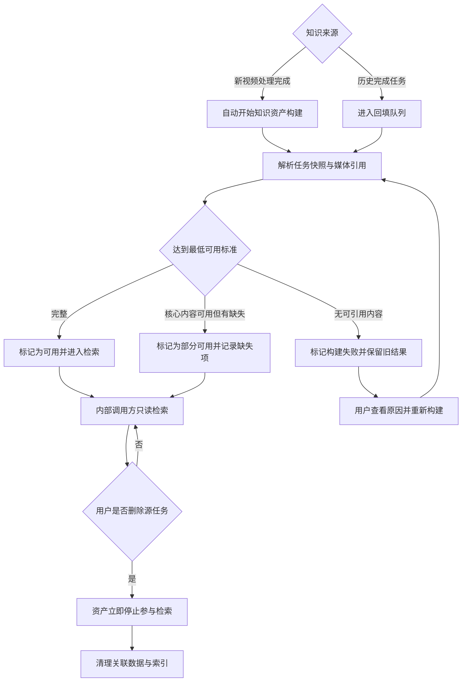
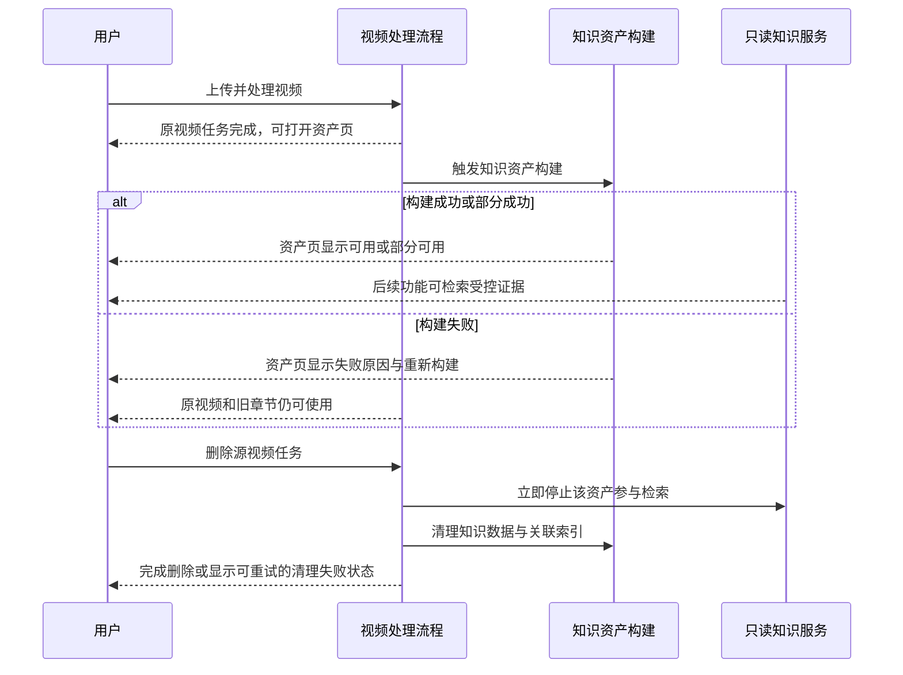

# 开发型 PRD：SnapNote 知识资产化一期 - V1.0

> PRD 类型：开发型 PRD（Development PRD）  
> PRD 编号：PRD-DEV-001  
> 状态：已确认，可进入开发  
> 日期：2026-08-16  
> 所属阶段：未来规划阶段一“知识资产化”  
> 适用端：Web 桌面端优先；后端与数据层为主要交付  
> 上位规划：[PRD-ROADMAP-001 SnapNote 未来产品规划](PRD-ROADMAP-001-SnapNote-未来产品规划.md)  
> 兼容基线：[PRD-001 SnapNote 视频知识资产页](PRD-001.md)

> 实现增补（2026-08-20）：在不改变关系模型、引用契约和权限过滤的前提下，已增加可选的 Qwen3 Embedding 语义索引；SQLite 用于零配置 Demo 降级，PostgreSQL + pgvector 用于生产向量检索。

## 1. 综述 (Overview)

### 1.1 项目背景与核心问题

SnapNote 当前已经把视频、音频、关键帧和 SQLite 数据保存在本机，并在 `snap_tasks` 中保存 `frames_json`、`transcripts_json`、`notes_json`、`visual_analysis_json` 和 `final_markdown`。这种任务级快照适合恢复处理结果和展示单条视频，但知识内容仍然绑定在大段 JSON 中，无法稳定支持跨视频检索、来源引用、版本演进、幂等回填和后续 AI 工具调用。

第一阶段要在不破坏现有处理链路和视频知识资产页的前提下，建立一层规范知识资产模型。新模型不是对现有 JSON 的一次性替换，而是由现有任务结果派生、可重建、可验证的查询层。

本阶段的最终消费者是下一阶段 MiMo 助手，但本阶段不实现对话和模型调用。验收重点是：数据是否形成规范资产、是否可只读检索、是否能回到原视频核验、是否能安全回填和删除。

### 1.2 产品目标

- 新视频处理完成后自动形成结构化知识资产，不要求用户再次操作。
- 历史完成任务无需重新调用 ASR、视觉模型或大模型即可回填。
- 资产、章节、原文片段、检索片段和媒体引用拥有稳定身份与来源关系。
- 通过统一只读知识服务取得可引用结果，不要求调用方理解数据库表或 JSON 结构。
- 资产构建失败不影响原视频和旧结果，并提供最小状态与重建入口。
- 删除源任务后，知识资产立即停止被检索，并最终清理关联数据。
- 引入版本化数据库迁移和构建版本，结束依赖零散 `ALTER TABLE` 的不可追踪演进方式。

### 1.3 一期非目标

- 不新增独立知识资产搜索页。
- 不实现 MiMo 聊天、跨视频问答、对话历史和答案引用 UI。
- 不实现 MCP Server、外部连接、凭证或第三方授权。
- 不实现向量 Embedding、语义召回和模型重排；本期建立可替换的索引边界，先交付结构化查询与中文关键词检索基线。
- 不迁移到 PostgreSQL、对象存储或独立任务队列；本期继续支持本地 SQLite 与本地文件。
- 不允许用户编辑章节、转写、知识分块或画面关键帧。
- 不建设知识图谱、实体关系、团队协作和多租户权限体系。
- 不删除或停止写入现有任务 JSON 字段，不改变 Markdown 导出格式。

### 1.4 核心业务流程 / 用户旅程地图

1. **阶段一：自动构建** - 新视频处理完成后，系统读取现有产物并形成规范知识资产。
2. **阶段二：历史回填** - 系统或开发运维人员扫描旧任务，以幂等方式补建资产并输出报告。
3. **阶段三：只读检索** - 后续内部调用方按范围检索资产、章节、原文和画面证据。
4. **阶段四：状态与治理** - 用户查看最小资产状态，在失败时重建；删除源任务时同步清理知识资产。

### 1.5 用户操作流



### 1.6 知识资产状态机

```mermaid
stateDiagram-v2
  [*] --> 未构建
  未构建 --> 构建中: 新任务完成或历史回填
  构建中 --> 可用: 完整度校验通过
  构建中 --> 部分可用: 核心证据可检索但存在缺失
  构建中 --> 构建失败: 无法形成最低可用资产
  可用 --> 构建中: 来源或构建版本发生变化
  部分可用 --> 构建中: 重新构建
  构建失败 --> 构建中: 重新构建
  可用 --> 删除中: 删除源任务
  部分可用 --> 删除中: 删除源任务
  构建失败 --> 删除中: 删除源任务
  删除中 --> 已删除: 主数据与索引清理完成
  已删除 --> [*]
```



### 1.7 自动构建与删除时序



## 2. 用户故事详述 (User Stories)

### 阶段一：新任务自动形成知识资产

---

#### **US-01：作为 SnapNote 用户，我希望新视频完成处理后自动形成规范知识资产，以便后续能力直接检索和引用。**

* **价值陈述 (Value Statement)**：
  * **作为** 上传课程、会议、教程或内容素材的用户
  * **我希望** 原处理完成后自动得到可复用知识资产
  * **以便于** 不重复整理、不重复调用 AI，也能为后续助手准备可靠证据
* **业务规则与逻辑 (Business Logic)**：
  1. **前置条件**：源任务存在且未删除；原视频路径有效；任务状态为完成；任务至少包含转写、结构化笔记或视觉分析中的一种可解析内容。
  2. **触发规则**：原视频处理任务进入完成态后触发知识资产构建。知识构建属于派生流程，其失败不得把原任务从“已完成”改为“失败”。
  3. **来源优先级**：
     1. 资产标题优先使用用户可见视频标题，缺失时使用安全文件名去扩展名。
     2. 章节优先使用整片视觉分析中的 `narrative_structure`，兼容 `structure`；缺失时按时间顺序将 `note_blocks` 降级为章节。
     3. 原文以 `transcripts_json` 为唯一转写来源，不使用模型摘要冒充原话。
     4. 画面引用以 `frames_json` 为来源，并通过已有 `frame_id`、时间和文件引用关联章节。
     5. 总体摘要优先使用整片视觉分析摘要，缺失时使用 Markdown 总体摘要或首批章节概要的受控拼接结果。
  4. **稳定标识规则**：知识资产与源任务一对一；章节、原文片段、知识分块和媒体引用拥有稳定标识。同一来源、同一构建版本重复执行时不得生成重复实体。
  5. **版本规则**：每次构建记录来源哈希、知识模型版本和构建器版本。来源哈希与版本均未变化时，自动构建直接返回已有结果；任一变化时创建新资产版本并在完整校验后切换为当前版本。
  6. **最低可用标准**：
     - 存在资产记录和有效原视频引用；
     - 至少生成 1 个可检索知识分块；
     - 每个可检索分块可追溯到章节、原文片段、笔记或视觉分析之一；
     - 涉及时间线的内容必须提供合法开始时间，且不得超出视频时长容差范围。
  7. **状态判定**：
     - `ready / 可用`：达到最低标准，章节、可检索文本与时间引用均存在，且无阻断性缺失；
     - `degraded / 部分可用`：达到最低标准，但缺少章节、画面、部分时间坐标或某类可选内容；
     - `failed / 构建失败`：无可检索文本、源任务无法解析、原视频引用无效或数据校验未通过。
  8. **分块规则**：
     - `chapter_summary`：每章一个概要分块，不跨章节；
     - `transcript`：仅合并同一章节内相邻原文，目标长度 300–800 个中文字符或等价文本长度，最长时间跨度 90 秒；不跨章节且不改写原文；
     - `note`：每个现有结构化笔记形成一个分块，保留原始标题、摘要和时间范围；
     - `video_summary`：每个资产最多一个总体摘要分块；
     - 空白内容、纯标点内容和完全重复内容不进入检索索引；重复判断基于规范化文本哈希。
  9. **媒体规则**：数据库保存受控相对引用、媒体类型、时间坐标、内容哈希和可用状态，不把图片二进制或原视频内容写入知识表。
  10. **兼容规则**：继续写入并读取现有任务 JSON；视频知识资产页继续按 PRD-001 的章节规则展示，不因新表存在而改变布局或字段。
  11. **异常处理 (Error Handling)**：
      - 单个章节解析失败时记录缺失项并继续处理其他章节；达到最低标准时标记部分可用。
      - 时间范围反转、负数或超出时长时先按合法边界修正；无法安全修正的实体被排除并记录原因。
      - 数据库提交失败时不切换当前资产版本，旧版本继续可读。
      - 索引建立失败时资产不得标记“可用”；结构化数据完整时标记部分可用并允许重建索引。
      - 构建日志不得包含 API Key、完整环境变量或非必要的原文全文。
* **验收标准 (Acceptance Criteria)**：
  * **场景 1：完整新任务自动构建**
    * **GIVEN** 一个完成任务包含视频、章节结构、转写、笔记和画面关键帧
    * **WHEN** 原处理流程完成并触发知识构建
    * **THEN** 在不需要用户操作的情况下生成一个 `ready` 资产；章节、原文和画面均可通过稳定标识读取并跳回合法时间
  * **场景 2：缺画面降级**
    * **GIVEN** 完成任务包含章节和转写但没有有效关键帧
    * **WHEN** 构建知识资产
    * **THEN** 文本仍进入检索，资产记录缺失项；状态根据其他完整度判定为可用或部分可用，不得失败
  * **场景 3：无章节兼容**
    * **GIVEN** 旧格式任务没有整片章节结构但存在按时间排序的笔记块
    * **WHEN** 构建知识资产
    * **THEN** 系统按兼容规则形成降级章节，并记录章节来源为笔记回退
  * **场景 4：重复触发幂等**
    * **GIVEN** 来源哈希和构建版本未变化且资产已可用
    * **WHEN** 同一任务再次触发构建
    * **THEN** 返回已有资产，不新增重复章节、原文片段、知识分块或索引项
  * **场景 5：知识构建失败隔离**
    * **GIVEN** 源任务 JSON 无法解析且没有任何可引用文本
    * **WHEN** 构建结束
    * **THEN** 知识资产状态为构建失败并保存可理解原因，原任务仍保持完成且原视频可访问

### 阶段二：历史任务安全回填

---

#### **US-02：作为开发运维人员，我希望以可预览、可续跑、幂等的方式回填历史任务，以便旧视频获得同等知识能力。**

* **价值陈述 (Value Statement)**：
  * **作为** 负责升级 SnapNote 数据的开发运维人员
  * **我希望** 在不重新运行昂贵 AI 流程的情况下批量补建知识资产
  * **以便于** 历史数据平滑升级，单条坏数据不会影响整个迁移
* **业务规则与逻辑 (Business Logic)**：
  1. **前置条件**：数据库结构迁移已完成；原数据库和任务目录具备备份或可恢复快照；回填进程具有只读源数据和写入知识表的权限。
  2. **候选范围**：默认只选择状态为 `completed` 且未删除的任务；支持指定单个任务、指定任务集合、仅失败任务和全部候选任务。
  3. **执行模式**：
     - `dry-run`：只扫描、校验和估算，不写知识表；
     - `execute`：按批次构建，逐条提交，输出进度和汇总；
     - `retry-failed`：只重试上次失败或部分可用的任务；
     - `force-rebuild`：显式要求时忽略相同来源哈希，生成新版本；默认禁用。
  4. **外部调用约束**：回填不得调用 MiMo、DeepSeek、MIMO-ASR、Whisper、OCR 或重新解码视频；只读取已存在数据库字段和媒体元数据。若旧数据不足，按部分可用或失败处理。
  5. **幂等规则**：候选任务已存在相同来源哈希、知识模型版本和构建器版本的成功结果时计为“跳过”，不重复写入。
  6. **失败隔离**：每条任务独立处理和提交；单条失败记录任务标识、失败阶段、错误摘要和可重试性，批次继续。
  7. **续跑规则**：进程中断后重新执行时，根据已提交构建记录继续；不得要求从第一条全部重做。
  8. **汇总结果**：至少输出候选总数、成功、部分可用、跳过、失败、总耗时和失败任务清单。
  9. **字符与路径兼容**：文件名显示乱码不得影响任务身份和知识构建；路径不可用时记录媒体缺失，不用文件名推断内容事实。
  10. **异常处理 (Error Handling)**：
      - 数据库被占用时按有限次数退避重试，超限后安全停止并保留已完成结果；
      - 单条 JSON 解析错误不得打印超大原始内容；
      - 磁盘空间不足时停止接收新批次，明确提示已完成范围和恢复方法；
      - 结构版本不兼容时禁止执行写入模式，要求先完成数据库迁移。
* **验收标准 (Acceptance Criteria)**：
  * **场景 1：预览不写入**
    * **GIVEN** 存在尚未回填的历史完成任务
    * **WHEN** 以 `dry-run` 模式执行
    * **THEN** 输出候选与风险统计，知识表记录数和当前资产版本均不变化
  * **场景 2：批量成功**
    * **GIVEN** 一批历史任务数据可解析
    * **WHEN** 以执行模式回填
    * **THEN** 每条任务形成一个当前知识资产，汇总中成功数与数据库结果一致，且没有外部 AI 请求
  * **场景 3：单条失败不中断**
    * **GIVEN** 候选中一条任务 JSON 损坏
    * **WHEN** 批量回填
    * **THEN** 该任务记为失败，其后候选继续处理，汇总列出失败原因和可重试性
  * **场景 4：中断续跑**
    * **GIVEN** 回填执行到一半时进程退出
    * **WHEN** 使用相同版本重新执行
    * **THEN** 已完成且来源未变的任务计为跳过，未完成任务继续执行，不产生重复实体
  * **场景 5：禁止隐式重算 AI**
    * **GIVEN** 某旧任务缺少转写和视觉分析
    * **WHEN** 回填执行
    * **THEN** 任务被标记部分可用或失败，系统不自动上传媒体或调用任何模型

### 阶段三：统一只读检索

---

#### **US-03：作为后续助手或产品功能的开发者，我希望调用统一只读知识服务获得可引用证据，以便不依赖数据库内部结构。**

* **价值陈述 (Value Statement)**：
  * **作为** 后续 MiMo 助手、站内搜索或 MCP 适配层的开发者
  * **我希望** 使用稳定、受控的领域查询能力
  * **以便于** 统一处理范围、排序、删除和引用规则，降低重复实现和数据泄露风险
* **业务规则与逻辑 (Business Logic)**：
  1. **前置条件**：调用方处于 SnapNote 后端可信边界；查询必须携带明确范围或使用当前用户默认可访问范围。本地单用户版本使用统一所有者范围，但接口必须保留范围参数。
  2. **一期能力清单**：
     - `list_assets`：按状态、创建时间和标题关键词列出知识资产摘要；
     - `get_asset`：读取单个资产元数据、总体摘要和章节目录；
     - `search_knowledge`：在允许范围内执行中文关键词检索；
     - `get_chapter`：读取章节概要、时间范围和关联画面；
     - `get_transcript`：按资产和时间范围读取原文片段；
     - `get_keyframe`：按稳定媒体标识取得受控画面引用与时间。
  3. **查询约束**：
     - 搜索词去除首尾空白后长度为 1–500 个字符；
     - `top_k` 默认 8，允许范围 1–20；
     - 单次显式资产范围最多 100 条，超出时要求分页或缩小范围；
     - 内容类型仅允许 `video_summary`、`chapter_summary`、`transcript`、`note`；
     - 时间范围必须满足 `0 ≤ start < end`，并被限制在视频合法时长内。
  4. **关键词索引**：一期采用适合中文子串匹配的全文检索策略；索引正文由规范化标题、章节概要、笔记和原文构成，画面路径、内部错误、密钥和处理日志不得进入索引。
  5. **排序规则**：所有子分数归一化为 0–1，最终分数为：

     `final_score = 0.75 × keyword_relevance + 0.15 × field_match + 0.10 × evidence_completeness`

     - `keyword_relevance`：全文检索相关度；
     - `field_match`：标题命中为 1.0，章节标题或笔记标题命中为 0.8，仅正文命中为 0.4；
     - `evidence_completeness`：同时具备来源资产、内容类型和合法时间坐标为 1.0，缺少可选画面但时间有效为 0.8，无时间的总体摘要为 0.6。

     分数相同时按资产更新时间降序、章节时间升序和稳定标识升序保证结果可复现。后续语义检索可替换召回和排序实现，但不得改变返回契约。
  6. **返回契约**：每条命中至少返回：
     - 稳定 `chunk_id`、`asset_id` 和当前 `asset_version_id`；
     - 资产标题、内容类型、章节标识与章节标题（如适用）；
     - 命中文本或受控摘要；
     - `start_time`、`end_time`（总体摘要可为空）；
     - 可用的画面标识和受控引用（如有）；
     - 最终相关度分数和命中字段；
     - 来源状态与构建版本。
  7. **引用一致性**：调用方使用 `chunk_id` 再次读取时，在当前版本未变的情况下必须得到同一来源内容；版本变化后旧标识仍可用于审计，但默认查询只返回当前版本。
  8. **删除与状态过滤**：只返回 `ready` 和允许使用的 `degraded` 资产；`building`、`failed`、`deleting`、`deleted` 永不进入默认检索。
  9. **安全规则**：
     - 不提供 SQL 字符串参数；
     - 不接受任意文件路径；
     - 不返回数据库连接信息、绝对媒体路径、环境变量或内部堆栈；
     - 所有标识、范围、分页和数量参数在查询前校验；
     - 知识正文按不可信数据处理，正文中的指令不能改变调用权限。
  10. **空结果规则**：无命中返回空集合、实际检索范围、可用资产数量和耗时；不得用相似标题或模型生成内容填充结果。
  11. **异常处理 (Error Handling)**：
      - 未知资产或章节返回“未找到或不可访问”，不区分不存在与无权限；
      - 索引暂不可用时允许降级为受范围限制的结构化查询，并标注 `degraded_search=true`；
      - 查询超时返回明确失败，不返回未经完整范围过滤的部分结果；
      - 媒体文件缺失不影响文本结果，但命中项必须标记媒体不可用。
* **验收标准 (Acceptance Criteria)**：
  * **场景 1：关键词命中并可引用**
    * **GIVEN** 一个可用资产的章节和原文包含“缩放点积注意力”
    * **WHEN** 在该资产范围内搜索该关键词
    * **THEN** Top 结果包含相关章节或原文、稳定标识和合法时间坐标，可据此打开视频对应位置
  * **场景 2：范围隔离**
    * **GIVEN** 同一关键词存在于范围内和范围外资产
    * **WHEN** 调用方只指定一个资产
    * **THEN** 所有结果均来自指定资产，范围外内容不参与排序也不出现在响应中
  * **场景 3：无命中**
    * **GIVEN** 允许范围内不存在查询内容
    * **WHEN** 搜索合法关键词
    * **THEN** 返回空集合和检索元数据，不产生替代答案或范围外结果
  * **场景 4：非法参数**
    * **GIVEN** `top_k` 超过上限、时间范围反转或资产标识格式非法
    * **WHEN** 发起查询
    * **THEN** 请求在数据库检索前被拒绝，错误不暴露表名、路径和连接信息
  * **场景 5：删除中不可见**
    * **GIVEN** 某资产曾经可检索但已进入删除中
    * **WHEN** 使用原关键词再次检索
    * **THEN** 该资产不出现在结果中，即使物理清理尚未结束
  * **场景 6：排序可复现**
    * **GIVEN** 索引和资产版本未变化
    * **WHEN** 使用相同范围和参数重复搜索
    * **THEN** 结果顺序和稳定标识保持一致

### 阶段四：状态、重建与删除一致性

---

#### **US-04：作为 SnapNote 用户，我希望看到知识资产状态并在失败时重建或删除，以便掌控内容是否可被后续能力使用。**

* **价值陈述 (Value Statement)**：
  * **作为** 视频知识资产所有者
  * **我希望** 在现有页面看见最小状态、失败原因和恢复操作
  * **以便于** 知道资产是否可检索，并确保删除源视频后不会留下孤立知识
* **业务规则与逻辑 (Business Logic)**：
  1. **前置条件**：用户可打开现有视频知识资产页；页面能够取得原任务状态与知识资产状态。
  2. **UI 范围**：仅在现有顶部信息栏增加知识资产状态，不新增导航入口、列表页或搜索框；右侧章节骨架继续遵循 PRD-001。
  3. **状态与文案**：

     | 内部状态 | 用户文案 | 用户可见说明 | 可用操作 |
     | --- | --- | --- | --- |
     | `not_built` | 未构建 | “尚未生成可检索知识资产” | 开始构建 |
     | `building` | 构建中 | “正在整理章节、原文与检索索引…” | 无；防止重复提交 |
     | `ready` | 可用 | “可供后续搜索与 AI 助手使用” | 重新构建（次要入口） |
     | `degraded` | 部分可用 | 展示缺失类型，如“缺少画面引用” | 重新构建 |
     | `failed` | 构建失败 | 展示不含技术堆栈的原因摘要 | 重新构建 |
     | `deleting` | 删除中 | “正在清理知识数据…” | 无 |

  4. **重建规则**：
     - `not_built`、`degraded`、`failed` 可直接重建；`ready` 的重建入口置于次要操作并二次确认；
     - 重建只重新解析已有结果和建立索引，不默认重跑 ASR、OCR、视觉理解或大模型；
     - 重建进行中重复点击不创建新任务；
     - 新版本校验通过前，原可用版本继续服务；失败时恢复原可用版本并显示本次失败。
  5. **失败原因文案**：按用户可处理性归类为“源数据不完整”“章节无法解析”“索引构建失败”“媒体引用不可用”“数据库暂时不可用”“未知错误”；详细技术信息只进入受控日志。
  6. **删除规则**：
     - 用户删除源任务并确认后，知识资产先进入删除中并立即从检索范围排除；
     - 清理范围包括资产当前版本与历史版本、章节、原文片段、知识分块、媒体引用、全文索引和构建记录中的内容引用；
     - 构建运行中收到删除时停止后续写入，并以删除操作优先；
     - 原任务文件删除失败时不得重新开放知识检索；页面显示“清理未完成，可重试”；
     - 删除完成后，通过原资产标识只能得到“未找到或不可访问”。
  7. **刷新恢复**：页面刷新后从持久化状态恢复，不依赖内存事件；构建中状态若无有效运行记录则自动转为可重试失败，避免永久卡住。
  8. **异常处理 (Error Handling)**：
     - 状态接口暂不可用时不影响视频和章节展示，状态区显示“知识状态暂不可用”；
     - 重建请求提交失败时保留原状态并显示非阻塞错误；
     - 删除清理部分失败时记录未完成范围，重试只处理残留项；
     - 不向用户展示绝对路径、SQL、内部表名或堆栈。
* **验收标准 (Acceptance Criteria)**：
  * **场景 1：可用状态最小展示**
    * **GIVEN** 一个视频的知识资产状态为可用
    * **WHEN** 用户打开现有视频知识资产页
    * **THEN** 顶部显示“知识资产：可用”，原视频和右侧章节布局与 PRD-001 保持一致
  * **场景 2：构建中防重**
    * **GIVEN** 资产正在构建
    * **WHEN** 用户刷新页面或重复点击原位置
    * **THEN** 页面继续显示构建中且不会创建第二个并发构建
  * **场景 3：失败重建成功**
    * **GIVEN** 资产因索引失败处于构建失败
    * **WHEN** 用户点击重新构建且本次成功
    * **THEN** 状态依次变为构建中和可用，原视频播放全程不受影响
  * **场景 4：可用版本重建失败**
    * **GIVEN** 资产已有可用版本
    * **WHEN** 用户发起重建但新版本校验失败
    * **THEN** 原版本继续可检索，页面提示本次重建失败，不切换到损坏版本
  * **场景 5：删除立即停止检索**
    * **GIVEN** 资产当前可被关键词检索
    * **WHEN** 用户确认删除源任务
    * **THEN** 资产立即退出检索；物理清理完成后关联知识数据和索引均不存在
  * **场景 6：状态服务降级**
    * **GIVEN** 知识状态暂时无法获取
    * **WHEN** 用户打开资产页
    * **THEN** 视频和章节仍正常加载，状态区显示可理解降级文案并允许刷新重试

* **页面布局线框图 (ASCII Wireframe)**：

```text
+------------------------------------------------------------------------------------------------+
| ← 返回处理中心   视频标题   已完成   知识资产：[可用 ✓]          [重新生成] [导出]      |
+---------------------------------------------------------------+--------------------------------+
|                                                               | 章节骨架                  4 章 |
|                                                               +--------------------------------+
|                        原视频播放器                           | ● 00:18                       |
|                           16 : 9                              | +--------------------------+   |
|                                                               | |      画面关键帧          |   |
|                                                               | +--------------------------+   |
|                                                               | 章节概要……                    |
|                                                               | [展开原文]                    |
+---------------------------------------------------------------+--------------------------------+

部分可用：知识资产：[部分可用 !]  缺少画面引用  [重新构建]
失败状态：知识资产：[构建失败 !]  章节数据无法解析  [重新构建]
构建状态：知识资产：[构建中 …]    正在整理章节、原文与检索索引
```

```text
+--------------------------------------------------------------------------+
| 重新构建知识资产                                                     [×] |
+--------------------------------------------------------------------------+
| 将重新解析现有章节、原文和画面，并重建检索索引。                        |
| 不会重新运行语音识别或 MiMo 视觉分析，也不会覆盖原视频任务结果。        |
|                                                                          |
| [取消]                                                  [确认重新构建] |
+--------------------------------------------------------------------------+
```

## 3. 知识资产数据要求

### 3.1 数据层级

```text
源视频任务 SnapTask（现有事实快照，保持兼容）
└── KnowledgeAsset（稳定资产身份与当前状态）
    ├── KnowledgeAssetVersion（不可变构建版本）
    │   ├── KnowledgeChapter（章节与时间范围）
    │   ├── KnowledgeTranscriptSegment（逐段原文）
    │   ├── KnowledgeChunk（检索单元）
    │   └── KnowledgeMedia（画面与源视频引用）
    └── KnowledgeBuildRun（每次构建、回填、重建的结果）
```

### 3.2 核心实体与字段

| 实体 | 必需字段 | 关键约束 |
| --- | --- | --- |
| `knowledge_assets` | `id`、`task_id`、`status`、`current_version_id`、`title`、`created_at`、`updated_at` | `task_id` 唯一；状态使用固定枚举；当前版本切换必须原子完成 |
| `knowledge_asset_versions` | `id`、`asset_id`、`source_hash`、`schema_version`、`builder_version`、`summary`、`duration`、`language`、`created_at` | 构建完成后不可原地修改内容；同资产相同来源与版本组合唯一 |
| `knowledge_chapters` | `id`、`asset_version_id`、`ordinal`、`title`、`summary`、`start_time`、`end_time`、`source_type` | 同版本顺序唯一；时间合法且章节按时间升序；允许降级章节 |
| `knowledge_transcript_segments` | `id`、`asset_version_id`、`source_segment_index`、`start_time`、`end_time`、`text`、`content_hash` | 保留原文，不由摘要替代；同版本来源序号唯一 |
| `knowledge_chunks` | `id`、`asset_version_id`、`chapter_id`、`content_type`、`source_ref`、`text`、`start_time`、`end_time`、`content_hash` | 只保存可检索文本；来源引用必填；规范化重复内容去重 |
| `knowledge_media` | `id`、`asset_version_id`、`frame_id`、`media_type`、`relative_uri`、`timestamp`、`content_hash`、`availability` | 不保存绝对路径和二进制；相对引用必须限制在任务媒体目录 |
| `knowledge_build_runs` | `id`、`asset_id`、`trigger`、`status`、`source_hash`、`builder_version`、`stats_json`、`error_code`、`error_summary`、时间字段 | 记录自动、回填、重建；错误摘要脱敏；同资产同一时间最多一个运行中构建 |

### 3.3 数据完整性规则

1. 所有关联关系使用外键或等价完整性校验；删除资产时关联实体必须可确定性清理。
2. 时间统一使用秒、允许小数；显示格式由前端转换；数据库中不得混用毫秒和秒。
3. `start_time` 不得小于 0；存在 `end_time` 时必须大于 `start_time`；允许最大值不超过视频时长 1 秒容差。
4. 文本统一以 UTF-8 语义处理，保留原始中文；规范化哈希仅用于比较，不回写改变用户可见原文。
5. 标题、摘要和检索文本设定明确长度上限；超限内容在构建期按语义边界截断或拆分，不在数据库驱动层静默截断。
6. 当前版本只有在结构化数据、索引和完整度校验全部达到对应状态标准后才能切换。
7. 版本化数据库迁移必须具有唯一版本号、升级步骤、失败处理和测试；应用启动时不得用未记录的临时字段修补代替正式迁移。

### 3.4 来源哈希

来源哈希用于判断是否需要重建，至少覆盖：

- 源任务标识与视频基础元数据；
- `frames_json`、`transcripts_json`、`notes_json`、`visual_analysis_json` 的规范化内容哈希；
- 当前知识模型版本和分块规则版本。

不把绝对目录前缀、数据库更新时间或无关处理进度写入来源哈希，避免没有内容变化却反复重建。

## 4. 只读知识服务契约

### 4.1 统一响应原则

- 成功响应包含稳定数据、分页信息或检索元数据。
- 错误响应包含稳定错误码和用户/开发者可理解摘要，不返回 SQL、绝对路径和堆栈。
- 所有返回默认只包含当前资产版本；审计或迁移工具必须显式请求历史版本。
- 所有媒体返回受控相对引用或现有静态资源 URL，不返回任意磁盘路径。
- 一期服务为内部领域接口；若同时提供 HTTP 路由，HTTP 层只做认证、校验和序列化，不复制检索逻辑。

### 4.2 检索结果示例

```json
{
  "query": "缩放点积注意力",
  "scope": {
    "asset_ids": ["asset_demo_transformer"]
  },
  "results": [
    {
      "chunk_id": "chunk_transcript_003",
      "asset_id": "asset_demo_transformer",
      "asset_version_id": "asset_version_01",
      "asset_title": "Transformer 核心原理",
      "content_type": "transcript",
      "chapter_id": "chapter_03",
      "chapter_title": "缩放点积注意力",
      "text": "缩放点积注意力先计算 Query 和 Key 的点积……",
      "start_time": 188.0,
      "end_time": 246.0,
      "keyframe_id": "media_frame_07",
      "score": 0.93,
      "matched_field": "chapter_title"
    }
  ],
  "total": 1,
  "degraded_search": false
}
```

## 5. 页面与状态要求

### 5.1 对现有页面的改动边界

- 顶部信息栏增加一个知识资产状态标签和必要操作。
- 资产构建状态不进入右侧章节卡片，不增加知识节点、搜索框或助手入口。
- 原视频仍是主内容，章节仍只展示 PRD-001 规定的时间戳、画面关键帧、章节概要和原文展开。
- 知识状态请求失败采用局部降级，不能让整个资产页进入失败态。

### 5.2 可见提示文案

| 场景 | 文案 |
| --- | --- |
| 构建中 | 正在整理章节、原文与检索索引… |
| 可用 | 可供后续搜索与 AI 助手使用 |
| 部分可用 | 知识资产可用，但部分内容缺失：{缺失类型} |
| 构建失败 | 知识资产构建失败：{原因摘要} |
| 状态不可用 | 知识状态暂不可用，不影响视频浏览 |
| 重建提交失败 | 暂时无法开始重新构建，请稍后重试 |
| 删除清理未完成 | 视频已停止提供知识检索，部分数据清理未完成，可重试 |

## 6. 数据迁移与发布策略

### 6.1 发布顺序

1. 引入版本化数据库迁移，创建知识资产相关表、约束和索引。
2. 发布知识构建器和只读服务，但关闭新任务自动触发。
3. 在测试库和数据库副本上执行回填预览与抽样校验。
4. 对少量指定历史任务执行正式回填，验证幂等、引用与删除。
5. 打开新任务自动构建功能开关，旧页面继续从现有 JSON 读取。
6. 分批回填全部历史完成任务；失败项隔离重试。
7. 前端灰度展示最小知识状态。
8. 指标稳定后将一期能力设为默认开启。

### 6.2 功能开关

至少提供以下独立开关或等价配置：

- 新任务完成后是否自动构建知识资产；
- 只读检索是否启用；
- 前端是否展示知识状态；
- 是否允许用户发起重建。

关闭新能力后，现有视频处理、任务列表、资产页和 Markdown 导出必须继续工作。

### 6.3 回退策略

- 数据库迁移失败时应用不得使用半完成结构启动写入；保留原数据库恢复路径。
- 新构建器发生问题时关闭自动构建开关，不删除已验证知识资产。
- 只读检索异常时关闭检索入口，现有资产页继续读取任务 JSON。
- 前端状态展示异常时关闭 UI 开关，不影响视频与章节页面。
- 不通过删除源 JSON 或覆盖旧任务的方式实现回退。

## 7. 性能、容量与可靠性

### 7.1 一期基准

一期验收基准以本地单用户、SQLite 和以下数据规模执行：

- 1,000 条知识资产；
- 100,000 个知识分块；
- 单资产最长视频 1 小时；
- 单次检索最多返回 20 条结果。

### 7.2 指标目标

| 指标 | 一期目标 |
| --- | ---: |
| 新任务派生知识构建耗时（不含原视频处理） | P95 ≤ 10 秒 |
| 单资产详情读取 | P95 ≤ 300 ms |
| 范围内关键词检索 | P95 ≤ 1 秒 |
| 时间范围原文读取 | P95 ≤ 500 ms |
| 自动构建成功率（源数据满足最低标准） | ≥ 99% |
| 可解析历史任务回填成功率 | ≥ 98% |
| 重复构建产生重复实体 | 0 |
| 删除确认后退出检索 | ≤ 1 秒 |

SQLite 写入必须使用受控事务和有限并发，避免回填、视频流水线和高频进度写入相互制造长期写锁。达不到规模基准时优先优化查询、索引和写入节流，不在一期临时引入未经规划的多数据库双写。

## 8. 安全与隐私要求

1. 原视频、原文、关键帧和知识分块默认保持本地存储边界；一期知识构建不得发送任何内容到新外部服务。
2. 数据库与检索服务不保存或返回 `MIMO_API_KEY`、`DEEPSEEK_API_KEY` 等密钥。
3. 只读查询按范围过滤后再检索，不能先检索全库再在响应阶段删除范围外结果。
4. 媒体引用必须验证解析后仍位于允许的任务存储目录，防止路径穿越。
5. 日志只记录任务标识、阶段、统计与脱敏错误，不默认记录完整原文和查询命中正文。
6. 删除进入 `deleting` 后立即从默认查询排除，即使文件清理仍在重试。
7. 知识正文中的任何“忽略规则”“执行命令”等内容均视为普通资料，不影响服务权限或行为。

## 9. 测试与验收计划

### 9.1 自动化测试

- 数据库迁移：空库升级、现有 `app.db` 升级、重复升级、失败恢复。
- 构建解析：完整任务、无章节、有笔记无转写、有转写无画面、损坏 JSON、非法时间。
- 幂等：相同来源重复构建、版本变化重建、并发重复触发。
- 分块：不跨章节、原文不改写、长度边界、重复内容去重、时间范围正确。
- 检索：中文关键词、范围过滤、内容类型过滤、稳定排序、空结果、非法参数。
- 状态：完整生命周期、卡住构建恢复、部分可用、失败重建、旧版本保留。
- 删除：可用资产删除、构建中删除、清理局部失败重试、删除后不可检索。
- 安全：SQL 字符串作为普通查询文本、非法标识、路径穿越、超限参数、错误脱敏。
- 兼容：现有任务 API、视频播放、章节展示、重试和 Markdown 导出回归。

### 9.2 数据抽样验收

至少选择以下 10 条样本：

- 课堂视频 3 条；
- 会议视频 3 条；
- 教程或 Demo 视频 2 条；
- 无完整 MiMo 视觉结果的降级任务 1 条；
- 已知存在缺失或异常字段的历史任务 1 条。

每条样本人工核验：资产身份、章节数量与顺序、随机 5 个原文时间坐标、随机 5 个关键词检索命中、画面引用、重复回填结果和删除结果。

### 9.3 一期总体验收

1. 新任务完成后能够自动形成知识资产，知识构建失败不改变原任务完成状态。
2. 历史任务回填不调用外部 AI，支持预览、失败隔离、续跑和幂等。
3. 当前数据库中已有完成任务能够成功回填或给出明确可重试失败原因。
4. 规范实体满足唯一性、时间、来源、状态和删除完整性约束。
5. 中文关键词检索返回稳定、可引用、受范围限制的结果。
6. 每条时间型命中能跳转到原视频合法位置，误差不超过 1 秒。
7. 状态 UI 不改变现有视频资产页的信息层级和核心交互。
8. 删除源任务后，资产在 1 秒内退出检索，最终无孤立知识记录。
9. 功能开关关闭后，现有视频处理、资产页和导出能力完整可用。
10. 一期性能基准、自动化测试和 10 条样本抽验全部通过。

## 10. 埋点与运行指标

| 事件 / 指标 | 关键属性 | 用途 |
| --- | --- | --- |
| `knowledge_build_started` | `task_id`、触发类型、构建器版本 | 统计触发与并发 |
| `knowledge_build_completed` | 状态、耗时、章节数、分块数、缺失类型 | 评估成功率与完整度 |
| `knowledge_build_failed` | 稳定错误码、阶段、可重试性 | 聚类失败原因 |
| `knowledge_backfill_batch_completed` | 候选、成功、部分可用、跳过、失败、耗时 | 迁移验收 |
| `knowledge_search_completed` | 查询长度、范围大小、结果数、耗时、是否降级 | 建立检索基线 |
| `knowledge_rebuild_clicked` | 原状态、失败类型 | 判断恢复需求 |
| `knowledge_asset_removed` | 退出检索耗时、清理耗时、残留数 | 验证删除一致性 |

埋点不得携带完整查询正文、完整原文、绝对路径或任何密钥。开发环境可通过显式调试开关查看有限内容，生产默认关闭。

## 11. 开发任务拆分建议

| 开发包 | 主要内容 | 前置依赖 | 完成定义 |
| --- | --- | --- | --- |
| WP-01 数据迁移框架 | 正式版本化迁移、知识表、约束、索引 | 现有 SQLAlchemy 模型 | 空库与现有库升级测试通过 |
| WP-02 知识构建器 | 来源解析、稳定标识、版本、分块、完整度 | WP-01 | 完整与降级样本构建通过 |
| WP-03 历史回填工具 | dry-run、执行、续跑、汇总、失败重试 | WP-02 | 真实现有任务可回填且幂等 |
| WP-04 全文检索与领域服务 | 索引、范围过滤、排序、六类只读能力 | WP-02 | 检索契约和安全测试通过 |
| WP-05 生命周期与删除 | 状态、并发互斥、卡住恢复、删除清理 | WP-02、WP-04 | 重建与删除端到端通过 |
| WP-06 最小状态 UI | 状态标签、文案、重建确认与局部降级 | WP-05 | 不破坏 PRD-001 页面，UI 验收通过 |
| WP-07 灰度与评测 | 开关、指标、抽样脚本、发布回退 | 全部 | 十条样本与性能基准通过 |

## 12. 依赖、风险与待后续处理

### 12.1 依赖

- 现有 `snap_tasks` 数据和任务目录保持可读。
- PRD-001 定义的章节兼容规则继续有效。
- SQLite 运行环境支持正式迁移和中文全文检索方案。
- 后端能够在应用启动或受控命令中执行数据库结构版本检查。

### 12.2 主要风险

| 风险 | 影响 | 一期处理 |
| --- | --- | --- |
| 历史 JSON 结构差异 | 回填结果不一致 | 版本化解析、来源优先级、失败隔离、样本抽验 |
| 中文全文检索召回有限 | 后续助手证据不足 | 保留关键词基线；一期增强已支持 Embedding 与混合检索，继续通过真实问题集评测 |
| SQLite 写锁 | 回填影响视频任务 | 有限并发、逐条提交、写入节流、可续跑 |
| 构建双写不一致 | 任务完成但资产缺失 | 派生状态独立、可重建、构建记录、功能开关 |
| 删除残留 | 隐私和检索污染 | 先退出检索、后物理清理、残留重试与验收 |
| 状态 UI 扩张现有产品范围 | 破坏简洁资产页 | 仅顶部最小状态，不新增搜索和知识节点 |

### 12.3 后续阶段接口预留

- `knowledge_chunks` 通过独立的 `knowledge_embeddings` 表关联可重建向量；模型版本变化时可批量重建，不改变资产身份。
- 只读知识服务保留用户/资产范围参数，为多用户权限和 MCP 复用准备。
- 稳定引用契约可被第二阶段答案引用和第三阶段 MCP 工具直接复用。
- 构建器 Provider 与数据主模型解耦，未来更换 Embedding 或生成模型不改变资产身份。

## 13. 一期成立标准

第一阶段成立的最小闭环是：一个新完成任务和一个历史完成任务都能在不重新调用 AI 的情况下形成规范知识资产；内部调用方可以按明确范围检索到章节、原文和时间坐标，并从结果回到原视频核验；相同来源重复执行不产生重复数据；构建失败不破坏旧结果；用户删除源任务后资产立即退出检索且最终无孤立知识记录。

只有该闭环通过自动化测试、10 条样本抽验和一期性能基准后，才进入第二阶段 MiMo 助手开发。
