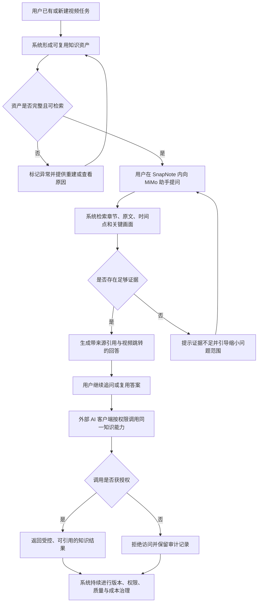
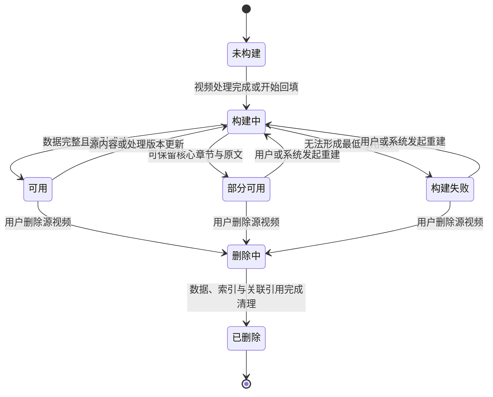
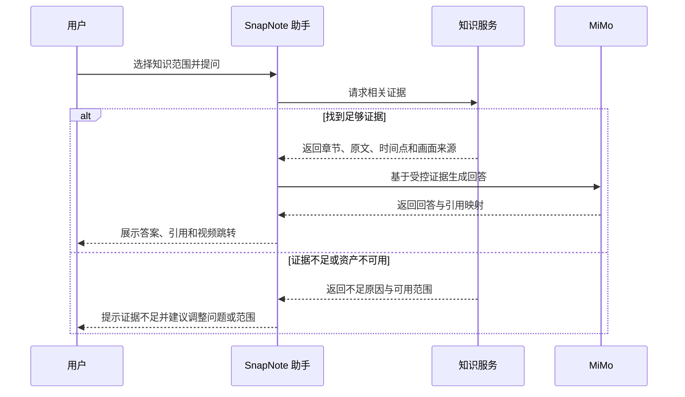

# 规划型 PRD：SnapNote 未来产品规划 - V1.0

> PRD 类型：规划型 PRD（Roadmap PRD）  
> PRD 编号：PRD-ROADMAP-001  
> 状态：规划已确认  
> 日期：2026-08-16  
> 规划周期：四阶段滚动建设  
> 关联现状：[PRD-001 SnapNote 视频知识资产页](PRD-001.md)  
> 第一阶段开发详规：[PRD-DEV-001 SnapNote 知识资产化一期](PRD-DEV-001-SnapNote-知识资产化一期.md)

## 1. 综述 (Overview)

### 1.1 项目背景与核心问题

SnapNote 已能够将视频处理为转写、章节、画面关键帧、视觉分析、结构化笔记和 Markdown，并在视频知识资产页中支持用户从章节返回原视频核验内容。但当前产物主要以任务级 JSON 和文件形式保存，解决的是“结果能保存、能再次展示”，尚未形成能够跨视频检索、被 AI 稳定引用、被外部工具安全复用的知识资产体系。

未来规划需要完成四次产品能力跃迁：

1. 从“任务结果”跃迁为结构清晰、可检索、可追溯的知识资产；
2. 从“用户手动浏览单条视频”跃迁为“可向 MiMo 助手提问并获得带证据回答”；
3. 从“SnapNote 内部使用”跃迁为“外部 AI 客户端可通过 MCP 复用”；
4. 从“单机 Demo”跃迁为“可扩展、可治理、可评测的生产系统”。

本规划坚持三个产品原则：

- **原视频是最终事实来源**：所有 AI 结论都应尽可能回到章节、原文、时间点或画面核验。
- **检索优先于生成**：助手不能把全库内容无差别塞入上下文，也不能在无证据时伪装成有依据。
- **领域服务优先于协议适配**：先建设统一知识服务，再分别提供内部调用接口和 MCP 适配，不把数据库直接暴露给模型。

### 1.2 产品目标

- 每个处理完成的视频都形成一份状态明确、版本可追踪的知识资产。
- 用户能够针对单条或多条视频提问，并得到带章节、原文、时间点和画面来源的答案。
- 用户可以点击回答引用直接回到原视频对应位置。
- 外部 AI 客户端可在授权范围内复用同一套只读知识能力。
- 系统能够持续衡量资产完整度、检索质量、回答可信度、模型成本和运行健康度。
- 当前任务 JSON、视频知识资产页和 Markdown 导出保持兼容，阶段建设不破坏既有使用路径。

### 1.3 非目标与长期边界

- 不让模型直接执行任意 SQL、读取任意文件或绕过用户权限。
- 不以 MCP 代替数据库模型、检索系统或权限系统。
- 不承诺 AI 回答绝对正确；产品通过来源引用、证据不足提示和原视频跳转提高可核验性。
- 第一阶段不提供对话助手、独立搜索页、跨视频问答或外部 MCP 接入。
- 第二阶段不默认开放写入、编辑、删除类 AI 工具。
- 第三阶段的 MCP 首版只读，不开放远程自动修改知识资产。
- 不在本规划内建设复杂知识图谱、多人协同编辑和企业级审批流。

### 1.4 核心业务流程 / 用户旅程地图

1. **阶段一：知识资产化** - 用户完成视频处理后，系统形成结构化、可检索、可追溯的知识资产；旧任务可安全回填。
2. **阶段二：MiMo 内置助手** - 用户选择知识范围并提问，系统检索证据后生成带引用、可跳转、可继续追问的回答。
3. **阶段三：MCP 复用生态** - 用户授权外部 AI 客户端读取 SnapNote 知识能力，并可查看连接范围与调用记录。
4. **阶段四：生产化与治理** - 系统在数据规模、用户规模和调用规模增长后，持续保障权限、质量、性能、成本与可恢复性。

### 1.5 阶段依赖与准入条件

| 阶段 | 关键交付 | 进入下一阶段的准入条件 |
| --- | --- | --- |
| 一、知识资产化 | 规范数据模型、旧数据回填、只读检索、构建状态与重建 | 新旧任务均可形成可检索资产；引用能定位到原视频；删除同步；核心验收通过 |
| 二、MiMo 内置助手 | 问答工作区、混合检索、工具调用、引用与多轮会话 | 回答引用正确率和证据约束达到目标；无依据回答受到控制；成本可观测 |
| 三、MCP 复用生态 | 只读 MCP Server、连接授权、工具与资源、审计 | 外部客户端稳定调用；越权请求被拒绝；无任意 SQL/文件读取能力 |
| 四、生产化与治理 | 可扩展存储与索引、任务队列、权限、评测、监控与成本治理 | 核心服务达到既定 SLO；具备备份恢复、灰度发布和持续评测能力 |

### 1.6 Mermaid 图（流程/状态/时序）

#### 1.6.1 用户操作流



#### 1.6.2 知识资产生命周期



#### 1.6.3 助手检索与回答时序



## 2. 用户故事详述 (User Stories)

### 阶段一：知识资产化

---

#### **US-01：作为 SnapNote 用户，我希望新视频完成处理后自动形成规范知识资产，以便后续检索和 AI 复用。**

* **价值陈述 (Value Statement)**：
  * **作为** 上传课程、会议、教程或内容素材的用户
  * **我希望** 视频处理完成后无需额外整理即可形成知识资产
  * **以便于** 后续助手、搜索和外部工具使用一致、可追溯的数据
* **业务规则与逻辑 (Business Logic)**：
  1. **前置条件**：视频任务至少具备原视频、处理状态以及可用的转写、章节或结构化笔记之一。
  2. **操作流程**：原处理流程完成后自动启动知识资产构建；系统拆分资产、章节、原文片段、检索片段和媒体引用，并记录来源与版本。
  3. **最低可用规则**：至少具备资产身份、原视频引用和一类可引用文本，才可标记“可用”或“部分可用”。
  4. **兼容规则**：原任务 JSON 和 Markdown 保持不变；知识资产是新增的可查询视图，不替换原结果。
  5. **异常处理**：局部内容缺失时尽量形成“部分可用”资产；完全无法建立可引用内容时标记“构建失败”，不影响原视频播放。
* **验收标准 (Acceptance Criteria)**：
  * **场景 1：完整资产生成**
    * **GIVEN** 视频任务已生成章节、转写和画面关键帧
    * **WHEN** 原处理流程完成
    * **THEN** 系统自动形成可用知识资产，且章节和原文引用可跳回正确时间
  * **场景 2：局部缺失降级**
    * **GIVEN** 视频缺少画面关键帧但存在章节与转写
    * **WHEN** 系统构建知识资产
    * **THEN** 资产标记为部分可用或可用并记录缺失项，不阻断文本检索
  * **场景 3：构建失败隔离**
    * **GIVEN** 任务数据损坏且无法形成任何可引用文本
    * **WHEN** 构建结束
    * **THEN** 仅知识资产标记失败，原视频和已有任务结果仍可访问

---

#### **US-02：作为已有 SnapNote 用户，我希望历史完成任务能安全回填为知识资产，以便旧内容获得同等复用能力。**

* **价值陈述 (Value Statement)**：
  * **作为** 已经积累视频任务的用户
  * **我希望** 无需重新上传或重新执行昂贵的 AI 分析即可升级旧内容
  * **以便于** 历史资产不会在产品升级后失效或被割裂
* **业务规则与逻辑 (Business Logic)**：
  1. 回填只读取已有任务结果和文件，不默认重新调用 ASR、视觉模型或大模型。
  2. 同一来源版本重复回填必须得到同一结果，不生成重复章节、片段或索引记录。
  3. 单条任务回填失败不得阻断其他任务；系统保留成功、部分成功、跳过和失败统计。
  4. 回填过程中用户仍可查看原视频和旧资产页。
  5. 旧数据缺少章节结构时，使用当前兼容规则形成降级章节，并记录构建依据。
* **验收标准 (Acceptance Criteria)**：
  * **场景 1：历史任务升级**
    * **GIVEN** 存在处理完成但尚无知识资产的旧任务
    * **WHEN** 系统执行回填
    * **THEN** 该任务形成知识资产且不重新调用外部 AI
  * **场景 2：重复执行**
    * **GIVEN** 某任务已按相同来源版本完成回填
    * **WHEN** 再次执行回填
    * **THEN** 系统安全跳过或更新同一资产，不产生重复数据
  * **场景 3：批次局部失败**
    * **GIVEN** 一批旧任务中有一条数据损坏
    * **WHEN** 批量回填执行
    * **THEN** 其他任务继续处理，最终结果明确列出失败对象与原因

---

#### **US-03：作为后续产品能力的调用方，我希望通过统一只读能力检索知识证据，以便稳定构建助手和外部复用。**

* **价值陈述 (Value Statement)**：
  * **作为** SnapNote 内置助手、搜索功能或受控集成
  * **我希望** 使用领域化查询获取资产、章节、原文和时间坐标
  * **以便于** 不理解数据库结构也能得到统一、可引用的结果
* **业务规则与逻辑 (Business Logic)**：
  1. 查询能力至少覆盖资产列表、资产详情、关键词检索、章节详情、时间范围原文和画面引用。
  2. 每条检索命中必须包含稳定标识、来源资产、内容类型、相关文本、开始与结束时间以及可用媒体引用。
  3. 第一阶段只读，不允许任意 SQL、任意文件读取或内容修改。
  4. 无命中时返回明确空结果，不生成看似合理的替代事实。
  5. 已删除、删除中或无权限资产不得出现在结果中。
* **验收标准 (Acceptance Criteria)**：
  * **场景 1：命中并引用**
    * **GIVEN** 某知识点存在于一个章节和对应原文中
    * **WHEN** 调用方按关键词检索
    * **THEN** 返回相关证据、资产标识和可跳转时间坐标
  * **场景 2：无命中**
    * **GIVEN** 库中不存在与问题相关的内容
    * **WHEN** 调用方检索
    * **THEN** 返回空结果与检索范围，不虚构内容
  * **场景 3：非法查询**
    * **GIVEN** 调用方提交越界数量、非法标识或试图执行 SQL
    * **WHEN** 系统校验请求
    * **THEN** 请求被拒绝且不泄露数据库结构或其他文件内容

---

#### **US-04：作为 SnapNote 用户，我希望看到知识资产状态并在失败时重建或删除，以便保持内容可用且符合我的数据控制意愿。**

* **价值陈述 (Value Statement)**：
  * **作为** 视频资产所有者
  * **我希望** 知道资产是否可被后续助手使用，并能处理失败或删除内容
  * **以便于** 不在后台黑盒状态下等待，也不留下孤立数据
* **业务规则与逻辑 (Business Logic)**：
  1. 现有视频知识资产页仅新增最小状态，不新增独立搜索页。
  2. 状态至少包含：未构建、构建中、可用、部分可用、构建失败。
  3. 构建失败或部分可用时展示原因摘要和“重新构建”；重建不默认重新运行 ASR 或视觉理解。
  4. 用户删除源视频任务后，知识资产、检索记录、会话引用和关联文件引用同步失效；删除中的资产立即停止被检索。
  5. 删除失败时明确提示剩余状态并允许重试，不能向用户显示“删除成功”但仍可被检索。
* **验收标准 (Acceptance Criteria)**：
  * **场景 1：查看可用状态**
    * **GIVEN** 知识资产已构建完成
    * **WHEN** 用户打开视频知识资产页
    * **THEN** 页面显示“知识资产可用”，且不改变既有章节布局
  * **场景 2：失败重建**
    * **GIVEN** 知识资产构建失败
    * **WHEN** 用户点击“重新构建”
    * **THEN** 状态变为构建中，完成后更新为可用、部分可用或失败
  * **场景 3：删除同步**
    * **GIVEN** 一个资产此前可被检索
    * **WHEN** 用户确认删除源视频任务
    * **THEN** 该资产立即不再参与检索，最终完成关联数据清理

* **页面布局线框图 (ASCII Wireframe)**：

```text
+------------------------------------------------------------------------------------------------+
| ← 返回处理中心     视频标题       已完成     知识资产：[可用 ✓]    [重新生成] [导出]      |
+---------------------------------------------------------------+--------------------------------+
|                                                               | 章节骨架                  4 章 |
|                        原视频播放器                           |                                |
|                           16 : 9                              | 00:18  章节概要                |
|                                                               | [展开原文]                    |
+---------------------------------------------------------------+--------------------------------+

失败态仅替换状态区域：
知识资产：[构建失败 !]  原因：章节数据无法解析  [重新构建]
```

### 阶段二：MiMo 内置助手

---

#### **US-05：作为视频知识使用者，我希望向 MiMo 助手提问并获得带来源的回答，以便跨章节或跨视频复用知识。**

* **价值陈述 (Value Statement)**：
  * **作为** 学习者、会议参与者或内容整理者
  * **我希望** 用自然语言查询选定视频范围
  * **以便于** 不必逐条打开视频即可综合已有知识，同时仍能核验事实来源
* **业务规则与逻辑 (Business Logic)**：
  1. 用户可选择当前视频、多个视频或全部有权访问的知识资产作为问答范围。
  2. 助手先检索后生成；回答引用必须来自本次检索证据。
  3. 每个关键结论至少关联一个可展开引用；引用展示视频标题、章节、时间和原文摘要。
  4. 点击引用跳转至既有视频知识资产页并定位对应时间。
  5. 回答生成失败时保留用户问题和已检索证据，提供重试；不得显示半截内容为完整答案。
* **验收标准 (Acceptance Criteria)**：
  * **场景 1：有证据回答**
    * **GIVEN** 所选资产中存在相关内容
    * **WHEN** 用户提交问题
    * **THEN** 助手流式展示回答，并附带至少一个可跳转引用
  * **场景 2：限定范围**
    * **GIVEN** 用户只选择一个视频
    * **WHEN** 发起问题
    * **THEN** 回答和引用不得使用范围外资产
  * **场景 3：生成失败**
    * **GIVEN** 已检索到证据但 MiMo 暂时不可用
    * **WHEN** 请求失败
    * **THEN** 页面说明失败、保留问题并提供重试，不伪造答案

* **页面布局线框图 (ASCII Wireframe)**：

```text
+----------------------------------------------------------------------------------------------+
| SnapNote 助手                  范围：[全部知识资产 v]                        [新建对话] |
+----------------------------+-----------------------------------------------------------------+
| 会话历史                   | 用户：比较这几段视频中对“注意力机制”的解释。                   |
| - 注意力机制复习           |                                                                 |
| - 产品会议决策             | MiMo：三段内容共同强调…… [1] [2]                               |
| - 教程操作步骤             |                                                                 |
|                            | 引用：                                                          |
|                            | [1] Transformer 课程 / 02:05 / Query、Key、Value               |
|                            | [2] 模型分享会 / 14:32 / 长上下文限制                           |
|                            |                                                                 |
|                            | [ 输入问题……                                      ] [发送]    |
+----------------------------+-----------------------------------------------------------------+
```

---

#### **US-06：作为谨慎的知识使用者，我希望助手在证据不足时明确说明并支持连续追问，以便避免把模型猜测当成视频事实。**

* **价值陈述 (Value Statement)**：
  * **作为** 需要据此学习、复盘或产出内容的用户
  * **我希望** 分清“来自知识库的事实”和“模型补充说明”
  * **以便于** 控制幻觉风险并逐步收敛问题
* **业务规则与逻辑 (Business Logic)**：
  1. 证据不足时优先回答“当前知识资产中未找到充分依据”，并展示已检索范围。
  2. 助手可建议用户更换关键词、缩小问题、扩大资产范围或重新构建异常资产。
  3. 多轮追问继承当前会话范围；用户修改范围时给出可见提示。
  4. 模型通识补充如被允许，必须与“来自 SnapNote 资产的内容”视觉区分，且默认不开启。
  5. 工具调用和模型重试不得导致同一用户问题重复显示多条答案。
* **验收标准 (Acceptance Criteria)**：
  * **场景 1：证据不足**
    * **GIVEN** 所选范围没有可靠证据
    * **WHEN** 用户提问
    * **THEN** 助手不生成确定性结论，展示不足提示与调整建议
  * **场景 2：连续追问**
    * **GIVEN** 用户已获得一条带引用回答
    * **WHEN** 用户追问“第二个观点的原话是什么”
    * **THEN** 助手沿用会话范围并优先返回对应原文引用
  * **场景 3：范围改变**
    * **GIVEN** 会话原本只包含一个视频
    * **WHEN** 用户将范围扩大为多个视频
    * **THEN** 页面明确提示范围已变化，后续回答按新范围检索

* **页面布局线框图 (ASCII Wireframe)**：

```text
+--------------------------------------------------------------------------------------+
| MiMo 助手   当前范围：产品复盘会.mp4                                   [调整范围] |
+--------------------------------------------------------------------------------------+
| 用户：会上是否已经确认九月上线？                                                   |
|                                                                                      |
| [证据不足] 当前视频中未找到“九月上线已确认”的明确原话。                            |
| 已检索：产品复盘会.mp4，全部 6 个章节。                                              |
|                                                                                      |
| 建议：[搜索“发布时间”] [加入其他会议视频] [查看可能相关的 12:30 原文]              |
|                                                                                      |
| [ 继续追问……                                                       ] [发送]        |
+--------------------------------------------------------------------------------------+
```

### 阶段三：MCP 复用生态

---

#### **US-07：作为外部 AI 客户端用户，我希望通过 MCP 读取 SnapNote 知识，以便在不同助手中复用同一资产。**

* **价值陈述 (Value Statement)**：
  * **作为** Codex、Claude、IDE 或其他 MCP 客户端用户
  * **我希望** 调用 SnapNote 已验证的知识检索能力
  * **以便于** 不复制数据库、不重复构建索引也能使用视频知识
* **业务规则与逻辑 (Business Logic)**：
  1. MCP 只暴露领域化只读工具与稳定资源，不暴露原始 SQL、数据库文件或任意本地路径。
  2. 首版工具至少覆盖搜索知识、获取资产、获取章节、获取时间范围原文和获取画面引用。
  3. 返回内容遵循与内置助手相同的来源、时间和删除规则。
  4. 工具参数采用简单、严格、可验证的结构；超限、未知标识和越权请求明确失败。
  5. MCP 不直接持有完整对话，客户端只获得当前调用所需的最小内容。
* **验收标准 (Acceptance Criteria)**：
  * **场景 1：外部检索**
    * **GIVEN** 用户已授权一个 MCP 客户端
    * **WHEN** 客户端调用知识搜索工具
    * **THEN** 返回与内部检索一致的证据和引用坐标
  * **场景 2：资源读取**
    * **GIVEN** 客户端获得一个有效资产标识
    * **WHEN** 请求对应资源
    * **THEN** 返回受控的资产内容而非底层数据库结构
  * **场景 3：非法能力**
    * **GIVEN** 客户端尝试执行 SQL 或读取未声明路径
    * **WHEN** 发起调用
    * **THEN** 服务拒绝请求且不暴露敏感信息

---

#### **US-08：作为知识资产所有者，我希望管理 MCP 连接范围并查看调用记录，以便控制谁能使用哪些内容。**

* **价值陈述 (Value Statement)**：
  * **作为** SnapNote 用户或管理员
  * **我希望** 创建、暂停和撤销外部连接并查看最近调用
  * **以便于** 在获得复用价值的同时保留数据控制权
* **业务规则与逻辑 (Business Logic)**：
  1. 每个连接必须具有名称、状态、授权资产范围、创建时间和最近使用时间。
  2. 默认授权最小范围，用户主动选择后才扩大；新资产不自动加入既有连接，除非用户选择“包含未来资产”。
  3. 暂停或撤销连接后，新调用立即失败；历史审计记录按治理策略保留。
  4. 调用日志展示客户端、工具、时间、资产范围、结果状态，不展示模型私有思考内容。
  5. 凭证只在创建时完整展示一次，之后只能轮换或撤销。
* **验收标准 (Acceptance Criteria)**：
  * **场景 1：创建最小权限连接**
    * **GIVEN** 用户选择两条知识资产
    * **WHEN** 创建 MCP 连接
    * **THEN** 连接只能检索这两条资产，凭证仅本次完整展示
  * **场景 2：撤销生效**
    * **GIVEN** 一个连接当前有效
    * **WHEN** 用户撤销连接
    * **THEN** 后续调用立即被拒绝并记录失败状态
  * **场景 3：查看审计**
    * **GIVEN** 外部客户端已产生调用
    * **WHEN** 用户打开连接详情
    * **THEN** 可查看调用时间、工具、范围和结果，不显示不必要的内容正文

* **页面布局线框图 (ASCII Wireframe)**：

```text
+--------------------------------------------------------------------------------------+
| MCP 连接管理                                                          [+ 新建连接] |
+--------------------------------------------------------------------------------------+
| 名称             状态       授权范围          最近使用          操作                 |
| Codex 本地        已启用     2 条资产          10 分钟前          [详情] [暂停]       |
| 团队研究助手      已暂停     标签：课程        3 天前             [详情] [启用]       |
+--------------------------------------------------------------------------------------+
| 最近调用                                                                            |
| 10:32  Codex 本地  search_knowledge  资产范围：2 条  成功                         |
| 10:31  Codex 本地  get_transcript    资产：课程A     成功                         |
+--------------------------------------------------------------------------------------+
```

### 阶段四：生产化与治理

---

#### **US-09：作为持续使用 SnapNote 的用户，我希望资产规模增长后检索和处理仍然稳定，以便知识库可以长期积累。**

* **价值陈述 (Value Statement)**：
  * **作为** 拥有大量视频资产的个人或团队用户
  * **我希望** 上传、构建、检索和问答不会因规模增长明显退化
  * **以便于** 将 SnapNote 作为长期知识基础设施使用
* **业务规则与逻辑 (Business Logic)**：
  1. 存储、媒体、索引与处理任务可独立扩展，迁移过程中保持用户资产可读。
  2. 长任务进入可恢复队列；失败可重试，重复消费不得产生重复资产。
  3. 索引升级采用版本化重建和切换，旧索引在新索引验证前保持可用。
  4. 备份与恢复覆盖结构化数据、媒体引用、索引重建依据和必要配置。
  5. 达到容量或速率限制时提供明确用户反馈，不静默丢失任务。
* **验收标准 (Acceptance Criteria)**：
  * **场景 1：规模增长**
    * **GIVEN** 资产和检索片段达到规划基准规模
    * **WHEN** 用户查询或打开资产
    * **THEN** 核心响应仍满足阶段 SLO 且结果完整
  * **场景 2：任务恢复**
    * **GIVEN** 构建任务执行中服务重启
    * **WHEN** 系统恢复
    * **THEN** 任务可继续或安全重试，不产生重复资产
  * **场景 3：索引升级失败**
    * **GIVEN** 新索引构建未通过验证
    * **WHEN** 系统准备切换
    * **THEN** 保持旧索引服务，不影响用户正常检索

---

#### **US-10：作为产品运营者和用户，我希望系统持续治理回答质量、权限风险和模型成本，以便 AI 能力可信且可持续。**

* **价值陈述 (Value Statement)**：
  * **作为** 产品负责人、管理员和知识使用者
  * **我希望** 看见资产质量、检索效果、回答引用、异常和成本趋势
  * **以便于** 发现问题、控制风险并持续优化产品
* **业务规则与逻辑 (Business Logic)**：
  1. 质量评测至少覆盖资产完整率、检索命中、引用正确率、证据不足识别率和无依据回答率。
  2. 运行监控至少覆盖构建成功率、检索延迟、模型错误、Token 使用和 MCP 越权拒绝。
  3. 高风险权限变更、批量删除、凭证创建与撤销保留审计。
  4. 用户可以反馈“回答无帮助”“引用不支持结论”“时间定位不准确”，反馈关联具体回答和引用。
  5. 达到预算阈值时可降级模型、限制范围或暂停非关键调用，但必须向用户说明影响。
* **验收标准 (Acceptance Criteria)**：
  * **场景 1：质量回归**
    * **GIVEN** 新版本导致引用正确率低于阈值
    * **WHEN** 评测执行
    * **THEN** 发布被阻断或自动回退，并显示受影响指标
  * **场景 2：预算预警**
    * **GIVEN** 模型消耗接近配置阈值
    * **WHEN** 继续产生请求
    * **THEN** 管理端产生预警并按策略降级，用户看到明确说明
  * **场景 3：用户反馈闭环**
    * **GIVEN** 用户认为引用无法支持回答
    * **WHEN** 提交反馈
    * **THEN** 系统记录回答、引用和问题类型，供后续评测复现

* **页面布局线框图 (ASCII Wireframe)**：

```text
+--------------------------------------------------------------------------------------+
| AI 与知识治理                                             时间：[最近 7 天 v]       |
+--------------------------------------------------------------------------------------+
| 资产可用率 98.7% | 引用正确率 93.2% | 无依据回答率 2.1% | 本期 Token 1.28M        |
+--------------------------------------------------------------------------------------+
| 趋势与告警                                                                            |
| [引用正确率趋势图]                [构建失败 / MCP 拒绝 / 成本预警列表]                |
+--------------------------------------------------------------------------------------+
| 最近用户反馈                                                                          |
| 回答 #A103  引用不支持结论   [查看回答与证据] [标记处理]                            |
+--------------------------------------------------------------------------------------+
```

## 3. 跨阶段关键规则

### 3.1 事实、引用与证据

- 资产、章节、原文片段、检索片段和媒体必须拥有稳定标识。
- 引用必须指向一个当前可访问的资产版本，并尽量携带开始与结束时间。
- 回答正文不能引用未出现在本次检索结果中的来源。
- 来源被删除或权限收回后，历史回答可保留文本，但引用必须显示“来源已不可用”，不得继续泄露正文。
- “无检索结果”“证据不足”“模型生成失败”是三个不同状态，用户可见文案不得混用。

### 3.2 模型与检索边界

- MiMo 负责理解问题、选择受控工具和组织答案，不直接连接数据库。
- 检索服务负责范围过滤、关键词与语义召回、排序、去重和证据打包。
- MCP 是知识服务的适配层；内置助手可直接调用领域服务，避免不必要协议绕行。
- Embedding、生成模型和重排模型采用可替换 Provider，资产主数据不绑定单一模型厂商。
- 多轮工具调用必须完整保存继续对话所需的助手消息和工具结果；失败重试不得重复执行有副作用操作。

### 3.3 权限与安全

- 所有查询先确定用户和资产范围，再执行检索；禁止先全库检索后过滤。
- 外部连接默认最小权限、只读、可暂停、可撤销、可轮换。
- 不向模型开放任意 SQL、数据库文件路径、任意本地文件读取或系统命令。
- 对知识内容中的提示注入按不可信数据处理，内容不能改变系统工具权限。
- API Key、MCP 凭证和模型密钥不得写入知识资产、日志正文或前端响应。

### 3.4 兼容与演进

- 现有 `snap_tasks` JSON 字段和 `storage/tasks/{task_id}` 文件在第一阶段保持源数据地位。
- 新模型通过版本号、来源哈希和构建记录支持幂等回填和重建。
- 数据模型或索引升级先构建新版本、完成校验后切换，不对现有资产做不可逆覆盖。
- 每个阶段应提供功能开关和回退路径，不以一次性大迁移替代渐进发布。

## 4. 成功指标

| 维度 | 指标 | 阶段目标 |
| --- | --- | ---: |
| 资产化 | 新完成任务知识资产生成成功率 | ≥ 99% |
| 资产化 | 历史可解析任务回填成功率 | ≥ 98% |
| 可追溯 | 检索结果具备有效来源与时间坐标的比例 | ≥ 99% |
| 检索 | 人工标注问题 Top 5 证据召回率 | ≥ 85% |
| 回答 | 关键结论具备有效引用的比例 | ≥ 95% |
| 回答 | 引用能够支持相邻结论的比例 | ≥ 90% |
| 安全 | 无权限资产被返回的事件 | 0 |
| MCP | 合法只读工具调用成功率 | ≥ 99% |
| 稳定性 | 核心知识服务月度可用率 | ≥ 99.9%（生产阶段） |
| 成本 | 单次回答 Token、检索和模型成本 | 可追踪、可设置预算 |

## 5. 里程碑与交付关系

| 里程碑 | 主要交付物 | 明确不包含 |
| --- | --- | --- |
| M1 知识资产化 | 规范表、构建器、历史回填、全文检索、只读知识服务、最小状态 | MiMo 对话、语义向量、MCP、独立搜索 UI |
| M2 MiMo 助手 | 助手页面、范围选择、混合检索、引用、多轮会话、反馈 | 外部 MCP、写入型 Agent、复杂团队权限 |
| M3 MCP 复用 | 只读 MCP 工具与资源、连接管理、权限范围、审计 | 任意 SQL、远程修改、无人值守删除 |
| M4 生产治理 | 可扩展存储与索引、任务队列、权限体系、评测监控、备份恢复 | 知识图谱和多人协作编辑 |

## 6. 主要风险与应对

| 风险 | 影响 | 规划应对 |
| --- | --- | --- |
| JSON 历史数据结构不一致 | 回填失败、引用错误 | 版本化解析器、兼容优先级、逐条失败隔离、人工抽样 |
| 中文检索召回不足 | 助手找不到已有证据 | 第一阶段建立全文基线，第二阶段引入语义召回与重排 |
| 长上下文诱导全量注入 | 成本高、噪声大、越权风险 | 强制范围过滤和 Top K 证据打包，不因上下文变长取消检索 |
| 模型产生无依据结论 | 用户误用 | 引用约束、证据不足状态、回答反馈和离线评测 |
| MCP 扩大攻击面 | 数据泄露或越权 | 只读白名单工具、最小授权、凭证轮换、审计和速率限制 |
| 数据删除不彻底 | 隐私与合规风险 | 删除先停止检索，再清理主数据、索引、引用与媒体 |
| 单机 SQLite 扩展受限 | 并发写入、迁移困难 | 阶段四迁移可扩展数据库与对象存储，保持领域接口不变 |

## 7. 规划成立标准

SnapNote 的未来建设成立，需要最终形成以下闭环：视频处理完成后自动成为可检索知识资产；用户可通过 MiMo 助手基于证据提问，并从引用回到原视频核验；用户可将同一知识能力安全授权给外部 MCP 客户端；系统能在数据和调用规模增长后持续保障权限、质量、性能、成本和可恢复性。

第一阶段不以“能建几张表”为完成标准，而以“新旧视频均能形成稳定、可检索、可删除、可追溯的资产，并能支撑下一阶段助手开发”为完成标准。
