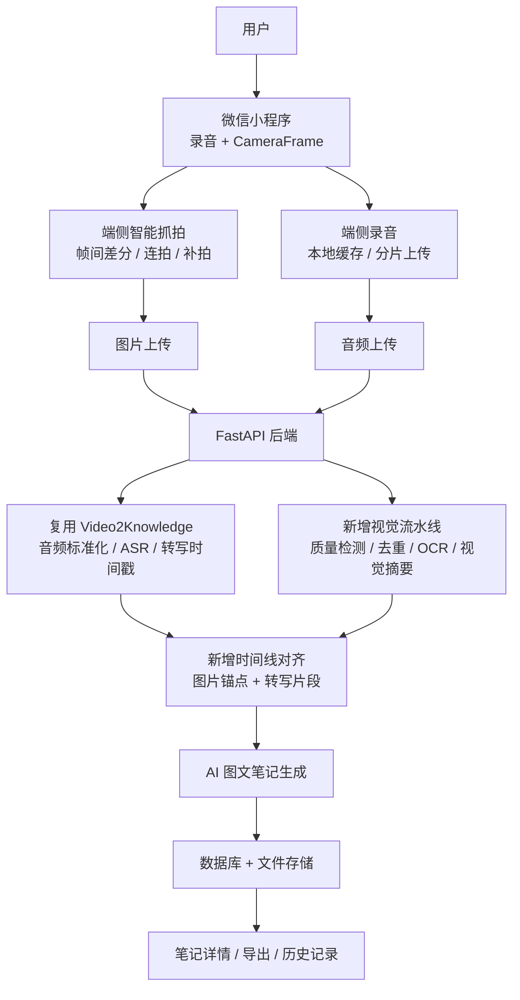
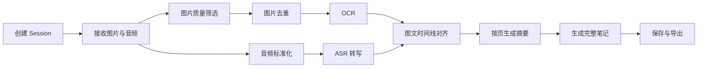

# SnapNote 产品需求文档 PRD v1.0

> 版本：v1.0  
> 日期：2026-08-01  
> 产品名：SnapNote  
> 产品形态：微信小程序 + 后端 AI 处理服务  
> 基础项目参考：`D:\hsj\Github\Video2Knowledge`

---

## 1. 背景与结论

SnapNote 是一款面向课堂、讲座、会议、培训场景的 AI 多模态笔记产品。用户在现场打开小程序，对准 PPT、白板或投影屏幕并开始录音，系统自动完成：

1. 语音采集与转写
2. PPT 翻页/关键画面自动捕获
3. 图片清晰度筛选、去重与文字识别
4. 图片时间点与语音时间轴对齐
5. 基于“图片 + 语音 + OCR”的结构化笔记生成
6. Markdown、长图、PDF 等格式导出

基于对 `Video2Knowledge` 项目的初步分析，可以判断：

- `Video2Knowledge` 已经实现了较完整的语音处理与知识生成底座。
- 现有链路包括：媒体输入、音频标准化、Whisper/MIMO-ASR 转写、章节划分、知识提取、Markdown 生成、SSE 进度流、资产管理与导出。
- 现有数据库包含 `videos`、`transcripts`、`topics`、`concepts`、`blogs`、`stage_results` 等表。
- 目前尚未看到面向 SnapNote 所需的关键帧截图、图片质量检测、OCR、视觉内容识别、图片与语音时间线对齐等专门能力。

因此，SnapNote 不需要从零实现完整 AI 笔记后端，而应在 `Video2Knowledge` 的音频转写与知识生成流水线上新增一条视觉采集与多模态对齐链路。

一句话结论：

**在 Video2Knowledge 现有语音处理能力基础上，补齐“小程序端关键帧采集 + 后端图片识别 + 图文时间线对齐”，即可形成 SnapNote MVP 的核心闭环。**

---

## 2. 产品定位

### 2.1 产品一句话

**SnapNote：自动捕获每一页 PPT 的 AI 课堂笔记。**

英文标语：

**SnapNote: AI notes that capture every slide.**

### 2.2 产品核心价值

SnapNote 解决用户在听课、听会、听讲座时“既要认真听，又要不断拍 PPT”的冲突。

产品不只是录音转文字，也不只是拍照存图，而是把现场画面和发言内容自动对齐，生成带图片锚点的结构化笔记。

### 2.3 目标场景

MVP 优先场景：

- 大学生课堂听课
- 公开课/讲座记录
- 培训课程记录
- PPT 型会议记录

后续扩展场景：

- 企业会议纪要
- 直播课程复盘
- 线下研讨会记录
- 白板讨论记录
- 视频课程转图文笔记

---

## 3. 目标用户

### 3.1 核心用户

1. 学生
   - 上课时需要记录 PPT 和老师讲解。
   - 希望课后快速得到可复习笔记。

2. 职场学习者
   - 参加培训、分享会、行业会议。
   - 需要沉淀会议内容和关键页。

3. 内容整理者
   - 需要把讲座、课程、会议内容整理成文章、纪要或知识库材料。

### 3.2 早期种子用户

MVP 阶段优先选择：

- 大学生
- 研究生
- AI/产品/编程课程学习者
- 经常参加 PPT 型分享会的人

原因：

- PPT 使用频率高。
- 录音和截图需求强。
- 对 AI 笔记接受度高。
- 愿意容忍早期产品的不完美。

---

## 4. 用户痛点

### 4.1 当前记录方式的问题

1. 手动拍 PPT 容易打断听课节奏。
2. 老师翻页快时，用户很容易漏拍。
3. 拍到的图片常常模糊、倾斜、曝光差。
4. 录音和 PPT 图片分散保存，课后很难对应。
5. 单纯录音转文字缺少视觉上下文。
6. 单纯定时拍照会产生大量重复图片，但仍无法保证不漏页。
7. 课后整理笔记耗时长，缺少自动摘要和知识点提炼。

### 4.2 SnapNote 要解决的核心问题

MVP 只聚焦三个高价值问题：

1. **不漏页**：尽可能捕获每次 PPT 翻页或关键画面变化。
2. **对得上**：每张图片能对应到相关语音讲解片段。
3. **能复习**：最终输出结构化、可阅读、可导出的课堂笔记。

---

## 5. 现有项目能力复用评估

### 5.1 Video2Knowledge 已具备能力

`Video2Knowledge` 当前已经具备以下能力，可作为 SnapNote 后端底座复用：

| 能力 | 当前状态 | SnapNote 复用方式 |
| --- | --- | --- |
| 音频上传 | 已实现 | 小程序录音结束后上传音频 |
| 视频上传 | 已实现 | 后续可支持录屏/视频导入 |
| URL 输入 | 已实现 | 后续支持 B 站/YouTube 课程链接 |
| ffmpeg 音频标准化 | 已实现 | 统一转为 16kHz mono WAV |
| Whisper ASR | 已实现 | 本地转写方案 |
| MIMO-ASR | 已实现 | 云端转写方案 |
| 带时间戳转写 | 已实现 | 用于和图片时间轴对齐 |
| 章节划分 | 已实现 | 可改造成课堂章节/主题识别 |
| 知识提取 | 已实现 | 可复用概念、方法、工具、洞察提取 |
| Markdown 生成 | 已实现 | 改造成图文笔记生成 |
| SSE 进度流 | 已实现 | 用于笔记生成进度展示 |
| 资产管理 | 已实现 | 改造成课堂笔记历史记录 |
| 多格式导出 | 已实现 | 复用 Markdown/TXT/JSON 导出 |

### 5.2 Video2Knowledge 缺失能力

SnapNote 还需要新增以下能力：

| 能力 | 是否已有 | 说明 |
| --- | --- | --- |
| 小程序端 CameraFrame 采集 | 未实现 | SnapNote 的现场采集入口 |
| PPT 翻页检测 | 未实现 | 基于帧间差分/HSV 直方图 |
| 连拍择优 | 未实现 | 翻页触发后连拍 3 张，选最清晰 |
| 图片清晰度检测 | 未实现 | 拉普拉斯方差或端侧轻量算法 |
| 图片重复度判断 | 未实现 | 感知哈希或直方图相似度 |
| OCR | 未实现 | 识别 PPT 页面文字 |
| 图片内容理解 | 未实现 | 用视觉模型识别图表、代码、公式、重点区域 |
| 图片-语音时间线对齐 | 未实现 | 根据 capture_time 与 transcript segment 对齐 |
| 手动补拍 | 未实现 | 漏拍兜底交互 |
| 现场会话模型 | 未实现 | 区分课堂 session 与视频 task |

### 5.3 产品化判断

SnapNote 的工程重点不是重写 ASR，而是新增“现场多模态采集层”。

可以把系统拆成两层：

1. **已有底座层**：Video2Knowledge
   - 音频处理
   - ASR 转写
   - 章节划分
   - 知识提取
   - Markdown 生成
   - 资产管理

2. **新增产品层**：SnapNote
   - 小程序录音和相机采集
   - 智能抓拍
   - 图片质量筛选
   - OCR/视觉理解
   - 图片与语音对齐
   - 图文课堂笔记体验

---

## 6. 产品目标

### 6.1 MVP 目标

1. 用户能完成一次 30-60 分钟课堂记录。
2. 系统能自动捕获大部分 PPT 页面。
3. 系统能生成带 PPT 截图和语音摘要的笔记。
4. 用户可以查看历史记录并导出 Markdown。
5. 整体体验明显优于“录音 App + 手机拍照 + 手动整理”。

### 6.2 核心指标

| 指标 | MVP 目标 |
| --- | --- |
| PPT 页面覆盖率 | 95%+ |
| 重复图片过滤率 | 60%+ |
| 单次记录成功率 | 90%+ |
| 图片与语音对齐准确率 | 85%+ |
| 30 分钟课程生成耗时 | 1-3 分钟 |
| 用户下一次继续使用意愿 | 60%+ |

### 6.3 非目标

MVP 不追求：

- 100% 不漏页
- 完美 OCR
- 完美透视矫正
- 实时生成完整笔记
- 多人协作
- 完整课程管理系统

---

## 7. MVP 功能范围

### 7.1 首页

目标：

让用户快速进入记录状态。

核心元素：

- SnapNote Logo
- 主按钮：开始记录
- 入口：历史笔记
- 入口：导入音频/视频
- 权限提示：相机、麦克风、相册

交互要求：

- 首次使用时解释为什么需要相机和麦克风。
- 非首次使用时减少打扰，直接展示“开始记录”。

### 7.2 记录页

目标：

让用户在课堂/会议现场稳定完成录音和抓拍。

核心元素：

- 相机预览区
- 录音状态
- 已记录时长
- 已捕获页数
- 当前网络状态
- 手动补拍按钮
- 暂停/继续
- 结束记录

关键交互：

1. 用户点击“开始记录”。
2. 小程序申请相机、麦克风权限。
3. 进入相机预览和录音状态。
4. 系统自动分析预览帧。
5. 触发翻页时自动抓拍。
6. 用户可以随时点击“补拍此页”。
7. 结束后进入上传和生成流程。

### 7.3 智能抓拍

SnapNote 采用三级防漏机制，而不是简单定时拍照。

#### 第一级：视觉变化触发

核心思路：

- 小程序实时读取 CameraFrame 预览帧。
- 将预览帧降采样，降低计算成本。
- 对当前帧和上一关键帧计算 HSV 直方图差异或感知哈希差异。
- 当差异超过阈值时，判断为可能翻页。
- 触发连拍 3 张。
- 选择清晰度最高的一张上传或缓存。

建议参数：

| 参数 | 建议值 |
| --- | --- |
| 帧分析频率 | 1-2 fps |
| 视觉变化阈值 | 30% |
| 连拍数量 | 3 张 |
| 连拍间隔 | 200-400 ms |
| 去抖时间 | 2-3 秒 |

#### 第二级：语音关键词触发

核心思路：

- 监听 ASR 中的翻页相关话术。
- 当识别到关键词时，强制触发一次抓拍。
- 用于补充 PPT 动画、局部内容变化、视觉变化不明显的场景。

关键词示例：

- 下一页
- 这一页
- 这张图
- 这个表
- 我们来看
- 总结一下
- 接下来
- 最后

MVP 简化方案：

- 第一版可以不做实时云端 ASR。
- 先在本地记录音频时间点。
- 如果后端转写后发现关键词附近没有图片锚点，可以标记为“疑似漏拍点”。
- v0.4 再做实时关键词补拍。

#### 第三级：低频兜底扫描

核心思路：

- 每隔 8-10 秒采集一张备用图。
- 如果图片清晰且与上一张保留图不重复，则作为备用页面。
- 如果重复或模糊，则丢弃。

作用：

- 防止视觉触发失效。
- 防止用户手动补拍遗漏。
- 捕获长时间停留但内容重要的页面。

### 7.4 图片质量检测

每张候选图片上传前需要经过质量判断。

检测项：

| 检测项 | 方法 | 处理 |
| --- | --- | --- |
| 清晰度 | 拉普拉斯方差 | 低于阈值丢弃或标记 |
| 重复度 | pHash/HSV 相似度 | 高重复图片丢弃 |
| 亮度 | 平均亮度/直方图 | 过暗过曝标记 |
| 画面稳定 | 连续帧运动量 | 移动中图片延迟采集 |
| 文字占比 | OCR 文本数量 | 辅助判断是否为有效课件 |

MVP 策略：

- 自动触发图片必须通过清晰度和重复度检测。
- 手动补拍图片默认保留，但标记质量分。
- 质量不佳时在笔记详情中允许用户删除或替换。

### 7.5 图片识别

图片识别分为两层。

#### OCR 文本识别

目标：

提取 PPT 页面上的标题、正文、关键词、公式、代码片段等文本信息。

MVP 输出：

- `ocr_text`
- `slide_title`
- `detected_keywords`
- `text_confidence`

#### 视觉内容理解

目标：

让 AI 理解图片中的非文本信息。

可识别内容：

- 图表
- 流程图
- 架构图
- 代码截图
- 数学公式
- 表格
- 示意图

MVP 输出：

- `visual_summary`
- `content_type`
- `important_regions`

MVP 可先只做 OCR，视觉内容理解放入 v0.3 或 v0.4。

### 7.6 语音记录与转写

SnapNote 复用 `Video2Knowledge` 的语音处理能力。

录音要求：

- 小程序端录制音频。
- 结束记录后上传音频文件。
- 后端统一转码为 16kHz mono WAV。
- 使用 Whisper 或 MIMO-ASR 转写。
- 保留 `start_time`、`end_time`、`text`。

转写输出示例：

```json
{
  "start_time": 182.4,
  "end_time": 195.7,
  "text": "这一页主要讲的是多模态数据对齐的三个步骤。"
}
```

### 7.7 图片与语音时间线对齐

这是 SnapNote 的核心新增能力。

#### 基础对齐规则

每张图片记录：

- `capture_time`
- `trigger_type`
- `quality_score`

每段语音记录：

- `start_time`
- `end_time`
- `text`

对齐规则：

- 图片 A 捕获于 `T1`。
- 下一张图片 B 捕获于 `T2`。
- 则 `[T1, T2)` 区间内的语音片段默认归属于图片 A。
- 如果图片 A 是手动补拍，则优先作为强锚点。
- 如果 ASR 关键词触发点附近没有图片，则生成“疑似漏拍提示”。

#### 对齐增强规则

1. OCR 标题与语音文本匹配
   - 如果 PPT 标题出现在语音片段中，提高匹配置信度。

2. 关键词匹配
   - OCR 中的关键词与转写文本重合越多，置信度越高。

3. 时间邻近度
   - 图片捕获时间与语音片段越接近，置信度越高。

4. 手动补拍优先级
   - 手动补拍认为是用户主动纠错，置信度更高。

#### 对齐输出

```json
{
  "slide_id": "slide_001",
  "capture_time": 182.4,
  "transcript_start": 182.4,
  "transcript_end": 248.9,
  "alignment_confidence": 0.88,
  "alignment_reason": ["time_window", "ocr_keyword_match"]
}
```

### 7.8 AI 笔记生成

输入：

- 全量转写文本
- 分段转写文本
- PPT 图片列表
- OCR 文本
- 图片视觉摘要
- 图片与语音对齐结果

输出：

- 课程标题
- 总体摘要
- 按页组织的图文笔记
- 每页对应讲解摘要
- 重点知识点
- 待复习问题
- 原始转写入口
- 导出文件

笔记结构：

```markdown
# 课程标题

## 总结

## 第 1 页：标题


### 页面内容

### 老师讲解

### 重点

## 第 2 页：标题
```

### 7.9 历史笔记

功能：

- 查看历史笔记列表
- 搜索标题
- 按状态筛选
- 查看详情
- 删除记录
- 重新生成笔记
- 导出 Markdown

列表字段：

- 标题
- 创建时间
- 记录时长
- 捕获页数
- 生成状态

### 7.10 导出

MVP 支持：

1. Markdown
2. TXT 转写
3. JSON 阶段数据

后续支持：

1. PDF
2. 长图
3. Word
4. 飞书/Notion/Obsidian 导出

---

## 8. 用户流程

### 8.1 现场记录流程

1. 用户打开 SnapNote。
2. 点击“开始记录”。
3. 授权相机和麦克风。
4. 将手机对准 PPT 或投影。
5. 系统开始录音并分析预览帧。
6. PPT 翻页时，系统自动抓拍。
7. 用户发现漏拍时点击“补拍此页”。
8. 课程结束后点击“结束记录”。
9. 小程序上传音频和图片。
10. 后端进行 ASR、OCR、时间线对齐、AI 总结。
11. 用户查看生成的图文笔记。
12. 用户导出或分享笔记。

### 8.2 导入已有音频/视频流程

1. 用户选择导入音频或视频。
2. 系统复用 Video2Knowledge 的上传与处理能力。
3. 如果是视频，可后续增加自动抽取关键帧。
4. 系统生成普通 AI 笔记或图文笔记。

---

## 9. 页面与交互设计

### 9.1 首页

页面目标：

- 快速开始
- 明确产品用途
- 进入历史记录

模块：

- 顶部：SnapNote
- 主操作：开始记录
- 次操作：导入音频/视频
- 历史笔记列表预览

### 9.2 权限引导页

触发条件：

- 首次点击开始记录
- 相机或麦克风权限未开启

文案原则：

- 简短说明用途
- 不制造焦虑
- 明确用户可随时删除数据

示例：

> SnapNote 需要使用相机捕获 PPT 页面，并使用麦克风记录讲解内容。你的图片和录音仅用于生成本次笔记。

### 9.3 记录页

页面目标：

- 稳定记录
- 让用户知道系统正在工作
- 给用户一个随时补救的入口

界面元素：

- 相机预览
- 顶部录音计时
- 已捕获页数
- 当前状态提示
- 补拍此页按钮
- 结束按钮

状态提示：

- 正在记录
- 已捕获第 N 页
- 画面不稳定
- 图片较模糊
- 网络较弱，已本地缓存

### 9.4 生成中页面

页面目标：

- 降低等待焦虑
- 展示处理进度

进度阶段：

1. 上传图片和音频
2. 标准化音频
3. 语音转写
4. 图片识别
5. 图文对齐
6. 生成笔记

可复用 `Video2Knowledge` 的 SSE 进度能力。

### 9.5 笔记详情页

页面目标：

- 让用户快速复习
- 支持核对和编辑

模块：

- 标题
- 总体摘要
- 页面目录
- 按页图文笔记
- 原始转写
- 导出按钮

每页卡片内容：

- PPT 截图
- OCR 标题
- 页面摘要
- 对应讲解内容
- 重点知识点
- 对齐置信度

### 9.6 历史记录页

模块：

- 搜索
- 状态筛选
- 笔记列表
- 删除
- 重新生成

---

## 10. 技术架构

### 10.1 总体架构



### 10.2 小程序端模块

| 模块 | 说明 |
| --- | --- |
| Recorder | 录音、暂停、结束、本地缓存 |
| CameraPreview | 相机预览与权限管理 |
| FrameAnalyzer | CameraFrame 降采样与变化检测 |
| CaptureManager | 自动抓拍、连拍择优、手动补拍 |
| QualityChecker | 清晰度、亮度、重复度初筛 |
| UploadManager | 图片/音频分片上传、断点续传 |
| SessionStore | 本地 session 状态持久化 |

### 10.3 后端模块

| 模块 | 说明 | 来源 |
| --- | --- | --- |
| SourceAdapter | 音频/视频输入标准化 | 复用 Video2Knowledge |
| ASR Pipeline | Whisper/MIMO-ASR 转写 | 复用 Video2Knowledge |
| Chapter Pipeline | 章节划分 | 复用并改 Prompt |
| Knowledge Pipeline | 知识提取 | 复用并改 Prompt |
| Note Generator | Markdown 产物生成 | 复用并改 Prompt |
| Slide Pipeline | 图片质量、OCR、视觉摘要 | 新增 |
| Timeline Aligner | 图文时间线对齐 | 新增 |
| Session API | 小程序会话管理 | 新增 |

---

## 11. 后端接口设计

### 11.1 创建记录会话

`POST /api/snapnote/sessions`

请求：

```json
{
  "title": "机器学习第 3 讲",
  "client_started_at": "2026-08-01T10:00:00+08:00",
  "device_info": {
    "platform": "ios",
    "model": "iPhone"
  }
}
```

响应：

```json
{
  "session_id": "uuid",
  "status": "recording"
}
```

### 11.2 上传图片

`POST /api/snapnote/sessions/{session_id}/captures`

表单字段：

- `image`: 图片文件
- `capture_time`: 相对录音开始的秒数
- `trigger_type`: `visual_change` / `manual_capture` / `fallback_scan` / `asr_keyword`
- `client_quality_score`: 端侧质量分
- `client_similarity_score`: 端侧相似度

响应：

```json
{
  "capture_id": "uuid",
  "accepted": true,
  "reason": "quality_passed"
}
```

### 11.3 上传音频

`POST /api/snapnote/sessions/{session_id}/audio`

表单字段：

- `audio`: 音频文件
- `duration`: 时长

响应：

```json
{
  "session_id": "uuid",
  "audio_uploaded": true
}
```

### 11.4 结束记录并开始处理

`POST /api/snapnote/sessions/{session_id}/finish`

请求：

```json
{
  "asr_provider": "mimo",
  "note_style": "classroom_note"
}
```

响应：

```json
{
  "session_id": "uuid",
  "status": "processing"
}
```

### 11.5 处理进度流

`GET /api/snapnote/sessions/{session_id}/stream`

事件：

- `upload_complete`
- `audio_normalized`
- `transcribing`
- `vision_processing`
- `aligning`
- `generating_note`
- `complete`
- `step_error`

### 11.6 获取笔记详情

`GET /api/snapnote/sessions/{session_id}`

响应包含：

- session 基本信息
- captures
- transcript segments
- aligned note blocks
- final markdown

### 11.7 导出

`POST /api/snapnote/export/{format}`

支持格式：

- `markdown`
- `txt`
- `json`
- 后续：`pdf`、`docx`

---

## 12. 数据库设计

SnapNote 可在现有 `Video2Knowledge` 表结构上扩展，也可以独立建表。MVP 推荐扩展独立 session 表，避免强行把现场课堂记录塞进 `videos` 概念。

### 12.1 snap_sessions

| 字段 | 类型 | 说明 |
| --- | --- | --- |
| id | string | session_id |
| user_id | string | 用户 ID |
| title | string | 笔记标题 |
| status | string | recording / uploading / processing / completed / failed |
| source_type | string | live / audio / video |
| started_at | datetime | 开始时间 |
| ended_at | datetime | 结束时间 |
| duration | float | 记录时长 |
| audio_path | string | 标准化音频地址 |
| created_at | datetime | 创建时间 |

### 12.2 slide_captures

| 字段 | 类型 | 说明 |
| --- | --- | --- |
| id | string | capture_id |
| session_id | string | 关联 session |
| image_path | string | 图片路径 |
| capture_time | float | 相对录音开始的秒数 |
| trigger_type | string | 触发类型 |
| sharpness_score | float | 清晰度分 |
| brightness_score | float | 亮度分 |
| similarity_score | float | 与上一张相似度 |
| quality_score | float | 综合质量分 |
| selected | bool | 是否进入最终笔记 |
| created_at | datetime | 创建时间 |

### 12.3 slide_ocr_results

| 字段 | 类型 | 说明 |
| --- | --- | --- |
| id | int | 自增 ID |
| capture_id | string | 关联图片 |
| slide_title | string | 页面标题 |
| ocr_text | text | OCR 全文 |
| keywords_json | text | 关键词 |
| confidence | float | OCR 置信度 |
| created_at | datetime | 创建时间 |

### 12.4 visual_summaries

| 字段 | 类型 | 说明 |
| --- | --- | --- |
| id | int | 自增 ID |
| capture_id | string | 关联图片 |
| content_type | string | text / chart / code / formula / diagram / table |
| visual_summary | text | 图片视觉摘要 |
| layout_json | text | 版面结构 |
| created_at | datetime | 创建时间 |

### 12.5 snap_transcripts

可复用 `transcripts` 表，也可新建。

| 字段 | 类型 | 说明 |
| --- | --- | --- |
| id | int | 自增 ID |
| session_id | string | 关联 session |
| start_time | float | 开始时间 |
| end_time | float | 结束时间 |
| text | text | 转写文本 |
| speaker | string | 说话人 |

### 12.6 timeline_alignments

| 字段 | 类型 | 说明 |
| --- | --- | --- |
| id | int | 自增 ID |
| session_id | string | 关联 session |
| capture_id | string | 关联图片 |
| transcript_start | float | 对齐语音开始 |
| transcript_end | float | 对齐语音结束 |
| transcript_text | text | 对应讲解文本 |
| confidence | float | 对齐置信度 |
| reason_json | text | 对齐依据 |

### 12.7 snap_notes

| 字段 | 类型 | 说明 |
| --- | --- | --- |
| id | int | 自增 ID |
| session_id | string | 关联 session |
| title | string | 笔记标题 |
| abstract | text | 摘要 |
| markdown | text | Markdown 正文 |
| html | text | HTML 正文 |
| quality_score | float | 生成质量分 |
| created_at | datetime | 创建时间 |

---

## 13. 处理流水线

### 13.1 MVP 后端流水线



### 13.2 复用 Video2Knowledge 的处理节点

原有节点：

1. `extract_audio`
2. `transcribe`
3. `segment_chapters`
4. `extract_knowledge`
5. `generate_blog`

SnapNote 改造后节点：

1. `normalize_audio`
2. `transcribe_audio`
3. `process_slide_captures`
4. `extract_slide_text`
5. `align_slides_with_transcript`
6. `segment_note_blocks`
7. `extract_learning_points`
8. `generate_snap_note`

### 13.3 Prompt 改造方向

原有 Prompt 主要面向“技术博客生成”。

SnapNote 需要新增或替换为：

- 课堂笔记生成 Prompt
- 每页 PPT 摘要 Prompt
- OCR 内容纠错 Prompt
- 图文对齐解释 Prompt
- 重点与待复习问题生成 Prompt

---

## 14. 关键算法策略

### 14.1 翻页检测

推荐 MVP 策略：

1. 每秒取 1-2 帧预览图。
2. 将图片缩放到低分辨率。
3. 转 HSV 色彩空间。
4. 计算直方图差异。
5. 超过阈值时触发抓拍。
6. 进入 2-3 秒冷却，防止重复抓拍。

### 14.2 清晰度检测

推荐策略：

- 使用拉普拉斯方差。
- 分数低于阈值认为模糊。
- 端侧先初筛，后端再复检。

### 14.3 去重

推荐策略：

- 第一版：pHash 或 HSV 直方图相似度。
- 相似度超过 90% 判断为重复。
- 手动补拍不因重复直接丢弃，只标记。

### 14.4 OCR

MVP 推荐：

- 优先接入云端 OCR 或微信生态可用 OCR 能力。
- 后端统一保存 OCR 结果。
- OCR 文本用于标题提取、关键词提取和对齐增强。

### 14.5 时间线对齐

基础分数：

```text
alignment_score =
  0.55 * time_window_score +
  0.25 * ocr_keyword_score +
  0.10 * trigger_priority_score +
  0.10 * slide_title_match_score
```

其中：

- `time_window_score`：语音片段是否落在图片时间窗口内。
- `ocr_keyword_score`：OCR 文本与语音文本关键词重合度。
- `trigger_priority_score`：手动补拍、视觉触发、兜底扫描权重不同。
- `slide_title_match_score`：PPT 标题是否在语音中出现。

---

## 15. 异常与兜底

### 15.1 权限异常

场景：

- 用户拒绝相机权限
- 用户拒绝麦克风权限

处理：

- 缺相机：允许纯录音模式。
- 缺麦克风：允许只拍 PPT，但不生成完整讲解笔记。
- 引导用户重新授权。

### 15.2 网络异常

处理：

- 录音和图片先本地缓存。
- 网络恢复后继续上传。
- 上传完成前不删除本地数据。

### 15.3 画面模糊

处理：

- 自动丢弃明显模糊图片。
- 连续模糊时提示用户稳定手机。
- 手动补拍图片保留。

### 15.4 疑似漏拍

触发条件：

- ASR 出现“下一页”等关键词。
- 关键词前后 5 秒没有新图片。

处理：

- 在生成结果中标记“可能缺少页面”。
- 后续版本支持用户补传图片。

### 15.5 ASR 失败

处理：

- 支持重试。
- 支持 Whisper 和 MIMO-ASR 切换。
- 保留图片笔记，允许稍后重新转写。

---

## 16. 权限与隐私

### 16.1 权限

需要权限：

- 麦克风：录制讲解声音。
- 相机：捕获 PPT 页面。
- 相册：保存导出长图或选择上传图片。

### 16.2 隐私原则

1. 明确提示用户正在录音和拍摄。
2. 默认仅用于本次笔记生成。
3. 用户可以删除历史笔记和原始素材。
4. 不默认公开分享。
5. 后续商业化前需要补齐隐私政策和用户协议。

---

## 17. MVP 不做范围

第一版暂不做：

- 多人协作
- 实时完整笔记生成
- 自动透视矫正
- 复杂公式 OCR 精修
- 白板手写识别
- 自动识别讲师身份
- 知识库长期记忆
- 社区分享
- 付费系统
- PC 客户端

---

## 18. 版本规划

### v0.1 基础记录版

目标：

先跑通“录音 + 手动补拍 + 上传 + AI 笔记”的最小闭环。

功能：

- 小程序录音
- 相机预览
- 手动补拍
- 音频上传
- 图片上传
- 复用 Video2Knowledge ASR
- 生成基础 Markdown 笔记

### v0.2 智能抓拍版

目标：

实现自动翻页捕获。

功能：

- CameraFrame 采集
- HSV/哈希帧间差分
- 自动抓拍
- 连拍择优
- 清晰度检测
- 图片去重
- 捕获页数展示

### v0.3 图文对齐版

目标：

让图片和语音真正对应。

功能：

- OCR
- 图片标题提取
- 图片与转写片段对齐
- 每页图文摘要
- 笔记详情页按页展示

### v0.4 可用 MVP

目标：

形成完整可测试产品。

功能：

- ASR 关键词疑似漏拍检测
- 生成失败重试
- 历史记录
- Markdown/TXT/JSON 导出
- 质量评分
- 基础数据埋点

### v1.0 发布版

目标：

面向真实用户稳定使用。

功能：

- 长图/PDF 导出
- 用户登录
- 云端存储
- 多设备同步
- 透视矫正
- 更强视觉理解
- 支付或会员能力

---

## 19. 开发拆解

### 19.1 后端优先任务

1. 从 `Video2Knowledge` 迁移或复用 ASR pipeline。
2. 新增 SnapNote session 数据模型。
3. 新增图片上传接口。
4. 新增 slide capture 表。
5. 新增图片质量检测服务。
6. 新增 OCR 服务。
7. 新增 timeline alignment 服务。
8. 改造 Markdown 生成 Prompt。
9. 新增 SnapNote 笔记详情接口。

### 19.2 小程序优先任务

1. 首页与权限引导。
2. 录音模块。
3. 相机预览模块。
4. 手动补拍。
5. 本地缓存。
6. 图片上传。
7. 音频上传。
8. 生成中页面。
9. 笔记详情页。

### 19.3 算法优先任务

1. 帧间差分 Demo。
2. 清晰度检测 Demo。
3. 图片去重 Demo。
4. OCR 接入 Demo。
5. 时间线对齐 Demo。

---

## 20. 里程碑

### 第 1 周：验证底座

- 跑通 `Video2Knowledge` 音频上传与转写。
- 确认 Whisper/MIMO-ASR 可用。
- 输出 SnapNote 后端最小接口设计。

### 第 2 周：小程序记录闭环

- 完成录音。
- 完成手动补拍。
- 完成音频和图片上传。
- 生成第一版纯文本笔记。

### 第 3 周：智能抓拍

- 接入 CameraFrame。
- 实现帧间差分。
- 实现连拍择优。
- 实现清晰度与去重。

### 第 4 周：图文对齐

- 接入 OCR。
- 完成图片与语音片段对齐。
- 生成按页组织的图文笔记。
- 支持 Markdown 导出。

---

## 21. 验收标准

### 21.1 功能验收

- 用户可以开始并结束一次记录。
- 记录过程中能录音。
- 记录过程中能手动补拍。
- 系统能自动抓拍 PPT 翻页。
- 系统能上传图片和音频。
- 系统能完成 ASR 转写。
- 系统能生成带图片的 Markdown 笔记。
- 历史记录中能查看已生成笔记。

### 21.2 质量验收

- 30 分钟课堂不中断。
- 自动抓拍不明显卡顿。
- 大部分 PPT 页面可捕获。
- 重复图片数量可控。
- 图片和语音基本对应。
- 生成笔记可用于复习。

### 21.3 技术验收

- 后端接口返回稳定。
- 处理进度可通过 SSE 展示。
- 生成失败可重试。
- 数据库能保存完整阶段结果。
- 原始素材和生成结果路径可追踪。

---

## 22. 风险与应对

| 风险 | 影响 | 应对 |
| --- | --- | --- |
| CameraFrame 在不同机型性能差异大 | 预览卡顿或漏检 | 降采样、降低分析频率、机型分级 |
| PPT 动画导致误触发 | 重复图片增多 | 去抖、去重、连拍择优 |
| 翻页变化小导致漏拍 | 页面缺失 | ASR 关键词和兜底扫描 |
| 图片模糊 | OCR 和复习体验差 | 清晰度检测、提示用户稳定手机 |
| ASR 延迟高 | 用户等待久 | 后台处理、进度展示、MIMO 分片 |
| OCR 成本高 | 费用上升 | 只对选中图片 OCR，重复图不 OCR |
| 时间线错位 | 笔记可信度下降 | 时间窗口 + OCR 关键词双重匹配 |

---

## 23. 简历项目描述

SnapNote 是一款面向课堂与会议场景的 AI 多模态笔记小程序。项目基于已有 Video2Knowledge 音频转写与知识生成流水线，新增微信小程序 CameraFrame 现场采集能力，设计基于 HSV 直方图变化率的帧间差分算法，实现 PPT 翻页智能抓拍；结合清晰度检测、图片去重、OCR 识别与语音时间戳对齐，将 PPT 页面与讲解内容自动绑定，并通过大模型生成按页组织的结构化课堂笔记。系统形成“录音-抓拍-转写-识别-对齐-总结-导出”的完整闭环，显著降低用户手动拍照和课后整理成本。

---

## 24. MVP 最小闭环判断

如果只问“这个产品做到什么程度就算 MVP 完成”，答案是：

1. 用户能在小程序里录音。
2. 用户能手动补拍 PPT。
3. 系统能自动抓取部分翻页关键帧。
4. 后端能复用现有 ASR 生成带时间戳转写。
5. 后端能识别图片文字。
6. 系统能按时间把图片与转写片段对齐。
7. 系统能生成按页组织的 Markdown 笔记。

做到以上七点，SnapNote 就已经是一个成立的 MVP。

后续的 95%+ 捕获率、透视矫正、实时关键词补拍、PDF 导出、多端同步，都属于增强体验和商业化前的打磨。

