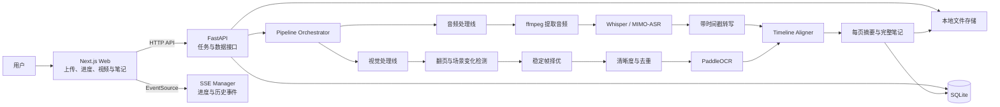
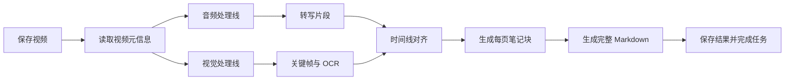

# SnapNote Web Demo 产品需求文档

> 版本：v1.0  
> 日期：2026-08-01  
> 产品名称：SnapNote  
> 产品形态：Web 应用 + 后端 AI 多模态处理服务  
> 文档范围：Web Demo，不包含微信小程序端  
> 基础项目参考：`D:\hsj\Github\Video2Knowledge`

---

## 1. 文档结论

SnapNote Web Demo 面向课堂、讲座、培训和 PPT 型会议场景。用户上传一段已有视频后，系统自动完成：

1. 从视频中提取音频并执行带时间戳的 ASR 转写。
2. 检测 PPT 翻页或关键画面变化，提取候选关键帧。
3. 对关键帧执行清晰度筛选、稳定帧择优、去重和 OCR。
4. 根据视频时间戳将关键画面与对应语音讲解片段对齐。
5. 基于关键画面、OCR 和语音转写生成按页组织的结构化 AI 笔记。
6. 在 Web 结果页中联动展示视频和图文笔记，并支持 Markdown 导出。

一句话产品闭环：

**上传视频 → 提取关键画面与音频 → OCR 与 ASR → 图文时间线对齐 → 生成带视频锚点的结构化笔记**

Web Demo 的核心目标不是覆盖任意复杂课堂视频，而是尽快验证以下价值：

> 用户是否愿意使用“关键画面 + 对应讲解 + 结构化总结”的笔记，替代手动截图、反复拖动视频和课后整理。

---

## 2. 产品定位

### 2.1 产品一句话

**SnapNote：自动把课堂和会议视频整理成带关键画面的结构化 AI 笔记。**

英文描述：

**SnapNote: Turn lecture videos into visual, timestamped AI notes.**

### 2.2 核心价值

传统视频学习需要用户在播放、暂停、截图和记录之间频繁切换。普通 ASR 产品只能提供连续转写文本，无法保留 PPT、图表、代码和公式等视觉上下文。

SnapNote 将视频中的“画面变化”和“语音讲解”自动绑定，使用户能够：

- 快速浏览视频结构，而不必完整重播。
- 知道每一页 PPT 对应讲了什么。
- 点击笔记中的画面或时间标签，跳转到视频原位置。
- 获得可阅读、可搜索、可复习和可导出的结构化笔记。

### 2.3 Demo 核心假设

Web Demo 需要验证：

1. 自动抽取的关键画面能否覆盖视频中的主要 PPT 页面。
2. 图片与语音的基础时间对齐是否足以形成可用笔记。
3. 按页组织的图文笔记是否明显优于纯 ASR 转写。
4. 用户是否会通过时间锚点返回视频复看重点。

---

## 3. 目标用户与使用场景

### 3.1 核心用户

1. 学生和研究生
   - 整理课程录屏、公开课和学术讲座。
   - 复习 PPT、公式、代码和老师补充讲解。

2. 职场学习者
   - 整理培训、产品分享、技术分享和行业会议视频。
   - 快速回顾会议主题和关键页面。

3. 内容整理者
   - 将课程或会议录像整理为文章、纪要或知识库素材。

### 3.2 MVP 优先场景

- PPT 录屏视频。
- 在线课程录制视频。
- 稳定机位拍摄、PPT 占据画面主要区域的课堂视频。
- 屏幕共享为主的会议录像。

### 3.3 暂不优先场景

- 镜头频繁移动的手持课堂视频。
- PPT 只占画面很小区域的视频。
- 以白板手写为主的视频。
- 多机位剪辑、频繁转场或画中画复杂布局的视频。
- 需要区分大量说话人的圆桌会议。

---

## 4. Demo 范围

### 4.1 必做范围

- Web 端本地视频上传。
- 支持 MP4、MOV、WebM 常见格式。
- 展示上传、处理和生成进度。
- 视频元信息解析与音频提取。
- Whisper 或 MIMO-ASR 转写。
- 带 `start_time` 和 `end_time` 的转写片段。
- PPT/关键画面候选检测。
- 候选帧清晰度筛选和稳定帧择优。
- pHash/直方图图片去重。
- OCR 文字识别。
- 基于时间窗口的图片与语音对齐。
- OCR 关键词辅助对齐。
- 按页生成讲解摘要和知识点。
- 生成完整 Markdown 图文笔记。
- 视频播放器与图文笔记联动。
- 点击时间锚点跳转视频。
- 历史任务列表和结果查看。
- Markdown 导出。
- 失败状态展示和整任务重试。

### 4.2 可选增强范围

- 用户手动删除误提取的关键帧。
- 用户手动合并重复页面。
- 用户修改页面标题。
- 单阶段重新执行 OCR、ASR 或笔记生成。
- TXT、JSON 导出。
- 图表、公式、代码截图的视觉摘要。

### 4.3 明确不做

- 微信小程序。
- 浏览器实时录制和实时抽帧。
- 直播流处理。
- 实时完整笔记生成。
- 自动透视矫正和复杂投影区域检测。
- 白板手写识别。
- 完整说话人分离。
- 多人协作编辑。
- 用户登录和多端同步。
- 支付、会员和配额系统。
- PDF、Word、长图导出。
- Redis、Celery、PostgreSQL 和对象存储。
- 移动端原生应用。

---

## 5. 输入与输出约束

### 5.1 输入约束

Demo 建议限制：

| 项目 | 建议限制 |
| --- | --- |
| 文件格式 | MP4、MOV、WebM |
| 视频时长 | 建议不超过 60 分钟 |
| 文件大小 | 建议不超过 2 GB |
| 视频内容 | 录屏或 PPT 占据主要画面 |
| 语言 | MVP 优先中文，兼容英文 |
| 音频 | 至少包含一路可识别语音 |

上传页需要明确提示：

> 为获得更好的关键帧效果，请优先上传录屏、在线课程或 PPT 画面稳定的视频。

### 5.2 输出内容

最终笔记至少包含：

- 视频标题。
- 视频时长和生成时间。
- 总体摘要。
- 章节目录。
- 按页面或关键画面组织的笔记块。
- 每个笔记块对应的关键画面。
- 每个笔记块对应的视频时间点。
- OCR 页面内容。
- 对应讲解摘要。
- 关键知识点。
- 待复习问题。
- 原始转写入口。
- Markdown 导出文件。

---

## 6. 用户流程

### 6.1 主流程

1. 用户打开 SnapNote Web Demo。
2. 用户拖拽或选择一个本地视频。
3. 用户选择 ASR 方案和笔记类型。
4. 用户点击“开始生成”。
5. 前端上传视频并创建处理任务。
6. 页面跳转至处理进度页。
7. 后端并行启动音频处理线和视觉处理线。
8. 两条处理线完成后执行图文时间对齐。
9. 系统生成每页摘要和完整笔记。
10. 页面自动进入结果详情页。
11. 用户浏览视频和图文笔记。
12. 用户点击图片或时间标签跳转视频位置。
13. 用户导出 Markdown 笔记。

### 6.2 异常流程

- 上传失败：保留已选择文件，允许重新上传。
- 视频解析失败：提示格式或编码不受支持。
- ASR 失败：显示失败阶段，允许重试整个任务。
- OCR 局部失败：保留图片并继续生成，不阻塞全部流程。
- 部分帧模糊：过滤或标记低质量帧。
- 未检测到明显翻页：启用低频兜底抽帧。
- LLM 失败：保留 ASR、关键帧和 OCR 阶段结果，允许重新生成笔记。
- 页面刷新：通过任务接口和 SSE 历史事件恢复进度。

---

## 7. 页面需求

### 7.1 上传首页 `/`

页面目标：

让用户理解产品能力，并在最少操作下开始一次视频笔记生成任务。

核心模块：

1. 产品标题与一句话说明。
2. 视频拖拽上传区域。
3. 文件格式、时长和适用场景提示。
4. ASR 选择：
   - MIMO-ASR。
   - Whisper。
5. 笔记类型：
   - 课堂笔记。
   - 会议笔记。
6. “开始生成”按钮。
7. 最近任务列表。

交互要求：

- 拖入不支持的格式时立即提示。
- 选择文件后显示文件名、大小和本地预览。
- 上传过程中显示上传百分比。
- 创建成功后自动跳转处理页。
- 防止用户重复提交同一任务。

### 7.2 处理进度页 `/tasks/[id]/processing`

页面目标：

清楚展示当前处理阶段，让长视频处理过程可理解、可恢复。

处理阶段：

1. 上传完成。
2. 解析视频。
3. 提取音频。
4. 语音转写。
5. 检测关键画面。
6. 图片筛选和去重。
7. OCR。
8. 图文时间对齐。
9. 生成每页摘要。
10. 生成完整笔记。
11. 处理完成。

页面元素：

- 总体进度条。
- 当前阶段名称。
- 当前阶段说明。
- 已运行时间。
- 已提取关键帧数量。
- 已完成转写时长或分片数量。
- 实时事件日志。
- 失败原因和重试按钮。
- 返回首页按钮。

### 7.3 结果详情页 `/tasks/[id]`

页面目标：

突出展示“这一张画面对应这一段讲解”的核心价值。

桌面端布局：

- 左侧：吸顶视频播放器。
- 右侧：按时间排列的图文笔记。
- 顶部：标题、摘要、导出和重新生成操作。

笔记块内容：

- 关键画面缩略图。
- 页面标题。
- 视频时间标签。
- 页面 OCR 文本，可折叠。
- 讲解摘要。
- 关键知识点。
- 待复习问题。
- 对齐置信度，可仅在调试模式展示。

联动要求：

- 点击时间标签时设置播放器 `currentTime`。
- 点击关键画面时跳转对应时间并播放。
- 视频播放时可高亮当前时间所属的笔记块。
- 当前笔记块进入视口时，不强制改变视频播放进度。

### 7.4 历史任务

MVP 可以作为首页下方列表，不必单独建立复杂资产页。

字段：

- 视频标题或文件名。
- 创建时间。
- 视频时长。
- 关键帧数量。
- 当前状态。
- 查看详情。
- 删除任务。

---

## 8. 技术架构

### 8.1 技术选型

| 层级 | 技术 | 用途 |
| --- | --- | --- |
| 前端 | Next.js 16 + React 19 + TypeScript | Web 页面和交互 |
| 样式 | Tailwind CSS 4 | 页面样式 |
| Markdown | react-markdown + remark-gfm | 笔记渲染 |
| 后端 | Python 3.10 + FastAPI + Uvicorn | API、任务生命周期、AI 流水线 |
| 进度 | SSE | 实时处理事件 |
| 视频 | ffmpeg + ffprobe | 音频提取、帧提取、视频元信息 |
| 帧分析 | OpenCV + PySceneDetect | 场景变化和关键帧检测 |
| 图片去重 | Pillow + ImageHash | pHash 去重 |
| OCR | PaddleOCR | 中英文文字识别 |
| ASR | faster-whisper / MIMO-ASR | 带时间戳语音转写 |
| LLM | DeepSeek，保留 Provider 接口 | 摘要、知识点、Markdown 生成 |
| ORM | SQLAlchemy async | 数据读写 |
| 数据库 | SQLite | 单机持久化 |
| 文件存储 | 本地文件系统 | 视频、音频、图片和导出文件 |

### 8.2 架构图



### 8.3 工程策略

SnapNote 仓库目前仅包含 PRD。Web Demo 建议迁移并复用 `Video2Knowledge` 的必要模块，而不是将另一个仓库作为运行时依赖。

优先复用：

- Next.js 上传和结果页面骨架。
- FastAPI 应用和 CORS 配置方式。
- 视频上传和 SourceAdapter。
- ffmpeg 音频标准化。
- Whisper/MIMO-ASR。
- SSE Manager 和事件历史。
- SQLAlchemy async + SQLite。
- Markdown 渲染和导出。
- DeepSeek LLM 调用方式。

新增模块：

- `frame_detector`：候选关键帧检测。
- `frame_selector`：翻页后稳定帧择优。
- `frame_quality`：清晰度、亮度和稳定性评分。
- `frame_deduplicator`：pHash 与直方图去重。
- `ocr_service`：PaddleOCR 封装。
- `timeline_aligner`：图片与转写对齐。
- `snapnote_generator`：按页笔记和完整笔记生成。

---

## 9. 后端处理流水线

### 9.1 总体流程



音频线和视觉线逻辑上并行。阻塞型 ffmpeg、OpenCV、Whisper 和 OCR 调用必须通过子进程、线程池或 `asyncio.to_thread` 执行，避免阻塞 FastAPI 事件循环。

如果本地 Whisper 与 OCR 同时运行造成 CPU 或内存竞争，可以通过配置切换为顺序执行。Demo 不要求强制物理并行。

### 9.2 任务状态

任务状态：

```text
queued
uploading
processing
completed
failed
cancelled
```

处理阶段：

```text
upload_complete
probing_video
extracting_audio
transcribing
detecting_frames
selecting_frames
deduplicating_frames
running_ocr
aligning
generating_blocks
generating_note
complete
step_error
```

每个阶段需要记录：

- 开始时间。
- 结束时间。
- 状态。
- 进度。
- 阶段摘要。
- 失败信息。
- 阶段产物路径或 JSON。

---

## 10. 关键帧算法方案

### 10.1 目标

关键帧流水线需要解决：

1. 尽可能覆盖 PPT 翻页。
2. 避免截到翻页动画或模糊画面。
3. 控制重复图片数量。
4. 为每张图片保留准确的视频时间戳。

### 10.2 候选帧检测

MVP 方案：

1. 将视频降采样为 1–2 fps。
2. 将分析帧缩放到宽度 320–640 像素。
3. 使用 PySceneDetect `AdaptiveDetector` 或 OpenCV HSV 直方图差异检测内容变化。
4. 当变化超过阈值时记录候选时间点。
5. 每隔 8–10 秒增加一个兜底候选点。
6. 候选点之间设置 2–3 秒最小间隔。

不采用纯固定间隔截图作为主策略。

### 10.3 稳定帧择优

翻页触发点附近可能包含动画、黑屏、过渡或运动模糊。

对于候选时间点 `T`：

```text
抽取 T+0.3、T+0.6、T+0.9、T+1.2 秒画面
→ 计算清晰度、亮度和运动稳定性
→ 选择综合质量最高的一张
```

候选帧最终时间戳使用实际选中图片的时间，而不是原始触发时间。

### 10.4 清晰度评分

使用灰度图拉普拉斯方差：

```text
sharpness_score = variance(Laplacian(gray_frame))
```

处理策略：

- 明显低于阈值：丢弃。
- 处于临界范围：保留并标记低质量。
- 同一候选窗口：选择分数最高的一张。

阈值不能写死，需要通过测试视频进行配置化调优。

### 10.5 去重

综合使用：

- pHash 汉明距离。
- HSV 直方图相似度。
- OCR 文本相似度。

初始规则建议：

```text
pHash 汉明距离 <= 8
且 HSV 相似度 >= 0.90
→ 判定为重复画面
```

对于逐步出现文字的 PPT 动画：

- 连续页面高度相似但 OCR 文本增加时，保留最后一个稳定版本。
- 如果中间版本对应明显不同讲解，可以保留两个版本。

### 10.6 OCR

只对完成筛选和去重的图片执行 OCR。

OCR 输出：

```json
{
  "frame_id": "uuid",
  "timestamp": 182.4,
  "slide_title": "多模态数据对齐",
  "ocr_text": "完整 OCR 文本",
  "keywords": ["时间窗口", "关键词匹配"],
  "confidence": 0.91
}
```

OCR 失败不能阻塞任务。失败图片仍然可以依靠时间戳进入对齐和笔记生成。

---

## 11. 语音处理方案

### 11.1 音频标准化

使用 ffmpeg 从视频中提取：

- WAV。
- 16kHz。
- Mono。

保留视频原始时长和音频起始偏移。如视频存在非零起始时间，需要统一转换为相对视频起点的秒数。

### 11.2 ASR

支持：

1. faster-whisper
   - 本地处理。
   - 无云端费用。
   - 根据设备自动选择 CPU/GPU。

2. MIMO-ASR
   - 云端处理。
   - 长音频分片并发。
   - 支持失败重试和进度心跳。

统一输出：

```json
{
  "start_time": 182.4,
  "end_time": 195.7,
  "text": "这一页主要介绍多模态数据对齐的三个步骤。"
}
```

### 11.3 分段

Demo 优先使用 ASR 原始时间片段，然后执行轻量合并：

- 相邻片段间隔小于 1 秒时可合并。
- 单片段目标时长约 10–30 秒。
- 过长片段按标点和静音点拆分。
- 不丢失原始时间戳。

---

## 12. 时间线对齐

### 12.1 基础规则

关键帧时间依次为 `T1、T2、T3...`：

- `[T1, T2)` 内的转写默认归属关键帧 1。
- `[T2, T3)` 内的转写默认归属关键帧 2。
- 第一张图片之前的转写进入开场内容。
- 最后一张图片之后的转写归属最后一页或结尾内容。

对于跨越边界的转写片段，根据与两个时间窗口的重叠时长决定归属；必要时复制到两个候选块，但生成笔记时避免重复表达。

### 12.2 增强规则

对齐分数：

```text
alignment_score =
  0.65 * time_window_score
  + 0.25 * ocr_transcript_similarity
  + 0.10 * slide_title_match_score
```

其中：

- `time_window_score`：转写片段和关键帧展示区间的重合程度。
- `ocr_transcript_similarity`：OCR 关键词与语音文本的相似度。
- `slide_title_match_score`：页面标题是否在讲解中出现。

MVP 不引入向量数据库。文本相似度优先使用：

- 中文字符 bigram Jaccard。
- RapidFuzz 模糊匹配。
- 页面标题和关键词精确匹配。

### 12.3 输出

```json
{
  "frame_id": "frame_001",
  "frame_timestamp": 182.4,
  "transcript_start": 182.4,
  "transcript_end": 248.9,
  "transcript_text": "对应讲解文本",
  "confidence": 0.88,
  "reasons": ["time_window", "ocr_keyword_match"]
}
```

---

## 13. AI 笔记生成

### 13.1 生成策略

采用两阶段生成，避免一次提交完整长视频转写。

第一阶段：逐页生成笔记块。

输入：

- 页面时间戳。
- 关键帧路径或 URL。
- 页面标题。
- OCR 文本。
- 对应语音转写。
- 对齐置信度。

输出：

```json
{
  "title": "多模态数据对齐",
  "summary": "本页介绍时间窗口和文本匹配相结合的对齐方法。",
  "key_points": [
    "先按时间窗口建立基础关系",
    "再使用 OCR 关键词提升准确度"
  ],
  "review_questions": [
    "为什么只使用时间戳可能产生错位？"
  ]
}
```

第二阶段：基于所有页面摘要生成完整笔记。

### 13.2 输出结构

```markdown
# 视频标题

## 总结

## 章节目录

## 00:03:02 多模态数据对齐

[跳转到视频](snapnote://seek?time=182.4)


### 页面内容

### 讲解摘要

### 关键知识点

### 待复习问题
```

### 13.3 模型策略

- MVP 复用已有 DeepSeek 文本模型。
- LLM Provider 必须封装为独立接口，避免业务代码绑定单一厂商。
- 第一版主要将 OCR 和转写文本发送给文本模型。
- 图表、公式和架构图的视觉理解作为增强能力，后续可接入视觉模型。
- 每页生成结果需要通过 Pydantic 结构校验。
- JSON 解析失败时自动重试一次，并在第二次失败后降级为纯文本摘要。

---

## 14. API 设计

### 14.1 创建并上传任务

`POST /api/snapnote/tasks`

表单字段：

- `video`：视频文件。
- `asr_provider`：`whisper` 或 `mimo`。
- `note_style`：`classroom` 或 `meeting`。

响应：

```json
{
  "task_id": "uuid",
  "status": "queued"
}
```

### 14.2 任务进度流

`GET /api/snapnote/tasks/{task_id}/stream`

SSE 事件示例：

```json
{
  "event": "running_ocr",
  "progress": 62,
  "message": "正在识别第 8/12 张关键画面"
}
```

### 14.3 获取任务详情

`GET /api/snapnote/tasks/{task_id}`

返回：

- 任务基本信息。
- 视频播放地址。
- 当前状态和进度。
- 关键帧列表。
- 转写片段。
- 对齐结果。
- 笔记块。
- 最终 Markdown。

### 14.4 获取关键帧

`GET /api/snapnote/tasks/{task_id}/frames`

`GET /api/snapnote/tasks/{task_id}/frames/{frame_id}`

### 14.5 重试任务

`POST /api/snapnote/tasks/{task_id}/retry`

MVP 默认从失败阶段重新开始；如果阶段恢复成本过高，可以先实现整条流水线重跑。

### 14.6 导出

`GET /api/snapnote/tasks/{task_id}/export/markdown`

可选增强：

- `/export/txt`
- `/export/json`

### 14.7 删除任务

`DELETE /api/snapnote/tasks/{task_id}`

删除任务时需要删除：

- 数据库记录。
- 原始上传视频。
- 标准化音频。
- 关键帧。
- 阶段结果。
- 导出文件。

---

## 15. 数据库设计

### 15.1 snap_tasks

| 字段 | 类型 | 说明 |
| --- | --- | --- |
| id | string | task_id |
| filename | string | 原始文件名 |
| video_path | string | 本地视频路径 |
| audio_path | string | 标准化音频路径 |
| duration | float | 视频时长，秒 |
| status | string | 任务状态 |
| current_stage | string | 当前阶段 |
| progress | int | 0–100 |
| asr_provider | string | whisper/mimo |
| note_style | string | classroom/meeting |
| error_message | text | 失败信息 |
| final_markdown | text | 最终笔记 |
| created_at | datetime | 创建时间 |
| updated_at | datetime | 更新时间 |

### 15.2 snap_frames

| 字段 | 类型 | 说明 |
| --- | --- | --- |
| id | string | frame_id |
| task_id | string | 关联任务 |
| timestamp | float | 视频时间点 |
| image_path | string | 图片路径 |
| trigger_type | string | scene_change/fallback |
| sharpness_score | float | 清晰度 |
| brightness_score | float | 亮度 |
| similarity_score | float | 与上一帧相似度 |
| phash | string | 感知哈希 |
| selected | bool | 是否进入最终笔记 |
| created_at | datetime | 创建时间 |

### 15.3 snap_ocr_results

| 字段 | 类型 | 说明 |
| --- | --- | --- |
| id | int | 自增 ID |
| frame_id | string | 关联图片 |
| slide_title | string | 页面标题 |
| ocr_text | text | OCR 全文 |
| keywords_json | text | 关键词 JSON |
| confidence | float | OCR 置信度 |
| created_at | datetime | 创建时间 |

### 15.4 snap_transcript_segments

| 字段 | 类型 | 说明 |
| --- | --- | --- |
| id | int | 自增 ID |
| task_id | string | 关联任务 |
| start_time | float | 开始时间 |
| end_time | float | 结束时间 |
| text | text | 转写文本 |
| created_at | datetime | 创建时间 |

### 15.5 snap_alignments

| 字段 | 类型 | 说明 |
| --- | --- | --- |
| id | int | 自增 ID |
| task_id | string | 关联任务 |
| frame_id | string | 关联图片 |
| transcript_start | float | 对齐开始时间 |
| transcript_end | float | 对齐结束时间 |
| transcript_text | text | 对应讲解 |
| confidence | float | 对齐置信度 |
| reason_json | text | 对齐依据 |

### 15.6 snap_note_blocks

| 字段 | 类型 | 说明 |
| --- | --- | --- |
| id | int | 自增 ID |
| task_id | string | 关联任务 |
| frame_id | string | 关联图片 |
| sort_order | int | 展示顺序 |
| title | string | 页面标题 |
| summary | text | 讲解摘要 |
| key_points_json | text | 关键知识点 |
| review_questions_json | text | 待复习问题 |
| created_at | datetime | 创建时间 |

### 15.7 snap_stage_results

| 字段 | 类型 | 说明 |
| --- | --- | --- |
| id | int | 自增 ID |
| task_id | string | 关联任务 |
| stage | string | 阶段名称 |
| status | string | running/completed/failed |
| result_json | text | 阶段结果 |
| error_message | text | 失败信息 |
| started_at | datetime | 开始时间 |
| completed_at | datetime | 完成时间 |

---

## 16. 推荐目录结构

```text
SnapNote/
├── backend/
│   ├── app/
│   │   ├── main.py
│   │   ├── config.py
│   │   ├── api/
│   │   │   └── snapnote.py
│   │   ├── models/
│   │   │   └── database.py
│   │   ├── schemas/
│   │   │   └── snapnote.py
│   │   ├── services/
│   │   │   ├── storage.py
│   │   │   └── llm_provider.py
│   │   └── pipeline/
│   │       ├── audio.py
│   │       ├── frame_detector.py
│   │       ├── frame_selector.py
│   │       ├── frame_quality.py
│   │       ├── frame_deduplicator.py
│   │       ├── ocr_service.py
│   │       ├── timeline_aligner.py
│   │       ├── note_generator.py
│   │       ├── orchestrator.py
│   │       └── sse_manager.py
│   ├── tests/
│   └── requirements.txt
├── frontend/
│   ├── src/
│   │   ├── app/
│   │   │   ├── page.tsx
│   │   │   └── tasks/[id]/
│   │   │       ├── page.tsx
│   │   │       └── processing/page.tsx
│   │   ├── components/
│   │   │   ├── VideoUploader.tsx
│   │   │   ├── ProcessingTimeline.tsx
│   │   │   ├── VideoNotePlayer.tsx
│   │   │   └── NoteBlock.tsx
│   │   └── lib/
│   │       └── api.ts
│   └── package.json
├── storage/
│   ├── videos/
│   ├── audio/
│   ├── frames/
│   ├── output/
│   └── app.db
├── snapnote.cmd
├── snapnote.ps1
└── README.md
```

---

## 17. 非功能需求

### 17.1 性能

- 上传过程必须显示真实上传进度。
- 处理页每 10 秒内至少收到一次进度或心跳事件。
- 30 分钟录屏视频目标在 3–10 分钟内完成，具体取决于 ASR 方案和硬件。
- 帧分析不得按原视频全帧率逐帧执行。
- OCR 只处理完成筛选和去重的图片。
- 页面加载时使用关键帧缩略图，避免直接加载全部原图。

### 17.2 稳定性

- 页面刷新后能够恢复任务状态。
- 单张图片 OCR 失败不能导致整任务失败。
- LLM 生成失败时保留前序阶段结果。
- 所有阶段异常需要记录可诊断错误。
- 未完成的任务不能被错误标记为成功。

### 17.3 安全与隐私

- 上传文件名需要清理，不能直接作为真实存储路径。
- 每个任务使用独立 UUID 目录。
- API 不允许通过路径参数读取任务目录之外的文件。
- 默认不公开分享视频和笔记。
- 删除任务时同步删除原始视频和中间产物。
- 日志不能记录 API Key、完整请求头或敏感转写内容。
- API Key 仅通过后端 `.env` 配置，不下发前端。

### 17.4 可维护性

- ASR、OCR 和 LLM 使用 Provider 接口封装。
- 阈值全部放入配置文件或环境变量。
- 阶段产物可追踪、可查看。
- API 返回使用 Pydantic Schema。
- 前端 API 地址通过环境变量配置，不能硬编码。

---

## 18. 配置项

建议配置：

```env
# Web/API
FRONTEND_ORIGIN=http://localhost:3002
API_BASE_URL=http://localhost:8001

# Storage
STORAGE_ROOT=./storage
MAX_UPLOAD_SIZE_MB=2048
MAX_VIDEO_DURATION_SECONDS=3600

# ASR
DEFAULT_ASR_PROVIDER=mimo
WHISPER_MODEL_SIZE=medium
WHISPER_LANGUAGE=zh
MIMO_API_KEY=

# LLM
DEEPSEEK_API_KEY=
DEEPSEEK_MODEL=

# Frame detection
FRAME_ANALYSIS_FPS=1.5
FRAME_MIN_INTERVAL_SECONDS=2.5
FRAME_FALLBACK_INTERVAL_SECONDS=10
FRAME_SCENE_THRESHOLD=30
FRAME_PHASH_MAX_DISTANCE=8
FRAME_HISTOGRAM_SIMILARITY=0.90
FRAME_SHARPNESS_THRESHOLD=80

# OCR
OCR_PROVIDER=paddleocr
OCR_LANGUAGE=ch
```

上述阈值均为初始值，需要通过真实视频调优，不能作为固定产品结论。

---

## 19. 验收标准

### 19.1 功能验收

- 用户能够上传一个受支持的视频文件。
- 系统能够创建任务并持续展示处理进度。
- 系统能够提取视频音频。
- 系统能够生成带时间戳的 ASR 转写。
- 系统能够自动提取关键画面。
- 系统能够过滤明显模糊和重复图片。
- 系统能够完成关键画面 OCR。
- 系统能够将图片与转写片段进行时间对齐。
- 系统能够生成按页组织的图文笔记。
- 用户能够在结果页播放原视频。
- 用户点击时间标签或关键画面后，视频能够跳转到对应位置。
- 用户能够查看历史任务。
- 用户能够导出 Markdown。
- 任务失败时能够看到失败原因并重试。

### 19.2 质量验收

以至少 5 个测试视频为基础：

| 指标 | Demo 目标 |
| --- | --- |
| 主要 PPT 页面覆盖率 | 85%+ |
| 明显重复页面过滤率 | 70%+ |
| 图片与讲解基本对应率 | 80%+ |
| OCR 可读页面成功率 | 85%+ |
| 任务成功率 | 90%+ |
| 30 分钟视频处理耗时 | 3–10 分钟 |

指标说明：

- “主要 PPT 页面”由人工标注测试集定义。
- 页面动画的中间状态不强制计为独立页面。
- 对齐正确指图片对应的讲解主题基本一致，不要求逐句精确。
- 性能目标需记录测试设备、ASR Provider 和网络条件。

### 19.3 Demo 成立标准

以下闭环全部完成即可认为 Web Demo 成立：

1. 用户上传一段 PPT 型视频。
2. 系统自动获取主要关键画面。
3. 系统生成带时间戳的语音转写。
4. 系统将图片和讲解片段绑定。
5. 系统生成按页面组织的 Markdown 笔记。
6. 用户能通过笔记跳转视频原位置。

---

## 20. 测试方案

### 20.1 测试视频集

至少准备：

1. 纯 PPT 录屏，翻页明确。
2. PPT 包含动画和逐行出现内容。
3. 在线课程，讲师头像 + PPT 画中画。
4. 稳定机位拍摄投影幕布。
5. 中英文混合的技术分享视频。

每个视频人工标注：

- 主要页面数量。
- 每页出现时间。
- 模糊或无效画面。
- 页面对应讲解区间。

### 20.2 后端测试

- 文件格式和大小校验。
- ffprobe 解析异常。
- 关键帧检测阈值。
- 清晰度评分。
- pHash 去重。
- OCR 空结果和异常降级。
- 跨边界转写片段对齐。
- LLM JSON 解析失败重试。
- SSE 断线重连和历史事件恢复。
- 删除任务时路径隔离。

### 20.3 前端测试

- 拖拽上传。
- 上传进度。
- 处理中刷新恢复。
- SSE 断线重连。
- 失败状态和重试。
- 视频时间跳转。
- 当前笔记块高亮。
- Markdown 图片和代码块渲染。

---

## 21. 开发里程碑

### 阶段 1：工程底座

目标：跑通 Web 上传、任务、SSE、ASR 和 Markdown 展示。

任务：

- 迁移 `Video2Knowledge` 必要前后端代码。
- 建立 SnapNote 数据模型和存储目录。
- 建立任务创建、进度和详情 API。
- 复用 ffmpeg 和 ASR。
- 完成上传页和处理页骨架。

### 阶段 2：视觉流水线

目标：从测试视频中获得可用关键画面。

任务：

- 接入 PySceneDetect/OpenCV。
- 实现候选时间点检测。
- 实现稳定帧择优。
- 实现清晰度和亮度评分。
- 实现 pHash/直方图去重。
- 保存关键帧和阶段结果。

### 阶段 3：OCR 与对齐

目标：让关键画面和语音片段建立稳定关系。

任务：

- 接入 PaddleOCR。
- 提取页面标题和关键词。
- 实现时间窗口对齐。
- 实现 OCR 关键词增强。
- 保存对齐置信度和原因。

### 阶段 4：笔记与结果页

目标：形成完整可演示闭环。

任务：

- 设计逐页摘要 Prompt。
- 生成结构化笔记块。
- 生成完整 Markdown。
- 完成视频与笔记联动结果页。
- 完成 Markdown 导出。
- 完成任务失败重试。

### 阶段 5：调优与验收

目标：使用真实测试集达到 Demo 指标。

任务：

- 标注 5 个以上测试视频。
- 调整场景变化、清晰度和去重阈值。
- 统计页面覆盖率和对齐正确率。
- 优化长视频性能和错误提示。
- 准备固定演示视频和演示脚本。

单开发者预估：5–7 个工作日完成首个可演示版本，算法调优时间取决于测试视频复杂度。

---

## 22. 风险与应对

| 风险 | 影响 | 应对 |
| --- | --- | --- |
| PPT 在画面中占比过小 | OCR 和翻页检测失败 | Demo 限定输入类型，后续增加屏幕区域检测 |
| PPT 动画频繁 | 重复帧过多 | 冷却时间、pHash、OCR 增量判断、保留最终稳定帧 |
| 镜头运动明显 | 产生大量误触发 | 使用 AdaptiveDetector、提高阈值、增加稳定性检测 |
| 翻页动画导致模糊 | OCR 质量差 | 触发后延迟多帧采样并择优 |
| ASR 时间戳较粗 | 图片与讲解错位 | 时间窗口为主，OCR 关键词增强，允许低置信度标记 |
| 本地 Whisper 过慢 | 用户等待时间长 | Demo 默认云端 ASR，本地模型作为回退 |
| PaddleOCR 依赖较重 | 环境安装复杂 | 锁定 Python 环境，封装 Provider，保留云端 OCR 替换能力 |
| CPU 同时跑 ASR 和 OCR | 资源竞争 | 可配置顺序执行或限制工作线程 |
| FastAPI 进程重启 | 进程内任务丢失 | Demo 记录阶段状态；正式版迁移独立任务队列 |
| LLM 输出结构不稳定 | 笔记生成失败 | Pydantic 校验、自动重试、纯文本降级 |
| 长视频文件过大 | 上传失败或磁盘占用高 | 文件大小限制、上传校验、任务删除和清理机制 |

---

## 23. 后续版本方向

### v0.2：结果可编辑

- 手动删除关键帧。
- 手动补充截图。
- 修改页面标题和摘要。
- 单阶段重新执行。

### v0.3：复杂视频增强

- PPT/投影区域自动检测。
- 透视矫正。
- 画中画布局识别。
- 图表、公式和架构图视觉理解。
- 更强的语义对齐。

### v0.4：在线采集

- 浏览器摄像头和麦克风录制。
- 浏览器屏幕共享录制。
- 录制过程低频关键帧采集。
- 断点上传。

### v1.0：产品化

- 微信小程序。
- 用户系统。
- 云端对象存储。
- PostgreSQL 和独立任务队列。
- 多端同步。
- PDF、Word 和长图导出。
- 分享、权限和隐私管理。

---

## 24. 最终实施建议

Web Demo 应坚持以下原则：

1. 先验证核心闭环，不解决所有视频类型。
2. 优先复用 `Video2Knowledge` 已有 ASR、SSE、数据库和前端能力。
3. 将新增工作集中在关键帧、OCR、时间对齐和结果页联动。
4. 第一版以 OCR + 转写文本驱动笔记生成，不强制接入视觉大模型。
5. 阈值和 Provider 全部配置化，为后续调优与替换保留空间。
6. 每个处理阶段必须保存结果，便于诊断和单阶段复用。

首个可交付版本的定义：

> 上传一个 PPT 型课堂视频后，用户能够获得一份按关键画面组织的图文笔记，并可从任意笔记块跳回视频对应时间。
