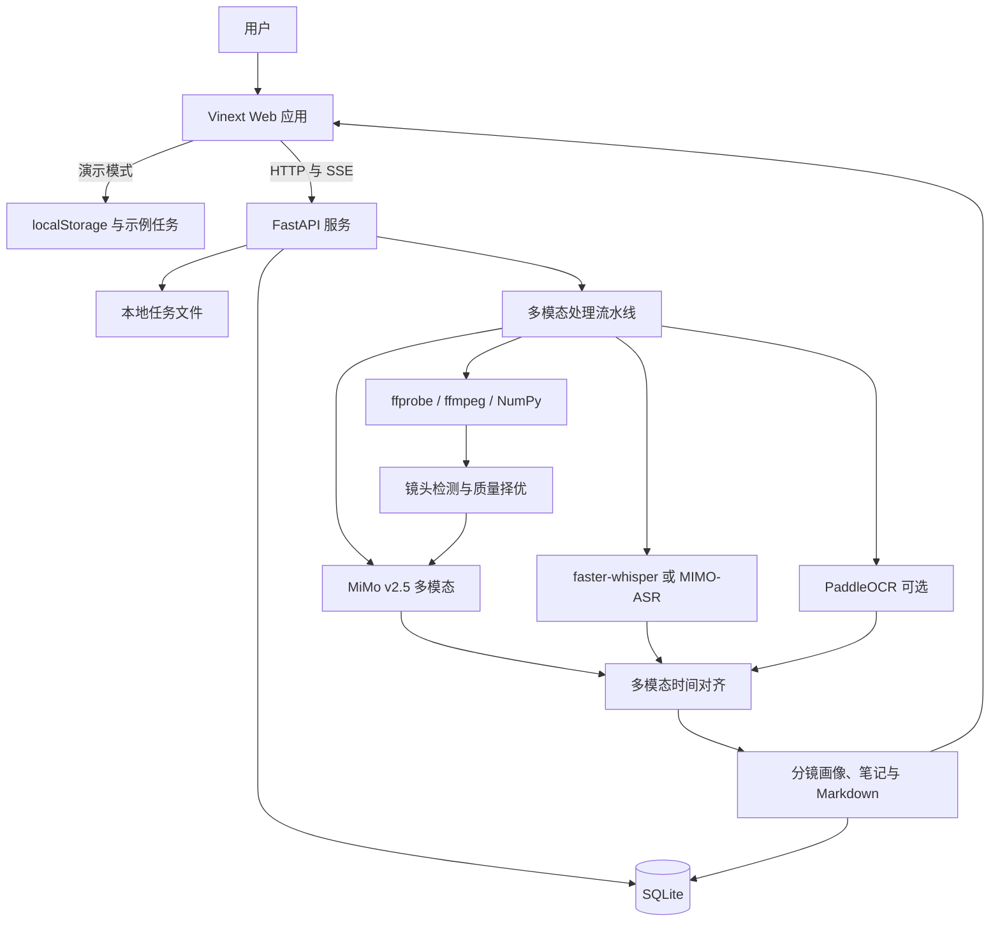
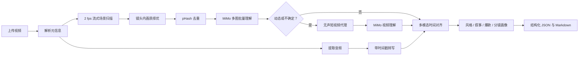
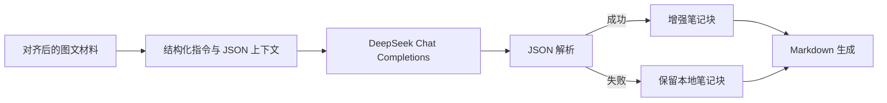

<div align="center">


# SnapNote

> 用低成本精确 ASR、本地智能抽帧和 MiMo v2.5，把长视频变成可检索笔记、视觉风格画像与分镜分析。

[](./LICENSE)
[](https://www.python.org/)
[](https://nodejs.org/)
[](https://fastapi.tiangolo.com/)
[](https://react.dev/)

[本地启动](#方式二windows-一键启动) · [产品 PRD](./PRD/SnapNote_PRD_v1.md) · [Web Demo PRD](./PRD/SnapNote_Web_Demo_PRD_v1.md) · [API 文档](#api-接口)

</div>

---

## 项目简介

视频通常包含两条同等重要的信息线：说了什么，以及画面如何表达。纯语音转写只能保留前者；把原始长视频直接交给视觉大模型又会产生不必要的 Token 和等待时间。

SnapNote 采用混合路线：本机 `faster-whisper` 负责低成本精确 ASR，本地算法完成镜头检测与关键帧质量择优，MiMo v2.5 只理解筛选后的多图和少量动态短片。结果把镜头、转写、视觉语义、内容风格和 storyboard 绑定到同一时间线，可用于课程/会议笔记，也可扩展到长视频批量分析、爆款素材风格学习和分镜研究。

> [!IMPORTANT]
> 项目当前以本地运行作为主要使用方式。原视频、ASR 权重和中间产物保存在本机；只有筛选后的关键帧、动态代理片段及其上下文会按配置发送给 MiMo。

---

## 核心能力

### 1. 关键画面与讲解自动绑定

后端使用 ffprobe 读取视频元信息，使用 ffmpeg 流式低分辨率解码；NumPy 检测场景变化并计算清晰度、亮度、对比度、稳定性和运动强度。每个镜头择优提取一张代表帧，再通过 pHash 去重并与相邻转写对齐。

### 2. 可回看的视频图文笔记

结果页采用吸顶播放器与时间线笔记布局。点击关键帧、章节目录或时间标签即可修改播放器时间；播放过程中，当前时间所属的笔记块会自动高亮。

### 3. 可解释的长任务进度

处理过程覆盖上传、解析、音频、ASR、镜头检测、质量择优、去重、OCR、MiMo 多图、动态代理、整片风格、对齐和结果生成。后端通过 SSE 推送事件并保留近期事件历史，前端刷新后仍可恢复任务状态。

### 4. 分层多模态 Provider 与确定性降级

ASR 可在本机 Whisper 与 MIMO-ASR 间选择；视觉统一使用 `mimo-v2.5`，并与 MIMO-ASR 复用同一 Token Plan Key。本地 OCR 与 DeepSeek 润色保持可选；视觉调用失败时默认保留本地镜头与转写结果，也可开启严格失败模式。

### 5. 双运行模式

- **浏览器演示模式**：不设置后端地址，任务、进度和示例笔记保存在 `localStorage`，便于不启动后端时体验界面。
- **真实处理模式**：设置 `NEXT_PUBLIC_API_BASE_URL`，前端改用 FastAPI、SQLite、本地文件与 SSE 处理真实视频。

### 6. Markdown 导出与历史任务

任务完成后可导出包含摘要、章节、时间锚点、关键画面、知识点和复习问题的 Markdown。SQLite 保存任务状态、阶段结果、转写、画面和笔记 JSON，首页提供历史任务入口。

---

## 效果展示

### 本地 Demo

双击 `start-snapnote.cmd`，然后访问 **http://127.0.0.1:43871**：

1. 拖入 MP4、MOV 或 WebM 视频；
2. 选择识别方案与笔记类型；
3. 查看 15 阶段处理时间线；
4. 在结果页体验视频跳转、章节导航、OCR 折叠和 Markdown 导出。

### 输入与输出

| 输入 | 输出 |
| --- | --- |
| 课程、会议、访谈、产品、剧情、短视频或屏幕录制 | 视频标题、时长与生成信息 |
| MP4 / MOV / WebM | 总体摘要与章节目录 |
| 中文优先，兼容 Whisper 支持的其他语言 | 按镜头组织的图文笔记与原始转写 |
| 建议 60 分钟以内 | 时间锚点、视觉语义、风格、爆款元素与 storyboard |
| 至少包含一路可识别音频 | 原始转写与 Markdown 文件 |

---

## 应用场景

- **学生与研究生**：整理课程录屏、公开课和学术讲座，复习老师对公式、代码和图表的补充说明。
- **职场学习者**：把培训、技术分享和行业会议转为可检索、可回看的结构化资料。
- **产品与项目团队**：从 PPT 会议中提取页面结论、讲解片段和后续复习问题。
- **内容整理者**：将长视频转换为文章、课程纪要或知识库素材的初稿。
- **内容创作者与研究者**：批量提取视频的开场钩子、构图、运镜、节奏、剪辑模式与逐镜头 storyboard。

当前版本不提供说话人分离，也不会把整条原视频逐秒上传给 MiMo；复杂动作只在动态/不确定镜头的短代理中补充分析。

---

## 安装部署

### 环境要求

| 工具 | 版本 / 要求 | 用途 |
| --- | --- | --- |
| Windows PowerShell | 5.1+ | 运行一键启动脚本 |
| Conda | Miniconda 或 Anaconda | 创建 Python 3.10 环境 |
| Python | 3.10+ | FastAPI 与处理流水线 |
| Node.js | 22.13+ | Vinext 前端构建与开发 |
| ffmpeg / ffprobe | 可从命令行调用，或配置绝对路径 | 视频解析、音频和关键帧提取 |

项目目前没有提供 Dockerfile 或 Compose 配置；Windows 一键脚本是已验证的首选启动方式。

### 方式一：让 AI 编码助手安装

将下面的提示词交给 Codex、Claude Code 或其他能够操作终端的编码助手：

```text
请帮我在 Windows 上安装并启动 SnapNote：
1. 克隆仓库：https://github.com/guyue356/SnapNote.git
2. 检查 Conda、Node.js 22.13+ 和 ffmpeg
3. 在仓库根目录运行 .\start.ps1
4. 如果需要真实 ASR，请按 README 配置 backend/.env
5. 验证 http://127.0.0.1:43871 和 http://127.0.0.1:43872/api/health
请保留现有配置，不要提交任何 API Key。
```

### 方式二：Windows 一键启动

克隆项目后，可以直接双击根目录的 `start-snapnote.cmd`。脚本会在后台启动前后端，确认服务正常后自动打开浏览器。需要关闭时双击 `stop-snapnote.cmd`。

也可以在 PowerShell 中运行：

```powershell
git clone https://github.com/guyue356/SnapNote.git
cd SnapNote
.\start.ps1
```

脚本会自动：

- 创建名为 `snapnote` 的 Python 3.10 Conda 环境；
- 安装前后端依赖；
- 从示例创建本地环境配置；
- 在 `http://127.0.0.1:43871` 启动 Web；
- 在 `http://127.0.0.1:43872` 启动 API；
- 将运行日志保存到 `.snapnote-logs`，并记录进程以便安全关闭。

关闭服务：

```powershell
.\stop.ps1
```

依赖已经安装时，可以减少检查步骤：

```powershell
.\start.ps1 -SkipInstall
```

### 方式三：手动安装

后端：

```powershell
conda create -n snapnote python=3.10 -y
conda activate snapnote
cd backend
pip install -r requirements.txt
Copy-Item .env.example .env
python -m uvicorn app.main:app --reload --host 127.0.0.1 --port 43872
```

前端需要在另一个终端中启动：

```powershell
cd frontend
npm.cmd install
Copy-Item .env.example .env.local
# 将 .env.local 中的地址设置为：
# NEXT_PUBLIC_API_BASE_URL=http://127.0.0.1:43872
npm.cmd run dev -- --host 127.0.0.1 --port 43871
```

如果只想体验界面，将 `NEXT_PUBLIC_API_BASE_URL` 留空即可进入浏览器演示模式。

---

## 快速开始

安装完成后打开 `http://127.0.0.1:43871`：

1. 上传一个 MP4、MOV 或 WebM 视频；
2. 选择识别方案和“课堂笔记 / 会议笔记”；
3. 点击“开始生成图文笔记”；
4. 等待任务完成后，从画面或时间标签跳回视频；
5. 点击“导出 Markdown”保存结果。

检查后端是否正常：

```powershell
Invoke-RestMethod http://127.0.0.1:43872/api/health
```

预期响应：

```json
{
  "status": "ok",
  "service": "snapnote"
}
```

---

## 使用说明

### 浏览器演示模式

当 `NEXT_PUBLIC_API_BASE_URL` 为空时，前端使用预置的 Transformer 课程与产品复盘示例。上传的文件仅用于当前浏览器预览；任务元信息保存在 `localStorage`，刷新后仍可看到任务，但浏览器重启后原视频对象地址可能失效。

### 真实处理模式

真实模式通过 XHR 上传文件并显示实际上传百分比。任务创建后，处理页订阅 `/stream` 的命名 SSE 事件；收到进度后重新获取任务详情。处理完成后自动进入结果页，并使用后端提供的视频、关键帧、转写和笔记内容。

### 上传限制

- 文件格式：`.mp4`、`.mov`、`.webm`
- 默认最大文件：2048 MB
- 默认最大处理时长：3600 秒
- 推荐内容：课程、会议、访谈、产品、剧情、短视频或屏幕录制

---

## 系统架构



| 模块 | 职责 |
| --- | --- |
| Vinext Web | 上传、任务列表、实时进度、播放器与笔记联动、导出入口 |
| FastAPI | 文件校验、任务 API、SSE、视频与 Markdown 文件响应 |
| Pipeline | 视频解析、ASR、镜头检测、关键帧择优、动态代理、MiMo 理解、对齐和结果生成 |
| SQLAlchemy async | 保存任务状态、阶段历史和最终产物索引 |
| 本地文件系统 | 按 UUID 隔离存储原视频、音频、关键帧和导出文件 |
| Provider 层 | Whisper / MIMO-ASR 双转写；MiMo v2.5 图片、视频与结构化输出复用同一 API Key |

---

## 核心工作流程



后端按以下阶段写入进度并发送 SSE：

| 阶段 | 默认进度 | 主要产物 |
| --- | ---: | --- |
| `upload_complete` | 3% | 原始视频与任务记录 |
| `probing_video` | 6% | 时长、分辨率、编码信息 |
| `extracting_audio` | 12% | 16kHz 单声道 WAV |
| `transcribing` | 28% | 带开始/结束时间的转写片段 |
| `detecting_frames` | 38% | 场景边界、运动与画质采样 |
| `selecting_frames` | 46% | 每个镜头的代表帧 |
| `deduplicating_frames` | 51% | pHash 去重后的关键帧 |
| `running_ocr` | 56% | 可选本地 OCR 文字 |
| `understanding_frames` | 68% | MiMo 多图视觉语义 |
| `understanding_clips` | 76% | 动态片段的动作、运镜和转场 |
| `analyzing_style` | 84% | 整片叙事、风格、爆款与分镜画像 |
| `aligning` | 89% | 镜头、视觉语义和转写对齐结果 |
| `generating_blocks` | 94% | 逐镜头结构化内容 |
| `generating_note` | 98% | 完整 Markdown 与分析 JSON |
| `complete` | 100% | 可浏览与导出的任务结果 |

---

## AI 工作流程

SnapNote 当前采用确定性的流水线编排，不是多 Agent 系统，也没有 RAG 或向量数据库。这样的设计减少了 Demo 阶段的基础设施依赖，让每个处理阶段都可以独立记录、诊断和降级。

### ASR

- 默认使用 `faster-whisper large-v3`，自动检测 CUDA；CUDA 使用 `int8_float16`，否则回退到 CPU `int8`。
- Whisper 显式复用当前用户的 Hugging Face 权重缓存；可通过 `WHISPER_CACHE_DIR` 指定已有缓存目录。
- Whisper 使用 VAD、词级时间戳和重复幻觉片段过滤，处理过程中持续发送分段进度。
- 选择 MIMO-ASR 后，系统把 WAV 转为 90 秒、32k 的 MP3 分片，最多并发 3 个请求，并提供请求级重试、心跳和可选串行 fallback。
- 两种 Provider 都返回统一的 `start`、`end`、`text` 分段结构。真实 ASR 不可用或返回空结果时任务会明确失败，不再生成演示转写。

### 本地镜头检测与关键帧

- ffmpeg 以默认 2 fps、320×320 灰度帧流式解码，不把整段视频载入内存，也不落盘全部采样帧。
- NumPy 同时计算直方图变化、像素运动、拉普拉斯清晰度、亮度、对比度与稳定性；场景突变或镜头过长都会建立新镜头。
- 每个镜头选择综合质量最高且避开转场瞬间的代表帧，再按全片时间桶控制覆盖度和 `FRAME_MAX_COUNT`，最后用 pHash 去重。

### MiMo v2.5 多模态理解

- 关键帧缩放到 736px 宽后按默认 8 张一批，以 Base64 多图输入调用 `mimo-v2.5`；同一请求附带镜头时间、局部画质指标和对应 ASR 文本。
- 输出使用 JSON 模式并校验每个 `frame_id`，得到主体、场景、动作、字幕、构图、运镜、光线、配色、风格标签、视觉钩子和置信度。
- 本地运动分数较高或模型判断静态帧信息不足时，系统生成最长 8 秒、无音轨、低码率的临时 MP4，以 2 fps 送入视频理解；调用结束立即清理代理文件。
- 最后再做一次文本级整片归纳，输出内容类型、受众、叙事结构、节奏、视觉/剪辑风格、爆款元素、逐镜头 storyboard 和改进建议，持久化在 `visual_analysis_json`。
- `ENABLE_MIMO_VISION=1` 但调用失败时默认保留本地结果；设置 `MIMO_VISION_REQUIRED=1` 可改为严格失败，避免批量分析静默降级。

### OCR

安装 PaddleOCR 后，流水线会按关键帧提取中英文页面文字。OCR 属于可选增强：导入失败或单帧识别异常不会中断整个任务，笔记仍可由时间窗口与转写生成。

### LLM 结构化增强

配置 `DEEPSEEK_API_KEY` 后，系统将已对齐的笔记块注入请求，要求模型输出 JSON，并保留 `id`、时间、图片、OCR 和置信度字段。模型负责改写标题、摘要、知识点和复习问题；调用失败时直接保留本地规则生成的块。



### 当前算法边界

动态片段只覆盖本地运动较强或 MiMo 标记为需要时序上下文的镜头，以此控制 Token 与耗时；因此它不是对原视频逐秒进行云端完整视频理解。当前任务仍在 FastAPI 进程内执行，批量生产环境应进一步迁移到独立任务队列。

---

## 技术栈

| 层级 | 技术 | 用途 | 选型理由 |
| --- | --- | --- | --- |
| 前端 | Vinext 0.0.50、React 19、TypeScript 5.9 | App Router 页面与交互 | 保留 Next 风格开发体验并输出 Cloudflare Worker 兼容构建 |
| 样式 | Tailwind CSS 4 + 项目级 CSS | 响应式视觉系统 | 轻量、可维护，适合快速构建产品 Demo |
| 后端 | FastAPI、Uvicorn | 异步 API 与自动文档 | 上传、SSE 和文件响应实现直接 |
| ORM | SQLAlchemy 2 async、aiosqlite | 任务与阶段结果持久化 | 单机 Demo 无需独立数据库服务 |
| 实时通信 | SSE / `sse-starlette` | 处理阶段与心跳推送 | 单向进度流比 WebSocket 更简单 |
| 媒体处理 | ffmpeg、ffprobe | 元信息、音频与关键帧 | 格式支持成熟，命令行集成稳定 |
| ASR | faster-whisper / MIMO-ASR | 带时间戳语音识别 | 本机权重低成本主路径，云端可选 |
| 视觉算法 | ffmpeg、NumPy、Pillow、ImageHash | 流式场景检测、质量评分与去重 | 无需保存全量采样帧，不限定 PPT 场景 |
| 视觉模型 | MiMo v2.5 | 多图、短视频、整片风格与分镜理解 | 原生多模态、结构化输出、同一 Token Plan Key |
| LLM | DeepSeek Chat Completions 可选 | 末端笔记文字润色 | 不参与核心视觉事实提取 |
| 部署 | Cloudflare Workers / Sites | 公开前端演示 | Worker 兼容 ESM 与边缘分发 |

---

## API 接口

启动后可访问 `http://127.0.0.1:43872/docs` 查看 OpenAPI 文档。

| 方法 | 路径 | 说明 |
| --- | --- | --- |
| `GET` | `/api/health` | 服务健康检查 |
| `POST` | `/api/snapnote/tasks` | 上传视频并创建后台任务 |
| `GET` | `/api/snapnote/tasks` | 获取历史任务 |
| `GET` | `/api/snapnote/tasks/{task_id}` | 获取任务、画面、转写和笔记详情 |
| `GET` | `/api/snapnote/tasks/{task_id}/stream` | 订阅 SSE 进度和心跳 |
| `POST` | `/api/snapnote/tasks/{task_id}/retry` | 清理阶段产物并重试 |
| `GET` | `/api/snapnote/tasks/{task_id}/export/markdown` | 下载 Markdown |
| `GET` | `/api/snapnote/tasks/{task_id}/video` | 获取原视频 |
| `DELETE` | `/api/snapnote/tasks/{task_id}` | 删除数据库记录和任务目录 |

上传示例：

```bash
curl -X POST "http://127.0.0.1:43872/api/snapnote/tasks" \
  -F "video=@lecture.mp4" \
  -F "asr_provider=whisper" \
  -F "note_style=classroom"
```

响应示例：

```json
{
  "task_id": "b93346f8-1ad6-4450-827b-4e977ca3ad37",
  "status": "queued"
}
```

---

## 数据模型

### `snap_tasks`

| 字段组 | 字段 | 说明 |
| --- | --- | --- |
| 标识与文件 | `id`、`filename`、`video_path`、`audio_path` | UUID 任务与本地文件位置 |
| 状态 | `status`、`current_stage`、`progress`、`error_message` | 生命周期、阶段和错误信息 |
| 参数 | `asr_provider`、`note_style` | 识别方案与笔记类型 |
| 产物 | `frames_json`、`transcripts_json`、`notes_json`、`visual_analysis_json`、`final_markdown` | 关键帧、转写、逐镜头块、整片视觉画像与 Markdown |
| 时间 | `created_at`、`updated_at` | UTC 创建与更新时间 |

### `snap_stage_results`

记录每个阶段的名称、状态、JSON 结果、错误信息、开始时间与完成时间，便于诊断和后续实现单阶段重试。

---

## 项目结构

```text
SnapNote/
├── backend/
│   ├── app/
│   │   ├── main.py             # FastAPI 路由、上传、SSE、导出与删除
│   │   ├── pipeline.py         # 媒体、ASR、OCR、对齐与笔记流水线
│   │   ├── asr.py              # Whisper/MIMO-ASR Provider、分片、重试与进度
│   │   ├── vision.py           # 流式镜头检测、质量评分、关键帧与动态代理
│   │   ├── mimo_vision.py      # MiMo 多图、短视频和整片结构化分析
│   │   ├── database.py         # SQLAlchemy 异步模型与数据库初始化
│   │   ├── config.py           # 环境变量、存储和 ffmpeg 探测
│   │   ├── schemas.py          # API 请求与响应 Schema
│   │   └── sse_manager.py      # 订阅者队列与近期事件历史
│   ├── tests/                   # ASR、镜头算法与 MiMo 结构化输出测试
│   ├── .env.example            # 后端配置模板
│   └── requirements.txt        # Python 依赖
├── frontend/
│   ├── app/
│   │   ├── page.tsx            # 上传首页与最近任务
│   │   ├── tasks/[id]/page.tsx # 视频与图文笔记结果页
│   │   ├── tasks/[id]/processing/page.tsx
│   │   │                         # 处理时间线与实时事件
│   │   ├── components/          # 品牌导航与画面预览组件
│   │   └── lib/                 # 后端客户端与本地演示数据
│   ├── worker/                  # Vinext 本地 Worker 运行入口
│   ├── public/                  # 图标与 Open Graph 资源
│   └── tests/                   # Worker 服务端渲染与产品文案测试
├── docs/images/                 # README 主视觉
├── PRD/
│   ├── SnapNote_PRD_v1.md       # 产品需求文档
│   └── SnapNote_Web_Demo_PRD_v1.md
│                                 # Web Demo 产品需求文档
├── storage/                     # SQLite 与任务文件，运行时生成且不提交
├── start-snapnote.cmd           # Windows 双击启动
├── stop-snapnote.cmd            # Windows 双击关闭
├── start.ps1                    # 一键启动核心脚本
├── stop.ps1                     # 按记录安全关闭前后端
└── README.md
```

---

## 配置说明

### 后端 `backend/.env`

| 配置项 | 必需 | 默认值 | 说明 |
| --- | --- | --- | --- |
| `FRONTEND_ORIGIN` | 否 | `http://127.0.0.1:43871` | 允许跨域访问的前端地址 |
| `STORAGE_ROOT` | 否 | 项目内 `storage` | 数据库和任务目录 |
| `DATABASE_URL` | 否 | SQLite async URL | 可覆盖数据库连接 |
| `MAX_UPLOAD_SIZE_MB` | 否 | `2048` | 上传大小上限 |
| `MAX_VIDEO_DURATION_SECONDS` | 否 | `3600` | 最大处理时长 |
| `DEFAULT_ASR_PROVIDER` | 否 | `whisper` | 未指定时使用的 ASR Provider |
| `ENABLE_LOCAL_WHISPER` | 否 | `1` | 是否启用本地 Whisper |
| `WHISPER_MODEL_SIZE` | 否 | `large-v3` | faster-whisper 模型规格 |
| `WHISPER_LANGUAGE` | 否 | `zh` | 识别语言；留空可自动检测 |
| `WHISPER_DEVICE` | 否 | 自动检测 | 可显式设置 `cpu` 或 `cuda` |
| `WHISPER_COMPUTE_TYPE` | 否 | 自动选择 | CPU 默认 `int8`，CUDA 默认 `int8_float16` |
| `WHISPER_CACHE_DIR` | 否 | 当前用户的 Hugging Face Hub 缓存 | 复用已下载的 Whisper 权重 |
| `MIMO_API_KEY` | 使用 MIMO 时 | 空 | MIMO-ASR 与 MiMo 视觉共用的 API Key |
| `MIMO_BASE_URL` | 否 | 根据 Key 自动选择 | `tp-` Key 默认使用 Token Plan 地址 |
| `MIMO_ASR_MODEL` | 否 | `mimo-v2.5-asr` | MIMO-ASR 模型名 |
| `MIMO_ASR_LANGUAGE` | 否 | `zh` | MIMO-ASR 识别语言 |
| `MIMO_ASR_CHUNK_SECONDS` | 否 | `90` | MP3 分片目标时长 |
| `MIMO_ASR_MP3_BITRATE` | 否 | `32k` | 分片码率 |
| `MIMO_ASR_CONCURRENCY` | 否 | `3` | 最大并发请求数 |
| `MIMO_ASR_TIMEOUT_SECONDS` | 否 | `90` | 单次请求超时 |
| `MIMO_ASR_MAX_ATTEMPTS` | 否 | `2` | 临时错误最大请求次数 |
| `MIMO_ASR_HEARTBEAT_SECONDS` | 否 | `10` | 等待响应时的进度心跳间隔 |
| `MIMO_ASR_FALLBACK_RETRY` | 否 | `0` | 并发临时失败后是否串行重试 |
| `ENABLE_MIMO_VISION` | 否 | `1` | 启用 MiMo v2.5 关键帧、动态片段和整片分析 |
| `MIMO_VISION_REQUIRED` | 否 | `0` | 视觉 API 失败时是否让任务严格失败 |
| `MIMO_VISION_MODEL` | 否 | `mimo-v2.5` | 图片与视频理解模型名 |
| `MIMO_VISION_IMAGE_BATCH_SIZE` | 否 | `8` | 每次多图请求的关键帧数量 |
| `MIMO_VISION_CONCURRENCY` | 否 | `2` | 多图批次最大并发数 |
| `MIMO_VISION_TIMEOUT_SECONDS` | 否 | `180` | 单次视觉请求超时 |
| `MIMO_VISION_MAX_ATTEMPTS` | 否 | `3` | 视觉请求最大尝试次数 |
| `MIMO_VISION_MAX_CLIPS` | 否 | `4` | 单视频最多补充分析的动态短片数 |
| `MIMO_VISION_CLIP_SECONDS` | 否 | `8` | 每个动态代理片段最长秒数 |
| `MIMO_VISION_VIDEO_FPS` | 否 | `2` | MiMo 对代理视频的采样帧率 |
| `DEEPSEEK_API_KEY` | 否 | 空 | 配置后启用 LLM 笔记增强 |
| `DEEPSEEK_MODEL` | 否 | `deepseek-chat` | DeepSeek 模型名 |
| `DEEPSEEK_BASE_URL` | 否 | `https://api.deepseek.com/v1` | OpenAI 兼容接口地址 |
| `FRAME_FALLBACK_INTERVAL_SECONDS` | 否 | `60` | 兜底抽帧间隔 |
| `FRAME_MAX_COUNT` | 否 | `24` | 单任务最大关键帧数 |
| `FRAME_ANALYSIS_FPS` | 否 | `2` | 本地场景扫描帧率 |
| `FRAME_ANALYSIS_WIDTH` | 否 | `320` | 本地低分辨率分析宽度 |
| `FRAME_OUTPUT_WIDTH` | 否 | `736` | 关键帧与代理视频输出宽度 |
| `SCENE_CHANGE_THRESHOLD` | 否 | `0.24` | 场景变化判定阈值 |
| `SCENE_MIN_DURATION_SECONDS` | 否 | `1.5` | 镜头最短持续时间 |
| `SCENE_MAX_DURATION_SECONDS` | 否 | `45` | 静态长镜头强制分段时间 |
| `FRAME_DYNAMIC_THRESHOLD` | 否 | `0.12` | 触发动态代理候选的运动阈值 |
| `FRAME_PHASH_THRESHOLD` | 否 | `6` | 关键帧感知哈希去重阈值 |
| `FFMPEG_BIN` / `FFPROBE_BIN` | 否 | 自动查找 | 媒体工具绝对路径 |

### 前端 `frontend/.env.local`

| 配置项 | 必需 | 默认值 | 说明 |
| --- | --- | --- | --- |
| `NEXT_PUBLIC_API_BASE_URL` | 否 | 空 | 空值使用浏览器演示模式；真实模式填写 `http://127.0.0.1:43872` |

> [!CAUTION]
> API Key 只应保存在 `backend/.env`，不要提交到 Git，也不要写入任何 `NEXT_PUBLIC_*` 变量。

---

## 性能与扩展性

- **主要瓶颈**：本地 Whisper、场景扫描解码、PaddleOCR 与 MiMo 请求会消耗 GPU/CPU、网络和 Token。
- **当前并发模型**：任务通过 FastAPI `BackgroundTasks` 在应用进程内执行，适合单机 Demo，不适合高并发生产环境。
- **视觉成本控制**：本地低分辨率扫描免费；只上传最多 24 张 736px 关键帧，并仅给最多 4 个动态/不确定镜头补充无声短视频。
- **可扩展方向**：将任务编排迁移到独立队列，将 SQLite 升级为 PostgreSQL，将文件迁移到对象存储，并为 ASR/OCR 设置独立工作池。
- **前端性能**：结果页优先加载关键帧缩略图；在线演示构建为 Cloudflare Worker 兼容 ESM。

---

## 安全设计

- 上传文件名经过 `Path.name` 与字符白名单清理，不直接作为目录路径。
- 每个任务使用独立 UUID 目录，删除时校验解析后的目标必须位于任务根目录下。
- 文件大小在流式写入过程中累计校验，超限时删除已创建的任务目录。
- API Key 只从后端环境变量读取，不返回给浏览器。
- CORS 默认仅允许本地前端地址；部署真实后端时应改为实际可信域名。
- 当前 Demo 没有用户登录和任务级权限隔离，不应直接作为多租户公开文件服务。

---

## 验证与测试

前端检查：

```powershell
cd frontend
npm.cmd run lint
npm.cmd test
```

`npm test` 会先完成 Vinext 生产构建，再验证首页服务端渲染、产品文案和 Open Graph 元数据。

后端检查：

```powershell
cd backend
conda run -n snapnote python -m compileall -q app
conda run -n snapnote python -c "from app.main import app; print(app.title)"
conda run -n snapnote python -m unittest discover -s tests -v
```

---

## 项目亮点

1. **产品创新**：以“关键画面 + 对应讲解 + 时间锚点”为核心信息单元，而不是把视频简单转换为长转写文本。
2. **混合成本路线**：本地精确 ASR 与场景算法负责高频工作，MiMo 只处理筛选后的信息密集素材。
3. **非 PPT 限定的视觉画像**：真实识别人物、动作、运镜、构图、剪辑节奏、爆款元素与 storyboard。
4. **双模式交付**：同一套前端既可作为无需服务端的产品 Demo，也能连接本地多模态后端处理真实视频。
5. **边缘友好前端**：Vinext 输出 Cloudflare Worker 兼容构建，同时保留 React App Router 的开发方式。

---

## Roadmap

- [x] 视频拖拽上传、进度与历史任务
- [x] ffprobe 元信息和 ffmpeg 音频/关键帧提取
- [x] faster-whisper large-v3 与 MIMO-ASR 双转写通道
- [x] MIMO-ASR MP3 分片、并发、重试和进度心跳
- [x] 流式自适应场景变化检测与镜头内关键帧质量择优
- [x] MiMo v2.5 多图批量理解与结构化 JSON 校验
- [x] 动态/不确定镜头的无声短视频代理与视频理解
- [x] 整片风格、叙事结构、爆款元素与 storyboard 画像
- [x] 可选 PaddleOCR 与 DeepSeek 增强
- [x] pHash 去重、时间窗口对齐和 Markdown 导出
- [x] 视频播放器、章节与笔记时间锚点联动
- [x] 公开在线前端演示
- [ ] 支持单帧删除、重复页面合并和标题编辑
- [ ] 支持单阶段 OCR / ASR / 笔记重新执行
- [ ] 引入独立任务队列、对象存储和 PostgreSQL
- [ ] 增加用户系统、任务权限与分享控制

---

## 贡献指南

欢迎通过 Issue 和 Pull Request 改进 SnapNote。

1. Fork 本仓库并从 `main` 创建分支；
2. 分支建议使用 `feature/xxx`、`fix/xxx` 或 `docs/xxx`；
3. 提交信息遵循 Conventional Commits，例如 `feat: add scene detector`；
4. 前端改动请运行 `npm.cmd run lint` 与 `npm.cmd test`；
5. 后端改动至少执行模块导入与相关 API 检查；
6. PR 中说明测试视频类型、环境、预期结果及兼容性影响。

涉及抽帧、去重或对齐算法时，建议附上人工标注的页面时间点与前后对比，避免只针对单个样例调参。

---

## FAQ

### 为什么在线 Demo 上传后没有真正调用 Whisper？

公开站点默认是浏览器演示模式，目的是无需上传服务即可体验完整产品交互。请按安装章节启动本地后端，并配置 `NEXT_PUBLIC_API_BASE_URL=http://127.0.0.1:43872`。

### 为什么 Whisper 任务启动后提示模型不可用？

确认已重新执行 `pip install -r backend/requirements.txt`，并保持 `ENABLE_LOCAL_WHISPER=1`。首次运行 `large-v3` 还需要下载模型文件；也可以通过 `WHISPER_DEVICE=cpu` 强制使用 CPU。

### 选择 MIMO-ASR 会调用 MIMO 服务吗？

会。后端会读取 `MIMO_API_KEY`，将音频压缩分片后调用 `mimo-v2.5-asr`。缺少 Key、请求失败或返回空转写时，任务会进入失败状态并显示具体原因。

### PaddleOCR 安装失败会导致任务失败吗？

不会。OCR 是可选阶段；无法导入或识别失败时会保留关键帧，并继续使用转写和时间窗口生成笔记。

### ffmpeg 不在 PATH 中怎么办？

在 `backend/.env` 中填写 `FFMPEG_BIN` 和 `FFPROBE_BIN` 的绝对路径。代码也会尝试查找项目相邻目录中的 `ffmpeg/bin/*.exe`。

### 任务文件保存在哪里？

默认位于仓库根目录的 `storage/tasks/{task_id}`，SQLite 位于 `storage/app.db`。这些运行时文件已被 `.gitignore` 排除。

---

## License

本项目基于 [Apache License 2.0](./LICENSE) 开源。你可以使用、复制、修改、合并、发布和分发本项目，但需要保留原始版权与许可声明，并在你的项目中注明原作者和来源。

**署名要求**：如果你使用或修改本项目，请在你的 README 或文档中注明：
> 本项目基于 [SnapNote](https://github.com/guyue356/SnapNote) 开发，原作者 guyue356，采用 [Apache License 2.0](http://www.apache.org/licenses/LICENSE-2.0) 许可。

详细署名要求请参见 [NOTICE](./NOTICE) 文件。

---

<div align="center">

如果 SnapNote 对你有帮助，欢迎提交 Issue、贡献代码或为项目点亮 Star。

</div>
