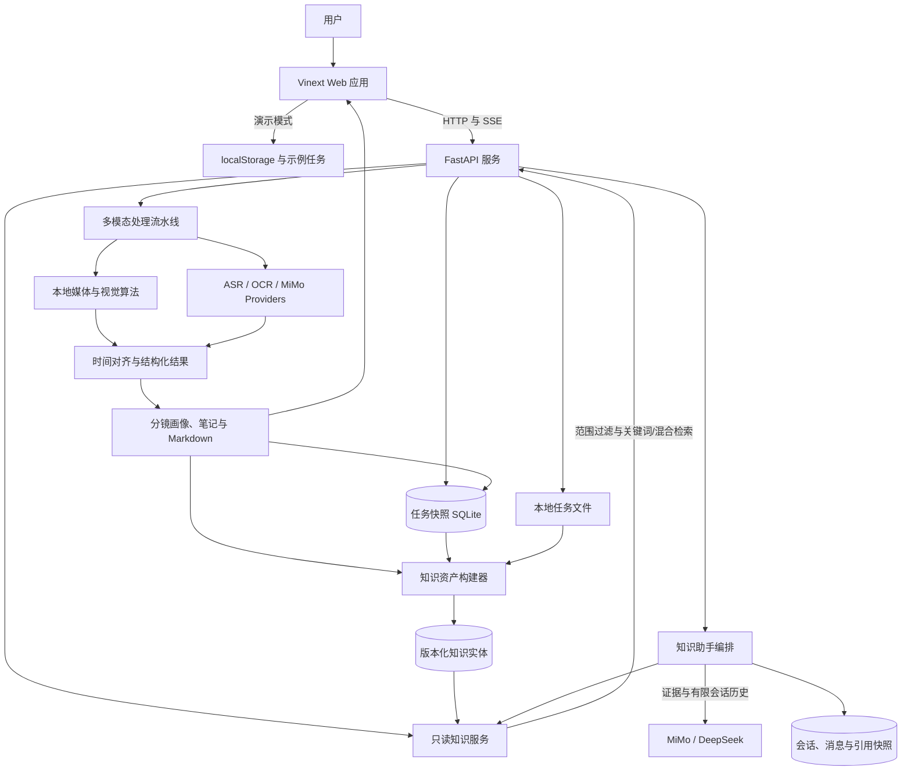
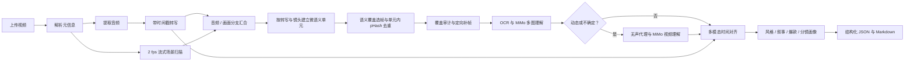
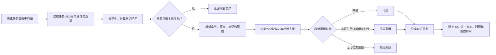
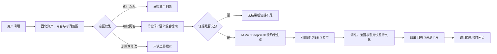
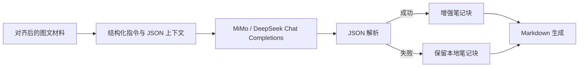
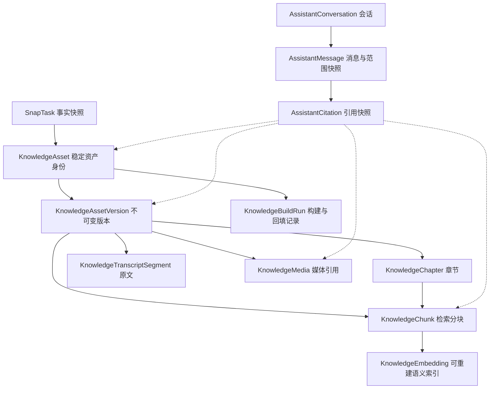

https://github.com/user-attachments/assets/fc575fcf-7d6e-4e3b-b2ed-a765126b5be3
<div align="center">


# SnapNote

> 把长视频转成可回看、可检索、可引用的本地知识资产。

[](./LICENSE)
[](https://www.python.org/)
[](https://nodejs.org/)
[](https://fastapi.tiangolo.com/)
[](https://react.dev/)

[本地启动](#方式二windows-统一控制台) · [知识助手](#知识助手与可追溯问答) · [知识助手 PRD](./PRD/PRD-MVP-002-SnapNote-知识助手MVP开发方案.md) · [API 文档](#api-接口)

</div>

---

## 项目简介

视频通常包含两条同等重要的信息线：说了什么，以及画面如何表达。纯语音转写只能保留前者；把原始长视频直接交给视觉大模型又会产生不必要的 Token 和等待时间。

SnapNote 采用混合路线：可在本机 `faster-whisper` 与 MIMO-ASR 之间选择转写通道，本地算法完成镜头检测与关键帧质量择优，MiMo v2.5 只理解筛选后的多图和少量动态短片。结果把镜头、转写、视觉语义、内容风格和 storyboard 绑定到同一时间线，可用于课程/会议笔记，也可扩展到长视频批量分析、爆款素材风格学习和分镜研究。

任务完成后，系统还会把原有 JSON 快照派生为版本化知识资产：资产、章节、原文片段、检索分块和媒体引用都拥有稳定标识与来源关系。内置知识助手在用户选定的视频、内容类型和时间范围内先检索证据，再调用 MiMo 或 DeepSeek 生成带编号引用的回答；每条引用都能回到对应章节、关键帧和原视频时间点。历史任务也能在不重新调用 ASR、OCR 或大模型的情况下幂等回填。

> [!IMPORTANT]
> 项目当前以本地运行作为主要使用方式。原视频、ASR 权重、中间产物和知识库保存在本机；启用云端模型时，筛选后的关键帧、动态代理片段及其上下文会发送给 MiMo，知识助手的问题、有限会话历史和检索证据会发送给所选的 MiMo 或 DeepSeek Provider。

---

## 核心能力

### 1. 关键画面与讲解自动绑定

后端使用 ffprobe 读取视频元信息，使用 ffmpeg 流式低分辨率解码；NumPy 检测场景变化并计算清晰度、亮度、对比度、稳定性和运动强度。每个镜头择优提取一张代表帧，再通过 pHash 去重并与相邻转写对齐。

### 2. 可回看的视频图文笔记

结果页采用吸顶播放器与时间线笔记布局。点击关键帧、章节目录或时间标签即可修改播放器时间；播放过程中，当前时间所属的笔记块会自动高亮。

### 3. 可解释的长任务进度

处理过程覆盖上传、解析、音频、ASR、镜头检测、质量择优、去重、OCR、MiMo 多图、动态代理、整片风格、对齐和结果生成。后端通过 SSE 推送事件并保留近期事件历史，前端刷新后仍可恢复任务状态。

### 4. 分层多模态 Provider 与确定性降级

ASR 可在本机 Whisper 与 MIMO-ASR 间选择；视觉统一使用 `mimo-v2.5`，并与 MIMO-ASR 复用同一 Token Plan Key。本地 OCR 与 DeepSeek 润色保持可选；视觉调用失败时默认保留本地镜头与转写结果，也可开启严格失败模式。

### 5. 双运行模式

- **浏览器演示模式**：不设置后端地址，任务、进度和示例笔记保存在 `localStorage`，便于不启动后端时体验界面。
- **真实处理模式**：设置 `NEXT_PUBLIC_API_BASE_URL`，前端改用 FastAPI、SQLite、本地文件与 SSE 处理真实视频。

### 6. 版本化知识资产与可引用检索

完成任务会自动派生 `KnowledgeAsset`，并按来源哈希、Schema 版本和 Builder 版本管理不可变版本。系统提供资产、章节、原文和关键帧只读接口，以及中文关键词检索；安装并启用可选 Embedding 后还支持混合语义检索。每条命中都返回稳定分块 ID、来源版本、时间范围和受控媒体引用。

构建失败不会改变原视频任务的完成状态。历史数据支持 `dry-run`、正式执行、失败重试和强制重建；相同来源重复执行会直接跳过，不产生重复实体。

### 7. 本地知识助手与证据回跳

知识助手支持跨视频资产查询、连续问答和只读知识定位。每个会话可限定资产、内容类型与更新时间；回答中的 `[1]`、`[2]` 引用会展开为原文/笔记/章节卡片，并可直接跳转到原视频对应时间点。会话、消息、范围快照和引用快照都持久化在本地数据库中。

### 8. Markdown 导出与历史任务

任务完成后可导出包含摘要、章节、时间锚点、关键画面、知识点和复习问题的 Markdown。SQLite 保存任务状态、阶段结果、转写、画面和笔记 JSON，首页提供历史任务入口。

---

## 效果展示

### 产品演示视频


https://github.com/user-attachments/assets/c2cac831-f2f6-4d42-8b2e-82f2355e32f1


### 本地 Demo

双击 `snapnote.cmd` 并选择“启动”，然后访问 **http://127.0.0.1:43871**：

1. 拖入 MP4、MOV 或 WebM 视频；
2. 选择识别方案与笔记类型；
3. 查看音频、画面、多模态理解等分支的实时进度与子任务状态；
4. 在结果页体验视频跳转、章节导航、OCR 折叠和 Markdown 导出；
5. 打开“知识助手”，按指定知识范围提问并从来源卡片跳回原视频。

### 输入与输出

| 输入 | 输出 |
| --- | --- |
| 课程、会议、访谈、产品、剧情、短视频或屏幕录制 | 视频标题、时长与生成信息 |
| MP4 / MOV / WebM | 总体摘要与章节目录 |
| 中文优先，兼容 Whisper 支持的其他语言 | 按镜头组织的图文笔记与原始转写 |
| 建议 60 分钟以内 | 时间锚点、视觉语义、风格、爆款元素与 storyboard |
| 至少包含一路可识别音频 | 原始转写与 Markdown 文件 |
| 已完成的当前或历史任务 | 版本化资产、章节、检索分块和受控媒体引用 |
| 针对一个或多个知识资产的自然语言问题 | 带来源编号、时间范围和关键帧的可追溯回答 |

---

## 应用场景

- **学生与研究生**：整理课程录屏、公开课和学术讲座，复习老师对公式、代码和图表的补充说明。
- **职场学习者**：把培训、技术分享和行业会议转为可检索、可回看的结构化资料。
- **产品与项目团队**：从 PPT 会议中提取页面结论、讲解片段和后续复习问题。
- **内容整理者**：将长视频转换为文章、课程纪要或知识库素材的初稿。
- **内容创作者与研究者**：批量提取视频的开场钩子、构图、运镜、节奏、剪辑模式与逐镜头 storyboard。

当前版本不提供说话人分离，也不会把整条原视频逐秒上传给 MiMo；复杂动作只在动态/不确定镜头的短代理中补充分析。

---

## 安装部署

### 环境要求

| 工具 | 版本 / 要求 | 用途 |
| --- | --- | --- |
| Windows PowerShell | 5.1+ | 运行一键启动脚本 |
| Conda | Miniconda 或 Anaconda | 创建 Python 3.10 环境 |
| Python | 3.10+ | FastAPI 与处理流水线 |
| Node.js | 22.13+ | Vinext 前端构建与开发 |
| ffmpeg / ffprobe | 可从命令行调用，或配置绝对路径 | 视频解析、音频和关键帧提取 |

项目目前没有提供 Dockerfile 或 Compose 配置；Windows 一键脚本是已验证的首选启动方式。

### 方式一：让 AI 编码助手安装

将下面的提示词交给 Codex、Claude Code 或其他能够操作终端的编码助手：

```text
请帮我在 Windows 上安装并启动 SnapNote：
1. 克隆仓库：https://github.com/guyue356/SnapNote.git
2. 检查 Conda、Node.js 22.13+ 和 ffmpeg
3. 在仓库根目录运行 .\snapnote.cmd start
4. 编辑 backend/.env：填写 MIMO_API_KEY，或把 DEFAULT_ASR_PROVIDER 改为 whisper 使用本地 ASR
5. 如需知识问答，确认 ASSISTANT_PROVIDER 对应的模型 Key 已配置
6. 运行 .\snapnote.cmd restart，然后验证 http://127.0.0.1:43871 和 http://127.0.0.1:43872/api/health
请保留现有配置，不要提交任何 API Key。
```

### 方式二：Windows 统一控制台

克隆项目后，直接双击根目录的 `snapnote.cmd`，即可通过菜单启动、关闭、重启、查看状态或查看日志。脚本会在后台启动前后端，确认服务正常后自动打开浏览器。

也可以在 PowerShell 中运行：

```powershell
git clone https://github.com/guyue356/SnapNote.git
cd SnapNote
.\snapnote.cmd start
```

脚本会自动：

- 创建名为 `snapnote` 的 Python 3.10 Conda 环境；
- 安装前后端依赖；
- 从示例创建本地环境配置；
- 在 `http://127.0.0.1:43871` 启动 Web；
- 在 `http://127.0.0.1:43872` 启动 API；
- 将运行日志保存到 `.snapnote-logs`，并记录进程以便安全关闭。

脚本创建 `backend/.env` 后，请至少选择一种真实转写方式：保留 `DEFAULT_ASR_PROVIDER=mimo` 并填写 `MIMO_API_KEY`，或改为 `DEFAULT_ASR_PROVIDER=whisper` 使用本地模型。修改配置后执行 `.\snapnote.cmd restart`。

常用管理命令：

```powershell
.\snapnote.cmd start
.\snapnote.cmd stop
.\snapnote.cmd restart
.\snapnote.cmd status
.\snapnote.cmd logs
```

依赖已经安装时，可以减少检查步骤：

```powershell
.\snapnote.cmd start -SkipInstall
```

### 方式三：手动安装

后端：

```powershell
conda create -n snapnote python=3.10 -y
conda activate snapnote
cd backend
pip install -r requirements.txt
Copy-Item .env.example .env
# 编辑 .env：填写 MIMO_API_KEY，或设置 DEFAULT_ASR_PROVIDER=whisper
python -m uvicorn app.main:app --reload --host 127.0.0.1 --port 43872
```

FastAPI 启动时会幂等执行数据库迁移：已有 `snap_tasks` 数据保持不变，并补充知识资产相关表与索引。生产或重要本地数据升级前，仍建议先备份 `storage/app.db`。

语义检索默认开启，基础依赖已包含 `sentence-transformers`。在另一个已激活 `snapnote` 环境的终端中进入 `backend`，下载本地 Embedding 模型，再为已有资产生成索引：

```powershell
conda run -n snapnote python -m app.download_embedding_model
conda run -n snapnote python -m app.embed_knowledge
```

运行时只从 `storage/models/Qwen3-Embedding-0.6B` 加载模型，不会在用户检索时访问 Hugging Face。模型不可用时仍会降级到关键词检索。

前端需要在另一个终端中启动：

```powershell
cd frontend
npm.cmd ci
Copy-Item .env.example .env.local
# 将 .env.local 中的地址设置为：
# NEXT_PUBLIC_API_BASE_URL=http://127.0.0.1:43872
npm.cmd run dev -- --host 127.0.0.1 --port 43871
```

如果只想体验界面，将 `NEXT_PUBLIC_API_BASE_URL` 留空即可进入浏览器演示模式。

---

## 快速开始

安装完成后打开 `http://127.0.0.1:43871`：

1. 上传一个 MP4、MOV 或 WebM 视频；
2. 选择识别方案和“课堂笔记 / 会议笔记”；
3. 点击“开始生成图文笔记”；
4. 等待任务完成后，从画面或时间标签跳回视频；
5. 点击“导出 Markdown”保存结果，或打开“知识助手”继续跨视频检索与提问。

检查后端是否正常：

```powershell
Invoke-RestMethod http://127.0.0.1:43872/api/health
```

预期响应：

```json
{
  "status": "ok",
  "service": "snapnote"
}
```

---

## 使用说明

### 浏览器演示模式

当 `NEXT_PUBLIC_API_BASE_URL` 为空时，前端使用预置的 Transformer 课程与产品复盘示例。上传的文件仅用于当前浏览器预览；任务元信息保存在 `localStorage`，刷新后仍可看到任务，但浏览器重启后原视频对象地址可能失效。

### 真实处理模式

真实模式通过 XHR 上传文件并显示实际上传百分比。任务创建后，处理页订阅 `/stream` 的命名 SSE 事件；收到进度后重新获取任务详情。处理完成后自动进入结果页，并使用后端提供的视频、关键帧、转写和笔记内容。

### 上传限制

- 文件格式：`.mp4`、`.mov`、`.webm`
- 默认最大文件：2048 MB
- 默认最大处理时长：3600 秒
- 推荐内容：课程、会议、访谈、产品、剧情、短视频或屏幕录制

### 知识资产状态与重建

真实处理模式下，结果页顶部会显示知识资产状态：`未构建`、`构建中`、`可用`、`部分可用`、`构建失败` 或 `删除中`。重建操作只重新解析现有章节、原文、笔记和画面引用，不会重新运行 ASR、OCR、MiMo 或 DeepSeek，也不会覆盖原任务结果。

### 知识助手

从顶部导航进入 `/assistant`。在真实处理模式下，助手只查询状态为 `ready` 或 `degraded` 的本地知识资产；在浏览器演示模式下，则使用预置资产和 `localStorage` 会话展示完整交互。

常见问法：

```text
总结最近的知识资产
列出和注意力机制相关的视频
这些视频有哪些共同观点？
查找 Query、Key、Value 的原话
```

使用步骤：

1. 新建或选择一个会话；
2. 在“知识范围与会话”中按视频、内容类型或更新时间限制检索边界；
3. 输入问题，等待资产检索或带引用回答；
4. 点击回答内的引用编号查看来源卡片，再选择“跳转观看”回到原视频时间点；
5. 不再使用的会话可先归档，再在设置页恢复或永久删除。

资产查询和无结果提示不依赖 LLM Key；生成事实回答需要配置 `ASSISTANT_PROVIDER` 对应的 `MIMO_API_KEY` 或 `DEEPSEEK_API_KEY`。当前助手是只读工具，删除、修改或重建知识内容等写操作会被拒绝。

### 历史任务回填

先执行只读预览，确认候选数和风险后再正式写入：

```powershell
cd backend
conda run -n snapnote python -m app.backfill_knowledge --dry-run
conda run -n snapnote python -m app.backfill_knowledge --execute
```

常用范围参数：

```powershell
# 指定一个或多个任务
conda run -n snapnote python -m app.backfill_knowledge --execute --task-id <task-id>

# 仅重试失败或部分可用资产
conda run -n snapnote python -m app.backfill_knowledge --execute --retry-failed

# 来源未变化时也显式创建新版本
conda run -n snapnote python -m app.backfill_knowledge --execute --force-rebuild
```

回填逐任务提交并输出候选、可用、部分可用、跳过、失败和耗时统计；中断后使用相同命令重跑即可从已提交结果继续。

---

## 系统架构



| 模块 | 职责 |
| --- | --- |
| Vinext Web | 上传、任务列表、实时进度、播放器与笔记联动、知识助手、导出入口 |
| FastAPI | 文件校验、任务与助手 API、知识只读 API、SSE、视频与 Markdown 文件响应 |
| Pipeline | 视频解析、ASR、镜头检测、关键帧择优、动态代理、MiMo 理解、对齐和结果生成 |
| Knowledge Builder | 从现有 JSON 与媒体元数据派生稳定、幂等、可重建的知识版本，不调用外部 AI |
| Knowledge Query | 统一处理资产范围、状态过滤、关键词/语义召回、时间引用和媒体可用性 |
| Assistant Orchestrator | 管理会话和检索范围，区分资产查询、知识问答与不支持的写操作，并持久化回答和引用 |
| SQLAlchemy async | 保存任务快照、阶段历史、Schema Migration、规范知识实体和助手会话 |
| 本地文件系统 | 按 UUID 隔离存储原视频、音频、关键帧和导出文件 |
| Provider 层 | Whisper / MIMO-ASR 双转写；MiMo v2.5 图片、视频与结构化输出复用同一 API Key |

---

## 核心工作流程



后端将进度持久化为准备视频、音频处理、画面处理、多模态理解和结果生成五条分支，并通过 SSE 同时推送分支进度与单调递增的总体进度。音频和画面分支在元信息解析后并行，在关键帧理解前汇合：

任务创建时即预置画面处理的“语义覆盖选帧、关键帧抽取、覆盖审计、定向补帧”和 AI 收尾的“关键帧理解、动态片段理解、整片分析、笔记增强”子任务。未开始、运行、完成、跳过、降级或失败状态会持续持久化；补帧过程中还会展示轮次、候选数、语义覆盖率与最大时间空洞。

| 分支 | 阶段 | 主要产物 |
| --- | --- | --- |
| 准备视频 | `upload_complete`、`probing_video` | 原始视频、时长、分辨率与编码信息 |
| 音频处理 | `extracting_audio`、`transcribing` | 16kHz 单声道 WAV、时间戳转写 |
| 画面处理 | `detecting_frames`、`selecting_frames`、`deduplicating_frames` | 镜头边界、质量指标和去重关键帧 |
| 多模态理解 | `running_ocr`、`understanding_frames`、`understanding_clips`、`analyzing_style` | OCR、静态/动态视觉语义和整片画像 |
| 结果生成 | `aligning`、`generating_blocks`、`generating_note` | 时间对齐、结构化内容和 Markdown |

---

## 知识资产化与检索

知识层是现有任务快照之上的派生查询层，不替换 `frames_json`、`transcripts_json`、`notes_json`、`visual_analysis_json` 或 Markdown。它可以被删除后重建，也可以在功能开关关闭时完全旁路，因此不会破坏原有视频处理与展示链路。



### 来源优先级与分块

| 内容 | 来源与降级规则 | 检索单元 |
| --- | --- | --- |
| 资产标题 | 视频显示标题，缺失时使用安全文件名去扩展名 | 参与标题命中评分 |
| 章节 | 优先 `narrative_structure`，兼容 `structure`；再降级到笔记或原文 | 每章一个 `chapter_summary`，不跨章节 |
| 原文 | 只使用 `transcripts_json`，不以摘要冒充原话 | 同章相邻片段合并，目标 300–800 字符且最长 90 秒 |
| 笔记 | `notes_json` 中已有标题、摘要与知识点 | 每个笔记一个 `note` 分块 |
| 总体摘要 | 视觉摘要、Markdown 摘要或受控笔记拼接 | 每个资产最多一个 `video_summary` |
| 画面 | `frames_json` 中的 `frame_id`、时间和受控相对 URL | 只保存引用与可用性，不复制图片二进制 |

所有实体使用稳定 UUID；空白、纯标点和规范化后重复的文本不会进入检索。时间统一为秒并限制在视频时长内，媒体引用必须仍位于对应任务目录。

### 关键词与语义检索

基础检索不依赖 Embedding，而是在明确的 `owner_scope` 与资产范围内做中文子串匹配。启用语义索引后，系统在同一范围内叠加 Qwen3 Embedding 召回，保留关键词检索作为降级路径。候选结果按以下可解释公式评分：

```text
final_score = 0.75 × keyword_relevance
            + 0.15 × field_match
            + 0.10 × evidence_completeness
```

- 标题、章节标题、内容标题和正文命中拥有不同字段权重；
- 同时具备资产、内容类型、合法时间和画面引用的证据完整度更高；
- 默认只检索 `ready` 与 `degraded` 当前版本，`building`、`failed` 和 `deleting` 不会泄漏到结果；
- `%`、`_` 和 SQL 片段均按普通查询文本处理，调用方不能传入 SQL 或任意文件路径。

语义索引是可删除、可重建的派生数据，不改变知识资产、原文证据或引用契约：

- SQLite 将向量以 JSON 文本保存，并在查询时计算余弦相似度，适合零额外服务的本地 Demo；
- PostgreSQL 使用 `pgvector` 列和 HNSW 索引，适合规模化语义召回；
- `ENABLE_KNOWLEDGE_EMBEDDINGS=1` 时，新知识资产构建完成后会尝试自动生成索引，失败不会把可用资产改成失败；
- 也可以只为已有资产手动重建，并按资产或所有者范围限制任务：

```powershell
cd backend
conda run -n snapnote python -m app.embed_knowledge
conda run -n snapnote python -m app.embed_knowledge --asset-id <asset-id> --owner-scope local
```

---

## 知识助手与可追溯问答

知识助手不是一个可以任意操作本地文件的自主 Agent，而是建立在知识查询契约之上的受约束 RAG 编排层。它先固化本轮会话的检索范围，再按意图区分资产查找、事实问答和不支持的写操作；只有相关度达到阈值的本地证据才会进入模型上下文。



### 范围、意图与检索

- 每个会话保存默认范围；单次消息也可携带范围快照，最多显式选择 100 个资产。
- 范围可同时限制 `video_summary`、`chapter_summary`、`transcript`、`note` 四类内容和资产更新时间。
- “列出最近视频”等请求走确定性的资产查询，不调用生成模型；事实问题复用知识服务的关键词或混合语义检索。
- 无命中或最高相关度低于 `ASSISTANT_MIN_EVIDENCE_SCORE` 时直接说明证据不足，不让模型用常识补全。

### 回答、引用与会话生命周期

- 系统提示要求模型只能使用本轮证据回答，关键事实必须携带合法的 `[n]` 引用，跨视频冲突需要明确区分来源。
- 服务会拒绝越界引用、删除未被回答实际引用的证据并重新连续编号；引用快照保存资产版本、分块、时间范围和可选关键帧。
- 来源资产被删除或切换版本后，旧引用会标记为不可用，不再展示失效原文或媒体。
- `client_request_id` 在单个会话内唯一，重复提交会复用已保存结果；服务重启时，未完成消息会被标记为失败而不是永远停留在运行中。
- 活跃会话可以归档和恢复；永久删除仅允许作用于已归档会话，并级联清理消息与引用，不影响视频和知识资产。

---

## AI 工作流程

SnapNote 采用确定性流水线和受约束 RAG 编排，不是多 Agent 系统。知识层以关系数据和引用契约为事实源；Embedding 只是可重建索引，生成模型只能接收当前范围内通过过滤的证据，不能替代权限过滤、原文证据或时间引用。

### 知识助手 RAG

助手默认取前 8 条检索结果，并在去重后按不超过 24,000 字符的预算组装上下文；最多带入近期 12 条已完成消息，实际发送给模型时只取最后 8 条且每条截断为 2,000 字符。MiMo 与 DeepSeek 均通过 OpenAI 兼容的 `/chat/completions` 接口调用，温度固定为 `0.15`，回答上限默认 1,200 Token。

Provider 返回完整回答后，后端会先校验引用，再以 48 字符分片通过 SSE 发送给前端。因此当前的流式体验是服务端分片传输，不代表上游模型使用原生流式推理。

### ASR

- 选择本地 Whisper 时使用 `faster-whisper large-v3`，自动检测 CUDA；CUDA 使用 `int8_float16`，否则回退到 CPU `int8`。当前 `.env.example` 默认选择 MIMO-ASR。
- Whisper 显式复用当前用户的 Hugging Face 权重缓存；可通过 `WHISPER_CACHE_DIR` 指定已有缓存目录。
- Whisper 使用 VAD、词级时间戳和重复幻觉片段过滤，处理过程中持续发送分段进度。
- 选择 MIMO-ASR 后，系统把 WAV 转为 90 秒、32k 的 MP3 分片，最多并发 3 个请求，并提供请求级重试、心跳和可选串行 fallback。
- 两种 Provider 都返回统一的 `start`、`end`、`text` 分段结构。真实 ASR 不可用或返回空结果时任务会明确失败，不再生成演示转写。

### 本地镜头检测与关键帧

- ffmpeg 以默认 2 fps、320×320 灰度帧流式解码，不把整段视频载入内存，也不落盘全部采样帧。
- NumPy 同时计算直方图变化、像素运动、拉普拉斯清晰度、亮度、对比度与稳定性；场景突变或镜头过长都会建立新镜头。
- ASR 与镜头扫描并行执行；汇合后根据转写边界、真实场景变化和最大语义时长建立“微语义单元”，每个单元优先保留一张清晰稳定的代表帧。
- 第一轮抽帧后检查语义覆盖率和最大时间空洞；未覆盖单元或超过阈值的区间会定向补帧。pHash 只在同一语义单元内去重，跨单元锚点即使版式相似也会保留。

### MiMo v2.5 多模态理解

- 关键帧缩放到 736px 宽后按默认 8 张一批，以 Base64 多图输入调用 `mimo-v2.5`；同一请求附带镜头时间、局部画质指标和对应 ASR 文本。
- 输出使用 JSON 模式并校验每个 `frame_id`，得到主体、场景、动作、字幕、构图、运镜、光线、配色、风格标签、视觉钩子和置信度。
- 本地运动分数较高或模型判断静态帧信息不足时，系统生成最长 8 秒、无音轨、低码率的临时 MP4，以 2 fps 送入视频理解；调用结束立即清理代理文件。
- 最后再做一次文本级整片归纳，输出内容类型、受众、叙事结构、节奏、视觉/剪辑风格、爆款元素、逐镜头 storyboard 和改进建议，持久化在 `visual_analysis_json`。
- `ENABLE_MIMO_VISION=1` 但调用失败时默认保留本地结果；设置 `MIMO_VISION_REQUIRED=1` 可改为严格失败，避免批量分析静默降级。

### OCR

安装 PaddleOCR 后，流水线会按关键帧提取中英文页面文字。OCR 属于可选增强：导入失败或单帧识别异常不会中断整个任务，笔记仍可由时间窗口与转写生成。

### LLM 结构化增强

笔记增强支持 MiMo 与 DeepSeek，由任务的 `note_model` 选择，默认使用 MiMo；分别读取 `MIMO_API_KEY` 或 `DEEPSEEK_API_KEY`。系统将已对齐的笔记块注入请求，要求模型输出 JSON，并保留 `id`、时间、图片、OCR 和置信度等来源字段。模型只改写标题、摘要、知识点和复习问题，标题须体现具体内容，不能只写“介绍”“总结”等结构词。缺少 Key 时跳过增强；请求失败时保留本地规则生成的块。



### 当前算法边界

动态片段只覆盖本地运动较强或 MiMo 标记为需要时序上下文的镜头，以此控制 Token 与耗时；因此它不是对原视频逐秒进行云端完整视频理解。当前任务仍在 FastAPI 进程内执行，批量生产环境应进一步迁移到独立任务队列。

---

## 技术栈

| 层级 | 技术 | 用途 | 选型理由 |
| --- | --- | --- | --- |
| 前端 | Vinext 0.0.50、React 19、TypeScript 5.9 | App Router 页面与交互 | 保留 Next 风格开发体验并输出 Cloudflare Worker 兼容构建 |
| 样式 | Tailwind CSS 4 + 项目级 CSS | 响应式视觉系统 | 轻量、可维护，适合快速构建产品 Demo |
| 后端 | FastAPI、Uvicorn | 异步 API 与自动文档 | 上传、SSE 和文件响应实现直接 |
| ORM / 数据库 | SQLAlchemy 2 async、aiosqlite、asyncpg | 任务、阶段结果与知识实体持久化 | SQLite 零配置；PostgreSQL 可接入生产语义检索 |
| 知识资产 | 版本化关系实体、稳定 UUID、来源哈希、关键词与可选向量索引 | 规范章节、原文、分块与媒体引用 | 向量是可重建查询索引，关系数据仍是事实源 |
| 语义检索 | sentence-transformers、Qwen3 Embedding、pgvector | 本地向量生成、SQLite 余弦召回与 PostgreSQL HNSW 召回 | 作为可选派生索引，不影响关键词降级与引用安全边界 |
| 知识助手 | 受约束 RAG、范围快照、引用校验 | 跨资产查询、连续问答和证据回跳 | 只读编排与视频处理解耦，无模型 Key 仍可查找资产 |
| 实时通信 | SSE / `sse-starlette` | 处理阶段与心跳推送 | 单向进度流比 WebSocket 更简单 |
| 媒体处理 | ffmpeg、ffprobe | 元信息、音频与关键帧 | 格式支持成熟，命令行集成稳定 |
| ASR | faster-whisper / MIMO-ASR | 带时间戳语音识别 | 本机权重低成本主路径，云端可选 |
| 视觉算法 | ffmpeg、NumPy、Pillow、ImageHash | 流式场景检测、质量评分与去重 | 无需保存全量采样帧，不限定 PPT 场景 |
| 视觉模型 | MiMo v2.5 | 多图、短视频、整片风格与分镜理解 | 原生多模态、结构化输出、同一 Token Plan Key |
| LLM | MiMo v2.5 / DeepSeek Chat Completions | 知识助手回答；DeepSeek 还可用于笔记润色 | OpenAI 兼容 Provider 可替换，回答必须通过引用校验 |
| 部署 | Cloudflare Workers / Sites | 公开前端演示 | Worker 兼容 ESM 与边缘分发 |

---

## API 接口

启动后可访问 `http://127.0.0.1:43872/docs` 查看 OpenAPI 文档。

| 方法 | 路径 | 说明 |
| --- | --- | --- |
| `GET` | `/api/health` | 服务健康检查 |
| `POST` | `/api/snapnote/tasks` | 上传视频并创建后台任务 |
| `GET` | `/api/snapnote/tasks` | 获取历史任务 |
| `GET` | `/api/snapnote/tasks/{task_id}` | 获取任务、画面、转写和笔记详情 |
| `GET` | `/api/snapnote/tasks/{task_id}/stream` | 订阅 SSE 进度和心跳 |
| `POST` | `/api/snapnote/tasks/{task_id}/retry` | 清理阶段产物并重试 |
| `GET` | `/api/snapnote/tasks/{task_id}/export/markdown` | 下载 Markdown |
| `GET` | `/api/snapnote/tasks/{task_id}/video` | 获取原视频 |
| `DELETE` | `/api/snapnote/tasks/{task_id}` | 删除数据库记录和任务目录 |
| `GET` | `/api/snapnote/tasks/{task_id}/knowledge` | 获取知识资产构建状态 |
| `POST` | `/api/snapnote/tasks/{task_id}/knowledge/rebuild` | 仅使用现有产物重建知识资产 |
| `GET` | `/api/knowledge/assets` | 分页列出知识资产 |
| `GET` | `/api/knowledge/assets/{asset_id}` | 获取资产摘要和章节目录 |
| `POST` | `/api/knowledge/search` | 在受控范围内执行中文关键词或混合语义检索 |
| `POST` | `/api/knowledge/assets/{asset_id}/embeddings/rebuild` | 为单个资产生成或重建语义索引 |
| `GET` | `/api/knowledge/chapters/{chapter_id}` | 获取章节和关联画面 |
| `GET` | `/api/knowledge/assets/{asset_id}/transcript` | 按时间范围读取原文 |
| `GET` | `/api/knowledge/media/{media_id}` | 获取受控关键帧引用 |
| `POST` | `/api/assistant/conversations` | 创建知识助手会话并设置默认范围 |
| `GET` | `/api/assistant/conversations` | 按活跃或归档状态列出会话 |
| `POST` | `/api/assistant/conversations/{conversation_id}/archive` | 归档活跃会话 |
| `POST` | `/api/assistant/conversations/{conversation_id}/restore` | 恢复归档会话 |
| `DELETE` | `/api/assistant/conversations/{conversation_id}` | 永久删除已归档会话及其消息和引用 |
| `GET` | `/api/assistant/scope/assets` | 预览当前范围内可访问的知识资产 |
| `PATCH` | `/api/assistant/conversations/{conversation_id}/scope` | 更新会话默认知识范围 |
| `GET` | `/api/assistant/conversations/{conversation_id}/messages` | 读取会话与历史消息 |
| `POST` | `/api/assistant/conversations/{conversation_id}/messages` | 提交问题并订阅检索、回答和引用 SSE 事件 |
| `POST` | `/api/assistant/messages/{message_id}/cancel` | 请求取消生成中的助手消息 |

上传示例：

```bash
curl -X POST "http://127.0.0.1:43872/api/snapnote/tasks" \
  -F "video=@lecture.mp4" \
  -F "asr_provider=whisper" \
  -F "note_style=classroom"
```

响应示例：

```json
{
  "task_id": "b93346f8-1ad6-4450-827b-4e977ca3ad37",
  "status": "queued"
}
```

范围内检索示例：

```powershell
curl.exe -X POST "http://127.0.0.1:43872/api/knowledge/search" `
  -H "Content-Type: application/json" `
  -d '{"query":"缩放点积注意力","asset_ids":["<asset-id>"],"content_types":["chapter_summary","transcript"],"top_k":8,"owner_scope":"local"}'
```

每条结果至少包含 `chunk_id`、`asset_id`、`asset_version_id`、内容类型、命中文本、相关度、来源状态，以及可用的章节、时间和关键帧引用。响应中的 `retrieval_mode` 会标识当前使用 `hybrid` 还是 `keyword`，`degraded_search=true` 表示语义路径不可用并已降级。搜索词长度限制为 1–500 字符，`top_k` 为 1–20，单次显式资产范围最多 100 条。

知识助手 SSE 示例：

```powershell
$conversation = Invoke-RestMethod -Method Post `
  -Uri "http://127.0.0.1:43872/api/assistant/conversations" `
  -ContentType "application/json" `
  -Body '{"owner_scope":"local"}'

curl.exe -N -X POST "http://127.0.0.1:43872/api/assistant/conversations/$($conversation.id)/messages" `
  -H "Content-Type: application/json" `
  -H "Accept: text/event-stream" `
  -d '{"content":"这些视频有哪些共同观点？","client_request_id":"readme-demo-1"}'
```

典型知识问答会依次返回 `message_started`、`retrieval_started`、`retrieval_completed`、`token`、`citations` 和 `message_completed`；资产查询还可能产生 `asset_results`，失败时返回 `message_failed`。同一会话内重试时应换用新的 `client_request_id`，需要幂等读取已提交结果时则复用原 ID。

历史任务可先预览、再执行幂等回填；该命令不会重新调用 ASR、OCR、MiMo 或 DeepSeek 等外部服务。若开启 `ENABLE_KNOWLEDGE_EMBEDDINGS=1`，正式执行时会额外运行本地 Embedding 模型：

```powershell
cd backend
conda run -n snapnote python -m app.backfill_knowledge --dry-run
conda run -n snapnote python -m app.backfill_knowledge --execute
```

---

## 数据模型



应用启动时通过 `schema_migrations` 记录迁移版本，并为 SQLite 启用外键约束。知识资产与源任务一对一；版本内容写入后保持不可变，只有完整校验通过的新版本才会原子切换为当前版本。

### `snap_tasks`

| 字段组 | 字段 | 说明 |
| --- | --- | --- |
| 标识与文件 | `id`、`filename`、`video_path`、`audio_path` | UUID 任务与本地文件位置 |
| 状态 | `status`、`current_stage`、`progress`、`error_message` | 生命周期、阶段和错误信息 |
| 参数 | `asr_provider`、`note_style` | 识别方案与笔记类型 |
| 产物 | `frames_json`、`transcripts_json`、`notes_json`、`visual_analysis_json`、`final_markdown` | 关键帧、转写、逐镜头块、整片视觉画像与 Markdown |
| 时间 | `created_at`、`updated_at` | UTC 创建与更新时间 |

### `snap_stage_results`

记录每个阶段的名称、状态、JSON 结果、错误信息、开始时间与完成时间，便于诊断和后续实现单阶段重试。

### 知识资产表

| 表 | 职责 | 核心约束 |
| --- | --- | --- |
| `schema_migrations` | 记录数据库结构版本和应用时间 | 迁移版本唯一，重复启动幂等 |
| `knowledge_assets` | 保存稳定资产身份、当前状态和当前版本 | `task_id` 唯一；删除源任务时级联清理 |
| `knowledge_asset_versions` | 保存来源哈希、Schema/Builder 版本、摘要和时长 | 同资产相同来源与版本组合唯一；内容不可变 |
| `knowledge_chapters` | 保存章节顺序、标题、概要和时间范围 | 同版本章节序号唯一，按时间升序 |
| `knowledge_transcript_segments` | 保存未经摘要替代的原文片段 | 同版本来源序号唯一，保留内容哈希 |
| `knowledge_chunks` | 保存 `video_summary`、`chapter_summary`、`transcript`、`note` 检索单元 | 来源引用必填，同版本相同内容哈希去重 |
| `knowledge_embeddings` | 保存分块的可重建 Embedding 索引 | 同一分块、模型和模型版本唯一；删除分块时级联 |
| `knowledge_media` | 保存关键帧相对引用、时间和可用性 | 不保存绝对路径或二进制，同版本 `frame_id` 唯一 |
| `knowledge_build_runs` | 保存自动构建、回填和手动重建的状态与统计 | 同资产最多一个 `running` 构建，卡住运行可恢复 |

### 知识助手表

| 表 | 职责 | 核心约束 |
| --- | --- | --- |
| `assistant_conversations` | 保存所有者范围、标题、活跃/归档状态和默认检索范围 | 按所有者与更新时间索引；不直接拥有知识内容 |
| `assistant_messages` | 保存用户/助手消息、意图、状态、范围和检索快照 | 同一会话内 `client_request_id` 唯一，避免重复提交 |
| `assistant_citations` | 保存回答实际使用的版本化证据快照 | 同一消息内引用序号唯一；会话删除时级联清理 |

---

## 项目结构

```text
SnapNote/
├── backend/
│   ├── app/
│   │   ├── main.py             # FastAPI 路由、上传、SSE、导出与删除
│   │   ├── pipeline.py         # 媒体、ASR、OCR、对齐与笔记流水线
│   │   ├── asr.py              # Whisper/MIMO-ASR Provider、分片、重试与进度
│   │   ├── vision.py           # 流式镜头检测、质量评分、关键帧与动态代理
│   │   ├── mimo_vision.py      # MiMo 多图、短视频和整片结构化分析
│   │   ├── knowledge.py        # 知识构建、分块、版本、查询与删除治理
│   │   ├── assistant.py        # 助手会话、范围、意图、检索编排与引用持久化
│   │   ├── assistant_llm.py    # MiMo/DeepSeek 兼容生成 Provider 与引用校验
│   │   ├── backfill_knowledge.py
│   │   │                       # 历史知识资产预览与幂等回填 CLI
│   │   ├── embedding.py         # 惰性加载本地 Embedding 模型
│   │   ├── embed_knowledge.py   # 已有知识资产的语义索引重建 CLI
│   │   ├── database.py         # SQLAlchemy 模型、迁移与完整性约束
│   │   ├── config.py           # 环境变量、存储和 ffmpeg 探测
│   │   ├── schemas.py          # API 请求与响应 Schema
│   │   └── sse_manager.py      # 订阅者队列与近期事件历史
│   ├── tests/                   # ASR、视觉、知识、助手会话与引用测试
│   ├── .env.example            # 后端配置模板
│   ├── requirements.txt        # 基础 Python 依赖
│   └── requirements-semantic.txt # 兼容保留的语义依赖安装入口
├── frontend/
│   ├── app/
│   │   ├── page.tsx            # 上传首页与最近任务
│   │   ├── assistant/           # 知识助手会话页与范围/归档设置页
│   │   ├── tasks/[id]/page.tsx # 视频与图文笔记结果页
│   │   ├── tasks/[id]/processing/page.tsx
│   │   │                         # 处理时间线与实时事件
│   │   ├── components/          # 品牌导航与画面预览组件
│   │   └── lib/                 # 后端客户端与本地演示数据
│   ├── worker/                  # Vinext 本地 Worker 运行入口
│   ├── public/                  # 图标与 Open Graph 资源
│   └── tests/                   # Worker 服务端渲染与产品文案测试
├── docs/
│   ├── images/                  # README 主视觉与视频封面
│   ├── videos/                  # 用于 README 展示的产品成片
│   └── SnapNote音视频处理*.md   # 流水线与时效优化技术方案
├── PRD/
│   ├── PRD-DEV-001-SnapNote-知识资产化一期.md
│   │                             # 当前知识资产化开发型 PRD
│   ├── PRD-MVP-002-SnapNote-知识助手MVP开发方案.md
│   │                             # 本地知识助手、范围和引用闭环方案
│   ├── PRD-ROADMAP-001-SnapNote-未来产品规划.md
│   │                             # 产品阶段规划
│   └── SnapNote_*.md             # 基础产品、Web Demo 与资产页 PRD
├── storage/                     # SQLite 与任务文件，运行时生成且不提交
├── snapnote.cmd                 # Windows 统一入口与交互菜单
├── snapnote.ps1                 # 启停、重启、状态和日志控制器
└── README.md
```

---

## 配置说明

### 后端 `backend/.env`

| 配置项 | 必需 | 默认值 | 说明 |
| --- | --- | --- | --- |
| `FRONTEND_ORIGIN` | 否 | `http://127.0.0.1:43871` | 允许跨域访问的前端地址 |
| `STORAGE_ROOT` | 否 | 项目内 `storage` | 数据库和任务目录 |
| `DATABASE_URL` | 否 | SQLite async URL | 可覆盖数据库连接 |
| `MAX_UPLOAD_SIZE_MB` | 否 | `2048` | 上传大小上限 |
| `MAX_VIDEO_DURATION_SECONDS` | 否 | `3600` | 最大处理时长 |
| `ENABLE_PIPELINE_PARALLELISM` | 否 | `1` | 是否并行执行音频转写与本地画面处理分支 |
| `ENABLE_KNOWLEDGE_AUTO_BUILD` | 否 | `1` | 任务完成后是否自动派生知识资产 |
| `ENABLE_KNOWLEDGE_SEARCH` | 否 | `1` | 是否启用只读关键词检索 |
| `ENABLE_KNOWLEDGE_STATUS_UI` | 否 | `1` | 是否在任务详情响应中返回知识状态 |
| `ENABLE_KNOWLEDGE_REBUILD` | 否 | `1` | 是否允许用户仅用现有产物重建知识资产 |
| `ENABLE_KNOWLEDGE_EMBEDDINGS` | 否 | `1` | 新资产完成后是否自动生成 Embedding |
| `EMBEDDING_MODEL_PATH` | 否 | `storage/models/Qwen3-Embedding-0.6B` | 本地 Embedding 模型目录 |
| `EMBEDDING_LOCAL_FILES_ONLY` | 否 | `1` | 是否禁止检索运行时联网补充模型文件 |
| `ENABLE_KNOWLEDGE_SEMANTIC_SEARCH` | 否 | `1` | 是否尝试语义 + 关键词混合检索；不可用时降级 |
| `EMBEDDING_MODEL_NAME` | 否 | `Qwen/Qwen3-Embedding-0.6B` | 本地 Embedding 模型 |
| `EMBEDDING_MODEL_VERSION` | 否 | `default` | Embedding 索引版本；模型变更后用于区分并重建索引 |
| `EMBEDDING_DIMENSIONS` | 否 | `1024` | 向量维度，需与 pgvector 列一致 |
| `EMBEDDING_BATCH_SIZE` | 否 | `16` | 批量生成向量的分块数量 |
| `EMBEDDING_DEVICE` | 否 | `auto` | Embedding 推理设备 |
| `SEMANTIC_RECALL_K` | 否 | `60` | 语义召回候选数量，之后与关键词结果合并排序 |
| `SEMANTIC_QUERY_TIMEOUT_SECONDS` | 否 | `3` | 语义查询超时；超时后保留关键词结果 |
| `SEMANTIC_FAILURE_COOLDOWN_SECONDS` | 否 | `60` | 语义模型失败后的冷却时间，避免连续阻塞请求 |
| `KNOWLEDGE_OWNER_SCOPE` | 否 | `local` | 本地单用户知识范围标识 |
| `ENABLE_ASSISTANT` | 否 | `1` | 是否启用真实后端的知识助手 API |
| `ASSISTANT_PROVIDER` | 生成回答时 | `.env.example` 为 `mimo` | 回答 Provider：`mimo` 或 `deepseek` |
| `ASSISTANT_MODEL` | 生成回答时 | `.env.example` 为 `mimo-v2.5` | 与 Provider 匹配的文本模型名 |
| `ASSISTANT_TOP_K` | 否 | `8` | 问答检索的候选分块数量，限制在 1–20 |
| `ASSISTANT_MAX_CONTEXT_CHARS` | 否 | `24000` | 注入生成模型的证据字符预算 |
| `ASSISTANT_MAX_ANSWER_TOKENS` | 否 | `1200` | 单次助手回答的最大 Token 数 |
| `ASSISTANT_TIMEOUT_SECONDS` | 否 | `90` | 回答 Provider 请求超时秒数 |
| `ASSISTANT_MAX_HISTORY_MESSAGES` | 否 | `12` | 查询会话历史时读取的最近已完成消息数 |
| `ASSISTANT_MAX_ASSET_RESULTS` | 否 | `20` | 资产查询最多返回的结果数 |
| `ASSISTANT_MIN_EVIDENCE_SCORE` | 否 | `0.45` | 允许进入回答生成的最低证据分数 |
| `DEFAULT_ASR_PROVIDER` | 否 | `mimo` | 未指定时使用的 ASR Provider |
| `ENABLE_LOCAL_WHISPER` | 否 | `1` | 是否启用本地 Whisper |
| `WHISPER_MODEL_SIZE` | 否 | `large-v3` | faster-whisper 模型规格 |
| `WHISPER_LANGUAGE` | 否 | `zh` | 识别语言；留空可自动检测 |
| `WHISPER_DEVICE` | 否 | 自动检测 | 可显式设置 `cpu` 或 `cuda` |
| `WHISPER_COMPUTE_TYPE` | 否 | 自动选择 | CPU 默认 `int8`，CUDA 默认 `int8_float16` |
| `WHISPER_CACHE_DIR` | 否 | 当前用户的 Hugging Face Hub 缓存 | 复用已下载的 Whisper 权重 |
| `HF_HUB_CACHE` | 否 | 当前用户的 Hugging Face Hub 缓存 | 未设置 `WHISPER_CACHE_DIR` 时作为默认模型缓存目录 |
| `MIMO_API_KEY` | 使用 MIMO 时 | 空 | MIMO-ASR、MiMo 视觉和 MiMo 助手共用的 API Key |
| `MIMO_BASE_URL` | 否 | 根据 Key 自动选择 | `tp-` Key 默认使用 Token Plan 地址 |
| `MIMO_ASR_MODEL` | 否 | `mimo-v2.5-asr` | MIMO-ASR 模型名 |
| `MIMO_ASR_LANGUAGE` | 否 | `auto` | MIMO-ASR 识别语言；默认自动检测 |
| `MIMO_ASR_CHUNK_SECONDS` | 否 | `90` | MP3 分片目标时长 |
| `MIMO_ASR_MP3_BITRATE` | 否 | `32k` | 分片码率 |
| `MIMO_ASR_CONCURRENCY` | 否 | `3` | 最大并发请求数 |
| `MIMO_ASR_TIMEOUT_SECONDS` | 否 | `90` | 单次请求超时 |
| `MIMO_ASR_MAX_ATTEMPTS` | 否 | `2` | 临时错误最大请求次数 |
| `MIMO_ASR_HEARTBEAT_SECONDS` | 否 | `10` | 等待响应时的进度心跳间隔 |
| `MIMO_ASR_FALLBACK_RETRY` | 否 | `0` | 并发临时失败后是否串行重试 |
| `ENABLE_MIMO_VISION` | 否 | `1` | 启用 MiMo v2.5 关键帧、动态片段和整片分析 |
| `MIMO_VISION_REQUIRED` | 否 | `0` | 视觉 API 失败时是否让任务严格失败 |
| `MIMO_VISION_MODEL` | 否 | `mimo-v2.5` | 图片与视频理解模型名 |
| `DEFAULT_NOTE_MODEL` | 否 | `mimo` | 笔记增强模型默认选项：`mimo` 或 `deepseek` |
| `MIMO_VISION_IMAGE_BATCH_SIZE` | 否 | `8` | 每次多图请求的关键帧数量 |
| `MIMO_VISION_CONCURRENCY` | 否 | `2` | 多图批次最大并发数 |
| `MIMO_VISION_TIMEOUT_SECONDS` | 否 | `180` | 单次视觉请求超时 |
| `MIMO_VISION_MAX_ATTEMPTS` | 否 | `3` | 视觉请求最大尝试次数 |
| `MIMO_VISION_MAX_CLIPS` | 否 | `4` | 单视频最多补充分析的动态短片数 |
| `MIMO_VISION_CLIP_SECONDS` | 否 | `8` | 每个动态代理片段最长秒数 |
| `MIMO_VISION_VIDEO_FPS` | 否 | `2` | MiMo 对代理视频的采样帧率 |
| `DEEPSEEK_API_KEY` | 使用 DeepSeek 时 | 空 | 启用 DeepSeek 笔记增强或知识助手回答 |
| `DEEPSEEK_MODEL` | 否 | `deepseek-chat` | DeepSeek 模型名 |
| `DEEPSEEK_BASE_URL` | 否 | `https://api.deepseek.com/v1` | OpenAI 兼容接口地址 |
| `FRAME_FALLBACK_INTERVAL_SECONDS` | 否 | `60` | 兜底抽帧间隔 |
| `FRAME_MAX_COUNT` | 否 | `60` | 单任务关键帧硬上限 |
| `FRAME_TARGET_INTERVAL_SECONDS` | 否 | `60` | 动态帧预算的目标覆盖间隔 |
| `FRAME_MAX_GAP_SECONDS` | 否 | `90` | 触发定向补帧的最大时间空洞 |
| `FRAME_SEMANTIC_MIN_SECONDS` | 否 | `20` | 微语义单元最短建议时长 |
| `FRAME_SEMANTIC_MAX_SECONDS` | 否 | `75` | 静态或长语音单元的强制拆分时长 |
| `FRAME_COVERAGE_REPAIR_ATTEMPTS` | 否 | `2` | 抽帧或去重后定向补帧轮数 |
| `FRAME_ANALYSIS_FPS` | 否 | `2` | 本地场景扫描帧率 |
| `FRAME_ANALYSIS_WIDTH` | 否 | `320` | 本地低分辨率分析宽度 |
| `FRAME_OUTPUT_WIDTH` | 否 | `736` | 关键帧与代理视频输出宽度 |
| `SCENE_CHANGE_THRESHOLD` | 否 | `0.24` | 场景变化判定阈值 |
| `SCENE_MIN_DURATION_SECONDS` | 否 | `1.5` | 镜头最短持续时间 |
| `SCENE_MAX_DURATION_SECONDS` | 否 | `45` | 静态长镜头强制分段时间 |
| `FRAME_DYNAMIC_THRESHOLD` | 否 | `0.12` | 触发动态代理候选的运动阈值 |
| `FRAME_PHASH_THRESHOLD` | 否 | `6` | 关键帧感知哈希去重阈值 |
| `FFMPEG_BIN` / `FFPROBE_BIN` | 否 | 自动查找 | 媒体工具绝对路径 |

### 前端 `frontend/.env.local`

| 配置项 | 必需 | 默认值 | 说明 |
| --- | --- | --- | --- |
| `NEXT_PUBLIC_API_BASE_URL` | 否 | 空 | 空值使用浏览器演示模式；真实模式填写 `http://127.0.0.1:43872` |

> [!CAUTION]
> API Key 只应保存在 `backend/.env`，不要提交到 Git，也不要写入任何 `NEXT_PUBLIC_*` 变量。

---

## 性能与扩展性

- **主要瓶颈**：本地 Whisper、场景扫描解码、PaddleOCR 与 MiMo 请求会消耗 GPU/CPU、网络和 Token。
- **当前并发模型**：任务通过 FastAPI `BackgroundTasks` 在应用进程内执行，适合单机 Demo，不适合高并发生产环境。
- **视觉成本控制**：本地低分辨率扫描不调用云端模型；按视频时长动态分配关键帧预算，硬上限为 60 张 736px 图片，并仅给最多 4 个动态/不确定镜头补充无声短视频。
- **知识构建成本**：基础知识构建只读取已有 SQLite 快照与媒体元数据，不重新解码视频，也不发起 ASR、OCR、MiMo 或 DeepSeek 请求；相同来源与版本直接跳过。若显式开启 Embedding，额外执行本地向量生成。
- **检索边界**：查询先按所有者、资产状态、显式资产范围和内容类型过滤，再执行关键词或混合召回；单次最多返回 20 条结果，向量索引不可绕过关系数据过滤。
- **助手上下文边界**：问答默认召回 8 个分块，证据上限 24,000 字符、回答上限 1,200 Token；当前模型请求仍是非流式调用，完成后由服务端分片发送。
- **一期验收目标**：面向本地单用户、1000 条资产、10 万分块，目标为单资产读取 P95 ≤ 300 ms、范围内检索 P95 ≤ 1 秒。该目标仍需使用实际 10 条样本与规模数据持续评测。
- **可扩展方向**：将任务编排迁移到独立队列，将 SQLite 升级为 PostgreSQL，将文件迁移到对象存储，并为 ASR/OCR 设置独立工作池。
- **前端性能**：结果页优先加载关键帧缩略图；在线演示构建为 Cloudflare Worker 兼容 ESM。

---

## 安全设计

- 上传文件名经过 `Path.name` 与字符白名单清理，不直接作为目录路径。
- 每个任务使用独立 UUID 目录，删除时校验解析后的目标必须位于任务根目录下。
- 文件大小在流式写入过程中累计校验，超限时删除已创建的任务目录。
- API Key 只从后端环境变量读取，不返回给浏览器。
- CORS 默认仅允许本地前端地址；部署真实后端时应改为实际可信域名。
- 知识查询先做 `owner_scope`、状态和资产范围过滤；正文中的指令只被视为资料，不能改变服务权限。
- 助手将每次提问使用的范围保存为快照，生成模型只能看到过滤后的有限证据与有限会话历史；删除、修改和重建内容等写意图会在编排层被拒绝。
- 模型回答必须包含合法证据编号；越界引用或无引用回答会失败，未被实际引用的候选证据不会保存为回答来源。
- 引用绑定具体资产版本。来源被删除或版本失效后，历史会话仅显示“来源已不可用”，不会继续暴露旧原文或关键帧。
- 关键词查询使用参数化 SQL，并转义 `%`、`_` 与反斜杠；接口不接受 SQL、绝对路径或任意媒体路径。
- 媒体 URL 解码后必须仍位于 `/storage/tasks/{task_id}/`，同时拒绝明文和编码后的路径穿越。
- 删除时先把知识资产标记为 `deleting` 并立即移出检索，再清理文件和级联实体；文件清理失败会保留可重试状态。
- 构建日志只记录任务标识、触发类型、数量、耗时和稳定错误码，不记录完整原文、查询正文、环境变量或密钥。
- 当前 Demo 没有用户登录和任务级权限隔离，不应直接作为多租户公开文件服务。

---

## 验证与测试

前端检查：

```powershell
cd frontend
npm.cmd run lint
npm.cmd test
```

`npm test` 会先完成 Vinext 生产构建，再验证首页服务端渲染、产品文案和 Open Graph 元数据。

后端检查：

```powershell
cd backend
conda run -n snapnote python -m compileall -q app
conda run -n snapnote python -c "from app.main import app; print(app.title)"
conda run -n snapnote python -m unittest discover -s tests -v
```

后端测试包含语义单元选帧与定向补帧、流水线进度、知识构建和版本幂等、中文关键词与语义降级、媒体路径穿越、助手只读意图、引用去重与重编号、会话归档/恢复/删除，以及服务重启后的消息恢复。测试数量与通过情况以当前运行结果为准。

`frontend/tests/` 当前受仓库的本地测试忽略规则影响，未随 Git 分发；新克隆的仓库可先运行 `npm.cmd run lint` 与 `npm.cmd run build`。`npm.cmd test` 还需要本地存在 `frontend/tests/rendered-html.test.mjs`。

---

## 项目亮点

1. **产品创新**：以“关键画面 + 对应讲解 + 时间锚点”为核心信息单元，而不是把视频简单转换为长转写文本。
2. **混合成本路线**：本地精确 ASR 与场景算法负责高频工作，MiMo 只处理筛选后的信息密集素材。
3. **非 PPT 限定的视觉画像**：真实识别人物、动作、运镜、构图、剪辑节奏、爆款元素与 storyboard。
4. **双模式交付**：同一套前端既可作为无需服务端的产品 Demo，也能连接本地多模态后端处理真实视频。
5. **可重建知识边界**：旧 JSON 保持事实快照，新实体通过稳定 ID、来源哈希和不可变版本形成查询层，失败不污染原任务。
6. **可引用而非黑盒问答**：关键词或语义证据经过范围过滤、版本绑定和引用校验后进入回答，用户可以从结论直接回到原视频核验。
7. **会话与知识解耦**：会话生命周期、范围快照和引用快照独立持久化；归档或删除会话不会影响视频与知识资产。
8. **边缘友好前端**：Vinext 输出 Cloudflare Worker 兼容构建，同时保留 React App Router 的开发方式。

---

## Roadmap

- [x] 视频拖拽上传、进度与历史任务
- [x] ffprobe 元信息和 ffmpeg 音频/关键帧提取
- [x] faster-whisper large-v3 与 MIMO-ASR 双转写通道
- [x] MIMO-ASR MP3 分片、并发、重试和进度心跳
- [x] 流式自适应场景变化检测与镜头内关键帧质量择优
- [x] MiMo v2.5 多图批量理解与结构化 JSON 校验
- [x] 动态/不确定镜头的无声短视频代理与视频理解
- [x] 整片风格、叙事结构、爆款元素与 storyboard 画像
- [x] 可选 PaddleOCR 与 DeepSeek 增强
- [x] pHash 去重、时间窗口对齐和 Markdown 导出
- [x] 视频播放器、章节与笔记时间锚点联动
- [x] 公开在线前端演示
- [x] 版本化知识资产、稳定引用与自动构建
- [x] 历史任务 dry-run、幂等回填、失败重试与强制重建
- [x] 中文关键词检索与六类只读知识接口
- [x] 知识状态、重建确认和删除一致性 UI
- [ ] 使用 10 条真实样本完成知识资产人工抽验与规模性能基准
- [x] 可选 Qwen3 Embedding、SQLite Demo 语义降级与 PostgreSQL/pgvector 混合检索
- [x] 本地知识助手、跨资产查询、知识范围与可追溯引用
- [x] 助手会话归档/恢复、消息幂等、失败恢复与原视频时间回跳
- [ ] 基于真实问题集完成语义召回评测与证据重排
- [ ] 使用真实本地资产问题集评测知识助手答案正确率与引用完整率
- [ ] 将当前知识查询与引用契约封装为 MCP 工具
- [ ] 支持单帧删除、重复页面合并和标题编辑
- [ ] 支持单阶段 OCR / ASR / 笔记重新执行
- [ ] 引入独立任务队列、对象存储和 PostgreSQL
- [ ] 增加用户系统、任务权限与分享控制

---

## 贡献指南

欢迎通过 Issue 和 Pull Request 改进 SnapNote。

1. Fork 本仓库并从 `main` 创建分支；
2. 分支建议使用 `feature/xxx`、`fix/xxx` 或 `docs/xxx`；
3. 提交信息遵循 Conventional Commits，例如 `feat: add scene detector`；
4. 前端改动请运行 `npm.cmd run lint` 与 `npm.cmd test`；
5. 后端改动至少执行模块导入与相关 API 检查；
6. PR 中说明测试视频类型、环境、预期结果及兼容性影响。

涉及抽帧、去重或对齐算法时，建议附上人工标注的页面时间点与前后对比，避免只针对单个样例调参。

---

## FAQ

### 为什么在线 Demo 上传后没有真正调用 Whisper？

公开站点默认是浏览器演示模式，目的是无需上传服务即可体验完整产品交互。请按安装章节启动本地后端，并配置 `NEXT_PUBLIC_API_BASE_URL=http://127.0.0.1:43872`。

### 为什么 Whisper 任务启动后提示模型不可用？

确认已重新执行 `pip install -r backend/requirements.txt`，并保持 `ENABLE_LOCAL_WHISPER=1`。首次运行 `large-v3` 还需要下载模型文件；也可以通过 `WHISPER_DEVICE=cpu` 强制使用 CPU。

### 选择 MIMO-ASR 会调用 MIMO 服务吗？

会。后端会读取 `MIMO_API_KEY`，将音频压缩分片后调用 `mimo-v2.5-asr`。缺少 Key、请求失败或返回空转写时，任务会进入失败状态并显示具体原因。

### PaddleOCR 安装失败会导致任务失败吗？

不会。OCR 是可选阶段；无法导入或识别失败时会保留关键帧，并继续使用转写和时间窗口生成笔记。

### ffmpeg 不在 PATH 中怎么办？

在 `backend/.env` 中填写 `FFMPEG_BIN` 和 `FFPROBE_BIN` 的绝对路径。代码也会尝试查找项目相邻目录中的 `ffmpeg/bin/*.exe`。

### 任务文件保存在哪里？

默认位于仓库根目录的 `storage/tasks/{task_id}`，SQLite 位于 `storage/app.db`。这些运行时文件已被 `.gitignore` 排除。

### 知识资产构建失败会让原视频任务失败吗？

不会。知识资产是任务完成后的派生查询层，拥有独立的 `not_built / building / ready / degraded / failed / deleting` 状态。构建或重建失败时，原任务仍保持完成，旧的可用知识版本也不会被损坏。

### 历史回填会重新调用模型或产生 API 费用吗？

不会。`app.backfill_knowledge` 不会重新调用 Whisper、MIMO-ASR、OCR、MiMo 或 DeepSeek；若开启 `ENABLE_KNOWLEDGE_EMBEDDINGS=1`，正式回填会额外运行本地 Embedding 模型。建议先运行 `--dry-run`，确认候选与失败原因后再使用 `--execute`。

### 如何启用语义检索？

默认可用 SQLite 运行本地混合检索。首次使用先下载完整模型，再生成本地向量：

```powershell
conda run -n snapnote python -m app.download_embedding_model
conda run -n snapnote python -m app.embed_knowledge
```

配置 PostgreSQL 时使用 `postgresql+asyncpg://...`，启动时会创建 `vector` 扩展。生产路径推荐 PostgreSQL + pgvector；向量记录位于 `knowledge_embeddings`，知识资产、原文、权限和引用仍由关系模型负责。

### 为什么知识助手能列出资产，却不能生成回答？

资产查询、范围筛选和证据检索可以在没有 LLM Key 时运行；事实回答还需要文本生成 Provider。复制 `.env.example` 后默认使用 MiMo，请填写 `MIMO_API_KEY`；也可以把 `ASSISTANT_PROVIDER` / `ASSISTANT_MODEL` 改为 `deepseek` / `deepseek-chat` 并填写 `DEEPSEEK_API_KEY`。

### 知识助手会联网补充答案吗？

不会。助手只把当前知识范围内检索到的本地证据交给所选生成 Provider，并要求每个关键事实附带来源编号。没有结果、相关度过低、回答缺少引用或引用越界时，系统会返回证据不足或生成失败，而不是用外部知识补全。

### 提问时哪些内容会离开本机？

会话、消息、索引和原视频仍保存在本地数据库与文件系统中。若启用 MiMo 或 DeepSeek 回答，当前问题、有限的近期会话历史和经过范围过滤的证据文本会发送给对应 Provider；引用卡片和原视频本身不会因问答自动上传。处理敏感内容前，请确认所选 Provider 的数据政策和你的合规要求。

### 删除视频后知识数据如何处理？

删除请求先把资产切换为 `deleting`，因此会立即退出默认检索；随后清理任务目录，并通过外键级联删除资产版本、章节、原文、分块、媒体和构建记录。文件占用导致清理失败时，接口会保留可重试状态，不会重新开放检索。

---

## License

本项目基于 [Apache License 2.0](./LICENSE) 开源。你可以使用、复制、修改、合并、发布和分发本项目，但需要保留原始版权与许可声明，并在你的项目中注明原作者和来源。

**署名要求**：如果你使用或修改本项目，请在你的 README 或文档中注明：
> 本项目基于 [SnapNote](https://github.com/guyue356/SnapNote) 开发，原作者 guyue356，采用 [Apache License 2.0](http://www.apache.org/licenses/LICENSE-2.0) 许可。

详细署名要求请参见 [NOTICE](./NOTICE) 文件。

---

<div align="center">

如果 SnapNote 对你有帮助，欢迎提交 Issue、贡献代码或为项目点亮 Star。

</div>
