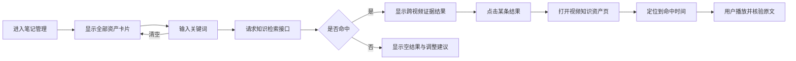

# SnapNote 笔记管理检索功能实现方案

> 文档状态：已实现，语义检索为可选增强
> 目标版本：V1（站内关键词检索）  
> 适用页面：`/notes` 笔记管理、`/tasks/[id]` 视频知识资产页  
> 编写日期：2026-08-17

## 1. 结论

笔记管理界面应该增加检索功能，而且应实现为“跨视频内容检索”，不应只做卡片标题过滤。

原因如下：

1. SnapNote 的核心价值是把视频转成可回看、可检索、可引用的知识资产；管理页只有浏览能力时，资产数量增加后很难再次找到具体知识。
2. 项目后端已经具备知识资产、章节、原文、笔记分块和 `POST /api/knowledge/search`，前端接入成本明显低于重新建设检索系统。
3. 现有结果包含章节、时间范围和关键帧引用，适合形成“搜索内容 → 打开视频 → 定位原文”的完整闭环。

首版仍直接把检索入口放在 `/notes`，不新增独立搜索页和 AI 问答；当前已增加可选 Embedding 混合检索，不改变关键词降级、引用和权限边界。

## 2. 当前实现盘点

### 2.1 已具备能力

| 层级 | 当前能力 | 位置 |
| --- | --- | --- |
| 笔记管理页 | 读取任务、按创建时间排序、展示卡片、打开详情、删除失败任务 | `frontend/app/notes/page.tsx` |
| 知识资产 | 自动构建资产、版本、章节、原文、笔记分块和画面引用 | `backend/app/knowledge.py` |
| 检索接口 | 支持关键词、资产范围、内容类型、Top K 和 owner scope | `POST /api/knowledge/search` |
| 检索范围 | 默认只返回 `ready`、`degraded` 当前版本 | `backend/app/knowledge.py` |
| 检索结果 | 返回资产、章节、正文、时间范围、关键帧、分数和命中字段 | `search_knowledge()` |
| 视频定位 | 详情页已有 `seek(seconds)`，章节和原文均可定位视频 | `frontend/app/tasks/[id]/page.tsx` |

### 2.2 当前缺口

1. `/notes` 没有搜索输入框、搜索状态、结果列表和空结果反馈。
2. `frontend/app/lib/api.ts` 没有知识检索请求函数及对应 TypeScript 类型。
3. 检索结果只有 `asset_id`，没有详情页路由所需的 `task_id`；前端不能只依赖临时映射猜测二者关系。
4. 视频详情页尚未读取 `?t=<seconds>`，不能从检索结果深链定位。
5. 管理页在未安装 Embedding 依赖或未生成向量时需要明确降级为关键词检索。
6. `GET /api/snapnote/tasks` 当前返回完整转写、笔记和 Markdown；资产增多后会拖慢管理页，建议在本功能中顺带收敛为列表摘要响应。

## 3. 产品目标与边界

### 3.1 目标

- 用户可以在一个入口检索全部可用视频知识资产。
- 结果能说明“命中了哪一条内容、来自哪个视频、位于什么时间”。
- 点击结果能打开原视频并定位到对应时间，方便核验上下文。
- 搜索失败、无结果、部分资产不可检索时，界面给出真实、可操作的反馈。
- 不破坏无关键词时现有的卡片浏览和上传入口。

### 3.2 首版非目标

- 不做 AI 问答、答案生成或多轮对话。
- 不做 AI 问答、向量重排和复杂多模态向量；语义召回由可选 Embedding 索引提供，未就绪时回退关键词检索。
- 不做拼音、同义词、纠错、联想词和搜索历史。
- 不做复杂高级语法，例如 AND、OR、引号精确匹配。
- 不做独立搜索页。
- 不允许搜索正文中的指令改变权限、范围或系统行为。

## 4. 用户流程



## 5. 交互方案

### 5.1 页面布局

在“笔记管理”标题和资产卡片之间增加搜索区：

```text
┌──────────────────────────────────────────────────────────────┐
│ 笔记管理                                  [＋ 上传新视频]    │
│ 浏览所有视频资产，也可以搜索章节、笔记和视频原文。           │
│                                                              │
│ [⌕ 搜索视频标题、章节、笔记或原文……                  ] [清除] │
│ [全部] [章节] [笔记] [原文]                         8 条结果 │
└──────────────────────────────────────────────────────────────┘
```

搜索框规则：

- 输入内容先 `trim` 并合并连续空白。
- 空关键词展示原资产卡片网格。
- 非空关键词使用 300 ms 防抖请求；新请求发出时取消旧请求。
- 支持 Enter 立即搜索，Escape 清空搜索。
- URL 同步为 `/notes?q=注意力&type=all`，刷新和返回时保留检索状态。
- 搜索框需要可见 label 或 `aria-label`，结果数量使用 `aria-live="polite"`。

### 5.2 内容类型筛选

首版提供四个轻量筛选项：

| 前端名称 | 接口 `content_types` |
| --- | --- |
| 全部 | 不传，使用后端默认四类 |
| 章节 | `chapter_summary` |
| 笔记 | `note` |
| 原文 | `transcript` |

`video_summary` 不单独展示筛选按钮，但包含在“全部”中。筛选变化后立即重新检索。

### 5.3 结果卡片

结果采用纵向列表，不继续使用视频封面宫格。每条至少显示：

- 资产标题；
- 内容类型标签；
- 章节标题（存在时）；
- 命中文本摘要；
- 时间点或时间范围；
- 来源状态：部分可用资产显示弱提示；
- “查看原视频”操作。

建议结构：

```text
┌──────────────────────────────────────────────────────────────┐
│ Transformer 核心原理与注意力机制                [原文]       │
│ 缩放点积注意力                                      03:18    │
│ ……将 Query 与 Key 做点积，再除以维度平方根……                 │
│                                           [查看原视频 →]      │
└──────────────────────────────────────────────────────────────┘
```

正文展示规则：

- 最多显示约 160 个字符、两到三行，完整正文保留在可访问文本或 `title` 中。
- 对关键词做前端纯文本高亮，禁止使用未清洗的 `dangerouslySetInnerHTML`。
- 若有 `start_time`，显示 `MM:SS` 或 `HH:MM:SS`；总体摘要没有时间时显示“视频摘要”。
- 同一资产可以出现多条证据，但首版总结果数默认 12、最大不超过 20。

### 5.4 状态设计

| 状态 | 页面反馈 |
| --- | --- |
| 初始 | 展示原有资产卡片 |
| 搜索中 | 保留搜索框，结果区显示 3–5 条骨架屏；不要清空输入 |
| 有结果 | 展示结果列表、数量和实际检索范围 |
| 无结果 | “没有找到‘xxx’相关内容”，建议缩短关键词或切换“全部” |
| 无可检索资产 | “现有视频尚未形成可检索知识资产”，提供打开资产/开始构建的说明 |
| 接口关闭 | “检索功能当前未启用”，保留原资产卡片和标题本地过滤能力 |
| 请求失败 | 展示行内错误和“重试”，不得把失败伪装成空结果 |
| 部分可用 | 正常展示文本结果，并标注“该视频部分内容缺失” |

### 5.5 演示模式降级

当 `hasBackend === false` 时，没有真实知识索引：

- 仅对 `task.title` 和 `task.filename` 做本地大小写不敏感过滤；
- 在结果区标注“演示模式仅检索视频标题”；
- 不伪造章节、原文或相关度结果；
- 内容类型筛选隐藏或禁用。

## 6. 接口与数据契约

### 6.1 复用现有检索接口

请求：

```http
POST /api/knowledge/search
Content-Type: application/json
```

```json
{
  "query": "缩放点积注意力",
  "content_types": ["chapter_summary", "transcript", "note"],
  "top_k": 12,
  "owner_scope": "local"
}
```

保留现有约束：

- `query` 长度 1–500；
- `top_k` 范围 1–20；
- 仅检索 `ready`、`degraded` 当前版本；
- 内容类型只允许 `video_summary`、`chapter_summary`、`transcript`、`note`；
- 显式 `asset_ids` 最多 100 条；
- 查询始终先做 owner scope 和状态过滤。

### 6.2 必须补充的返回字段

在每条 `results[]` 中增加 `task_id`：

```json
{
  "chunk_id": "chunk-uuid",
  "asset_id": "asset-uuid",
  "task_id": "task-uuid",
  "asset_version_id": "version-uuid",
  "asset_title": "Transformer 核心原理与注意力机制",
  "content_type": "transcript",
  "chapter_id": "chapter-uuid",
  "chapter_title": "缩放点积注意力",
  "text": "将 Query 与 Key 做点积……",
  "start_time": 198.2,
  "end_time": 226.8,
  "keyframe": {
    "id": "media-uuid",
    "relative_uri": "/storage/tasks/task-uuid/frames/frame-001.jpg",
    "timestamp": 200.0,
    "availability": "available"
  },
  "score": 0.91,
  "matched_field": "text",
  "source_status": "ready"
}
```

增加 `task_id` 的理由：

- 前端详情路由使用任务 ID，而不是知识资产 ID；
- 避免前端额外请求资产详情或依赖任务列表建立易失映射；
- 该字段来自 `KnowledgeAsset.task_id`，不会增加新的查询。

### 6.3 前端类型和请求封装

在 `frontend/app/lib/api.ts` 增加：

```ts
export type KnowledgeContentType =
  | "video_summary"
  | "chapter_summary"
  | "transcript"
  | "note";

export type KnowledgeSearchHit = {
  chunk_id: string;
  asset_id: string;
  task_id: string;
  asset_version_id: string;
  asset_title: string;
  content_type: KnowledgeContentType;
  chapter_id: string | null;
  chapter_title: string | null;
  text: string;
  start_time: number | null;
  end_time: number | null;
  keyframe: {
    id: string;
    relative_uri: string;
    timestamp: number;
    availability: string;
  } | null;
  score: number;
  matched_field: "asset_title" | "chapter_title" | "content_title" | "text";
  source_status: "ready" | "degraded";
};

export type KnowledgeSearchResponse = {
  query: string;
  scope: { asset_ids: string[] | null; owner_scope: string };
  results: KnowledgeSearchHit[];
  total: number;
  available_assets: number;
  degraded_search: boolean;
  elapsed_ms: number;
};
```

新增 `searchKnowledge()`，接收 `AbortSignal`，统一解析 FastAPI 的字符串或对象型 `detail`，并把 503、422 与网络错误转成用户可理解的消息。

### 6.4 任务列表接口瘦身（推荐同批完成）

当前 `GET /api/snapnote/tasks` 复用了任务详情响应，包含所有转写、笔记和 Markdown。管理页只需要：

- `id`、`title`、`filename`；
- `duration`、`status`、`progress`、`current_stage`；
- `note_style`、`created_at`；
- `thumbnail_url`；
- `knowledge_asset` 状态摘要。

建议列表接口改为轻量 `TaskListItem`，任务详情接口继续返回完整数据。若担心一次修改影响较大，可先保持兼容，并把瘦身列为紧随检索后的性能任务。

## 7. 前端实现设计

### 7.1 `/notes` 状态模型

建议拆出 `useKnowledgeSearch` Hook，避免继续扩大页面组件：

```ts
type SearchState = {
  query: string;
  type: "all" | "chapter" | "note" | "transcript";
  status: "idle" | "loading" | "success" | "error";
  data?: KnowledgeSearchResponse;
  error?: string;
};
```

Hook 职责：

1. 从 URL 初始化 `query` 和 `type`；
2. 规范化输入；
3. 300 ms 防抖；
4. 使用 `AbortController` 取消过期请求；
5. 只接受最后一次请求结果，避免慢响应覆盖新结果；
6. 同步 URL，但不让每次输入产生一条浏览历史；输入时用 `replace`，最终提交可用 `push`；
7. 组件卸载时取消请求。

建议新增文件：

```text
frontend/app/notes/
├── page.tsx
├── useKnowledgeSearch.ts
├── SearchBar.tsx
└── SearchResults.tsx
```

如果希望首版改动更小，也可先写在 `page.tsx`，但应至少把结果项提取成独立组件。

### 7.2 搜索结果跳转

有时间坐标时：

```ts
router.push(`/tasks/${hit.task_id}?t=${Math.floor(hit.start_time)}&from=search`);
```

没有时间坐标时：

```ts
router.push(`/tasks/${hit.task_id}?from=search`);
```

不建议把整段命中文本放进 URL；`chunk_id` 如需用于后续埋点，可作为短参数传递，但首版不是播放定位的必要条件。

### 7.3 视频详情页深链

`frontend/app/tasks/[id]/page.tsx` 增加以下能力：

1. 使用 `useSearchParams()` 读取 `t`；
2. 校验为有限非负数，并限制在视频时长内；
3. 视频 `loadedmetadata` 后设置 `currentTime`；
4. 页面状态同时更新到该时间对应章节；
5. 初次定位默认不自动播放，避免浏览器自动播放限制；
6. 定位完成后显示一次“已定位到 03:18”的轻提示；
7. 非法、缺失或超出范围的 `t` 安全忽略，不影响页面打开。

需注意：当前 `seek()` 在视频元素存在时可以立即赋值，但从路由进入时媒体元数据可能尚未加载，因此应保留待定位时间，在 `onLoadedMetadata` 中执行一次，而不是只在请求完成时调用。

### 7.4 样式

在 `frontend/app/globals.css` 增加以下样式组：

- `.library-search`
- `.library-search-input`
- `.library-search-filters`
- `.search-result-list`
- `.search-result-card`
- `.search-result-snippet`
- `.search-result-empty`
- `.search-highlight`

响应式要求：

- 桌面端搜索框与结果数量同一行；
- 小屏下筛选项允许横向滚动，不隐藏搜索能力；
- 结果卡片在移动端改为单列，时间标签不覆盖正文；
- 键盘焦点样式必须可见；
- `prefers-reduced-motion` 下关闭骨架闪动和非必要动画。

## 8. 后端实现设计

### 8.1 最小改动

在 `backend/app/knowledge.py` 的 `search_knowledge()` 结果组装处加入：

```py
"task_id": asset.task_id,
```

并在现有测试中断言：

```py
self.assertEqual(hit["task_id"], "task-ready")
```

现有查询已经关联 `KnowledgeAsset`，不需要新增 JOIN，也不需要数据库迁移。

### 8.2 查询安全与性能

继续沿用现有规则：

- 关键词通过 `_like_pattern()` 转义 `%`、`_` 等通配符；
- 所有范围与内容类型在查询前校验；
- owner scope、资产状态和当前版本过滤必须先于命中排序；
- 删除中、构建失败和旧版本不得进入结果；
- 返回内容为数据库文本，不执行其中的任何指令；
- 日志只记录查询长度、范围、结果数和耗时，不记录完整查询正文或大段命中文本。

首版仍是 SQLite `LIKE` 子串检索，并会先收集最多 1000 个候选。上线本 UI 前建议用真实数据记录以下指标：

- `search_requests_total`；
- `search_empty_total`；
- `search_errors_total`；
- `search_elapsed_ms`；
- `search_result_click_total`（前端埋点条件具备后再加）。

当可检索分块接近 10 万或 P95 超过 1 秒时，再评估 SQLite FTS5、倒排索引或混合检索；不应在首版提前引入向量库。

## 9. 错误处理

| 场景 | 处理方式 |
| --- | --- |
| 空关键词 | 不请求接口，恢复资产卡片 |
| 查询超过 500 字符 | 前端限制输入，后端继续做最终校验 |
| `422 INVALID_QUERY` | 提示用户调整关键词，不清空输入 |
| `503` 检索未启用 | 告知检索未启用，允许继续浏览资产 |
| 网络中断 | 显示重试按钮，保留上次关键词和筛选条件 |
| 请求被新输入取消 | 静默结束，不显示错误 |
| 结果对应资产刚被删除 | 打开时按现有 404 页面处理，并允许返回搜索结果 |
| 结果无时间坐标 | 打开视频首页，不尝试定位 |
| 关键帧不可用 | 不显示缩略图，文本结果仍可点击 |
| `available_assets = 0` | 明确提示尚无可检索资产，不显示“无关键词命中” |

## 10. 测试方案

### 10.1 后端单元测试

扩展 `backend/tests/test_knowledge.py`：

1. 关键词能命中章节、笔记和原文；
2. 每条命中包含正确的 `task_id`；
3. `asset_ids` 与 `content_types` 过滤有效；
4. `%`、`_` 和反斜杠不会变成通配查询；
5. `failed`、`building`、`deleting` 资产不可见；
6. 删除后原关键词返回空结果；
7. 相同数据和查询的结果顺序稳定；
8. 空关键词、超长关键词、非法 `top_k` 返回明确错误；
9. `degraded` 资产仍可返回文本证据。

### 10.2 前端组件与交互测试

1. 空输入展示原卡片网格；
2. 输入关键词后显示 loading，再显示结果；
3. 连续输入只渲染最后一次响应；
4. Escape 清空并恢复卡片；
5. 类型筛选传递正确 `content_types`；
6. 空结果、无可用资产、503、422、网络错误文案正确；
7. 点击带时间的结果生成正确 `/tasks/{task_id}?t=...`；
8. 文本高亮不使用不安全 HTML；
9. 演示模式只按标题和文件名过滤；
10. 键盘可以聚焦、切换筛选和打开结果。

### 10.3 详情页定位测试

1. `?t=198` 在元数据加载后定位到 198 秒；
2. 当前章节同步到包含该时间的章节；
3. 默认不自动播放；
4. `t=-1`、`t=abc`、`t=Infinity` 被忽略；
5. `t` 超过视频时长时按时长边界处理或忽略；
6. 没有视频 URL 的本地演示播放也能同步 `currentTime`。

### 10.4 人工验收样本

至少准备 10 个真实中文视频，覆盖：

- 同一关键词存在于多个视频；
- 同一视频中存在多个命中；
- 仅标题命中；
- 仅章节命中；
- 仅原文命中；
- 中英文混合词，例如 `Query/Key/Value`；
- 无命中；
- 缺关键帧但文本可用；
- 旧任务回填资产；
- 已删除或构建失败资产。

## 11. 验收标准

### AC-01：跨视频检索

**GIVEN** 至少两个可检索视频包含目标关键词  
**WHEN** 用户在笔记管理页输入关键词  
**THEN** 页面展示来自这些视频的证据结果，并标明资产、内容类型和时间。

### AC-02：结果定位

**GIVEN** 某命中包含合法 `start_time`  
**WHEN** 用户点击“查看原视频”  
**THEN** 系统打开对应任务详情，并在视频加载完成后定位到该时间，误差不超过 1 秒。

### AC-03：范围与状态隔离

**GIVEN** 相同关键词还存在于失败、删除中或旧版本资产  
**WHEN** 用户搜索  
**THEN** 结果只来自当前 `ready` 或 `degraded` 版本。

### AC-04：空结果可信

**GIVEN** 可访问资产中不存在关键词  
**WHEN** 用户搜索  
**THEN** 页面返回空结果和实际可检索资产数量，不生成相似答案，也不展示范围外内容。

### AC-05：搜索不影响浏览

**GIVEN** 用户清空搜索词或检索接口不可用  
**WHEN** 返回笔记管理页  
**THEN** 原有卡片浏览、打开资产、上传和失败任务删除能力仍可使用。

### AC-06：性能

在本地单用户、1000 个资产、10 万分块目标规模下：

- 搜索接口 P95 ≤ 1 秒；
- 前端输入到 loading 反馈 ≤ 100 ms；
- 过期响应不会覆盖当前关键词结果；
- 任务列表首屏不因加载全部转写正文而持续恶化。

## 12. 实施顺序

### 阶段 A：打通最小闭环

1. 后端结果增加 `task_id` 并补测试；
2. 前端增加搜索类型与 `searchKnowledge()`；
3. `/notes` 增加搜索框、筛选、loading、结果和错误状态；
4. 结果点击跳转 `/tasks/{task_id}?t=...`；
5. 详情页支持 `t` 深链定位；
6. 完成桌面端和移动端样式。

### 阶段 B：稳定性与性能

1. 任务列表接口瘦身；
2. 增加真实样本和 10 万分块基准；
3. 补齐前端自动化测试和可访问性检查；
4. 增加耗时、空结果率、错误率和结果点击率观测。

### 阶段 C：后续增强（不属于首版）

1. 搜索范围选择：全部、单个或多个视频；
2. 按创建时间、笔记类型过滤；
3. FTS5 或混合检索；
4. 搜索结果聚合与去重；
5. 基于检索证据的 MiMo 问答和可引用回答。

## 13. 预计改动文件

| 文件 | 改动 |
| --- | --- |
| `backend/app/knowledge.py` | 检索结果增加 `task_id`，必要时补充可观测字段 |
| `backend/tests/test_knowledge.py` | 增加返回契约、过滤、状态和排序测试 |
| `frontend/app/lib/api.ts` | 增加检索类型、返回类型和请求函数 |
| `frontend/app/notes/page.tsx` | 接入搜索状态，切换卡片与结果视图 |
| `frontend/app/notes/useKnowledgeSearch.ts` | 防抖、取消请求、URL 同步（建议新增） |
| `frontend/app/notes/SearchBar.tsx` | 搜索框和内容类型筛选（建议新增） |
| `frontend/app/notes/SearchResults.tsx` | 结果、空状态、错误和高亮（建议新增） |
| `frontend/app/tasks/[id]/page.tsx` | 读取 `t` 并在媒体就绪后定位 |
| `frontend/app/globals.css` | 搜索区、结果列表、响应式和焦点样式 |

## 14. 发布与回滚

- 使用现有 `ENABLE_KNOWLEDGE_SEARCH` 作为后端总开关；前端收到 503 时自动降级为资产浏览。
- 本方案最小闭环不修改数据库结构，可独立回滚前端入口和 `task_id` 返回字段。
- 发布前先对历史完成任务执行知识资产 dry-run，再按需回填，避免用户进入搜索后看到大量“无可检索资产”。
- 若搜索性能不达标，先降低默认 `top_k`、保留明确错误并关闭入口，不允许绕过 owner scope 或状态过滤换取速度。

## 15. 最终建议

优先实施阶段 A，并把“任务列表接口瘦身”放在同一迭代或紧邻迭代。该方案能用较小改动兑现 SnapNote 已经具备的知识资产能力，形成从管理、检索到原视频核验的完整路径；首版保持关键词检索，先验证用户是否能稳定找到并核验内容，再决定是否投入语义检索和 AI 问答。
