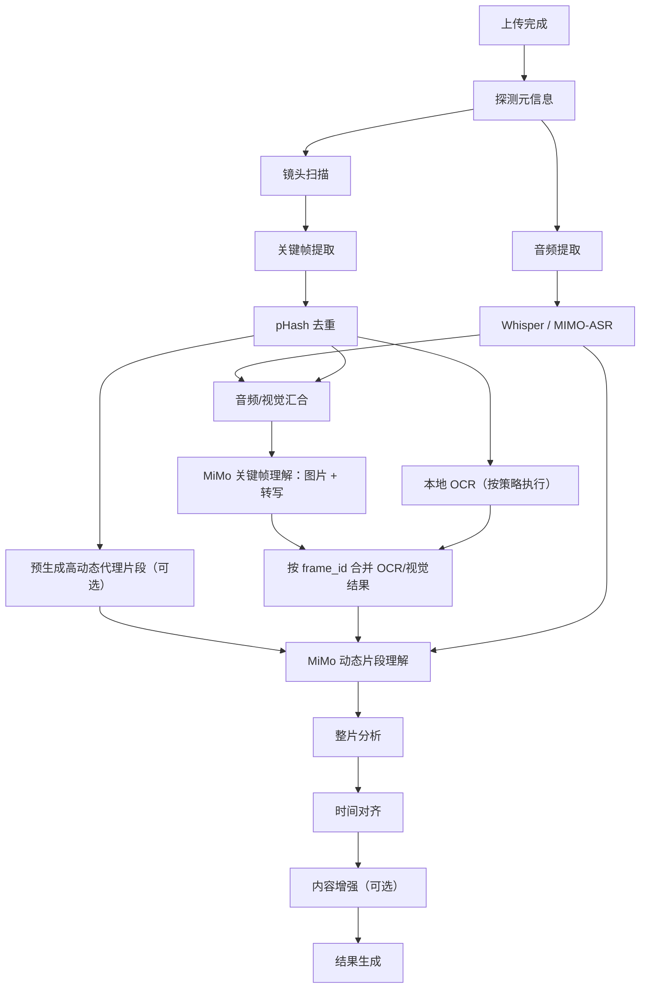

# SnapNote 音视频处理时效优化方案

> 方案状态：核心并行方案已实施，后续性能增强持续推进  
> 基线版本：当前 V1 串行流水线  
> 更新日期：2026-08-15

## 0. 实施状态

2026-08-15 已完成以下改造：

- `ffprobe` 后并行执行音频分支与本地视觉分支，可通过 `ENABLE_PIPELINE_PARALLELISM=0` 回退串行模式；
- 音频分支负责音频提取和 ASR，本地视觉分支负责镜头扫描、关键帧提取和 pHash 去重；
- 两条分支完成后在 MiMo 关键帧理解前汇合；
- PaddleOCR 与 MiMo 图片理解并行执行，使用独立帧副本并按 `frame_id` 合并；
- 新增五分支持久化进度：准备视频、音频处理、画面处理、多模态理解、结果生成；
- SSE 与任务详情 API 返回分支、阶段、说明、状态、分支百分比及单调递增总进度；
- 阶段开始与完成更新同一条 `StageResult`，可直接计算阶段耗时；
- 处理页已升级为分支进度 UI，明确展示音频与画面的并行状态和后续汇合关系。

尚未实施的中长期项包括 ffmpeg 批量抽帧、全局 CPU/GPU/Provider 资源调度、阶段缓存、持久化 worker/队列和自适应镜头扫描。这些工作应在新进度数据形成性能基线后按关键路径推进。

## 1. 优化目标

本方案目标是在不降低关键帧覆盖、转写准确率和最终笔记完整度的前提下，缩短用户从上传完成到结果可用的等待时间，并建立可持续调优的指标体系。

核心判断：画面和音频两条 pipeline 可以并行，但应采用“有依赖的 DAG + 资源受控并行”，而不是把所有 CPU、GPU 和 API 调用无上限同时启动。

建议目标分三层定义：

- **核心时延**：端到端处理实时系数 `RTF = 处理耗时 / 视频时长`，分别统计 5、30、60 分钟视频的 P50/P95。
- **阶段时延**：记录每个阶段排队、执行、重试和外部 API 等待耗时。
- **质量护栏**：ASR 片段完整率、关键帧数量与覆盖率、MiMo 成功率、降级率、最终任务成功率不得劣化。

在没有生产样本实测前，不承诺固定百分比。结构上，并行后的主干耗时可由：

```text
当前：T ≈ T_probe + T_audio_branch + T_local_vision_branch + T_multimodal + T_output
目标：T ≈ T_probe + max(T_audio_branch, T_local_vision_branch) + T_multimodal + T_output
```

理论节省量接近两个独立分支耗时中的较小者，实际收益受 CPU/GPU/磁盘竞争影响，必须通过基准测试确认。

## 2. 推荐目标 DAG



### 2.1 可并行边界

`ffprobe` 完成后即可同时启动：

- 音频分支：`提取音频 → ASR`；
- 本地视觉分支：`镜头扫描 → 关键帧提取 → pHash 去重`。

这两个分支都只依赖原视频和统一的处理时长，不互相依赖。它们应在 MiMo 关键帧理解前汇合，因为当前图片提示词会携带同一镜头时间范围内的转写文本。

### 2.2 暂不并行的边界

- 整片风格综合必须等待静态视觉、动态视觉和转写完成。
- 图文对齐必须等待关键帧与转写完成。
- 最终 Markdown 必须等待结构化块和整片分析完成。
- 同一 CUDA 设备上的 Whisper 与 PaddleOCR 是否同时运行，不能写死，应由资源策略和实测结果决定。

## 3. 第一优先级：建立可测量基线

在改并发前先修正阶段观测，否则无法判断“更快”来自真实缩短还是进度展示变化。

### 3.1 阶段记录

将每次阶段执行建模为同一条记录的状态流转：

```text
queued → running → completed | failed | skipped | degraded | cancelled
```

建议新增或规范以下字段：

- `branch`：`common/audio/vision/multimodal/output`；
- `attempt`：重试序号；
- `queued_at/started_at/completed_at`；
- `elapsed_ms/queue_ms`；
- `resource`：CPU/GPU/ffmpeg/API；
- `input_count/output_count`；
- `degraded/error_code`。

当前 `_set_stage` 对开始和完成各插一行，应改为返回或定位同一阶段实例并更新，避免阶段耗时配对歧义。

### 3.2 指标与基准集

建立固定测试集，至少覆盖：

- 5/30/60 分钟视频；
- PPT 课程、人物讲解、屏幕录制、高动态实拍；
- 720p/1080p、H.264/VP9 等常用组合；
- Whisper CPU、Whisper CUDA、MIMO-ASR 三种资源画像。

每种场景至少重复 3 次，记录冷启动和热启动两组数据。输出端到端 P50/P95、各分支耗时、CPU/GPU/内存峰值、磁盘读取量、API 请求数和重试率。

## 4. 第二优先级：实现两条分支受控并行

### 4.1 总控改造

将 `run_pipeline` 拆成职责明确的协程：

```python
metadata = await probe(...)

audio_task = asyncio.create_task(run_audio_branch(...))
vision_task = asyncio.create_task(run_local_vision_branch(...))

(segments, engine), (frames, shot_stats) = await asyncio.gather(
    audio_task,
    vision_task,
)

frames, visual_analysis = await run_multimodal_join(...)
await generate_outputs(...)
```

推荐进一步使用结构化并发语义：任一必需分支失败时取消并等待另一分支退出；可降级分支失败时返回显式的 degraded 结果。所有 ffmpeg 子进程都要在取消时终止并回收，避免任务失败后仍占用 CPU 和文件句柄。

### 4.2 资源策略

增加任务内和全局两级信号量，建议配置项如下：

| 配置 | 建议初始值 | 用途 |
|---|---:|---|
| `ENABLE_PIPELINE_PARALLELISM` | `1` | 总开关，可快速回退串行模式 |
| `MAX_CONCURRENT_FFMPEG` | `2` | 单进程 ffmpeg 全局上限 |
| `MAX_CONCURRENT_CPU_HEAVY` | `1~2` | Whisper CPU、OCR、NumPy 重任务上限 |
| `MAX_CONCURRENT_GPU_TASKS` | `1` | 单 GPU 初始保护值 |
| `MAX_CONCURRENT_PIPELINES` | `1~2` | 同时处理的视频任务数 |

推荐的默认调度策略：

- **MIMO-ASR**：ASR 主要等待网络，本地视觉分支可直接并行，收益通常最稳定。
- **Whisper CUDA**：Whisper 使用 GPU，本地镜头扫描主要使用 ffmpeg/CPU，可并行；监控 CPU 解码和显存峰值。
- **Whisper CPU**：Whisper、ffmpeg 和 NumPy 会争用 CPU。仍保留并行代码路径，但通过 `MAX_CONCURRENT_CPU_HEAVY` 或自动策略限制；实测无收益时允许此资源画像回退到部分串行。

不要仅提高 `MIMO_ASR_CONCURRENCY` 或 `MIMO_VISION_CONCURRENCY`。它们应同时受 Provider 限流、错误率和全局请求预算约束。

## 5. 第三优先级：缩短视觉分支

### 5.1 减少 ffmpeg 启动与重复解码

当前每个关键帧和每个动态代理片段分别启动一次 ffmpeg。建议依次评估：

1. 使用单个 ffmpeg 进程按时间戳批量输出关键帧；
2. 若批量 filter 复杂度过高，先实现 2 路有界并发提取，而不是一次并发 24 个进程；
3. 对动态代理片段采用相同的 1~2 路有界并发；
4. 中长期评估一次低分辨率解码同时完成场景检测与候选帧缓存，减少后续 seek。

优化必须验证时间戳准确性、不同容器关键帧 seek 行为和磁盘峰值，避免为减少进程数引入错帧。

### 5.2 自适应扫描

固定 2 fps 对静态课程可能过度，对高动态内容又可能不足。可采用两阶段策略：

1. 低采样率粗扫，定位潜在变化区间；
2. 仅在变化区间提高采样率复扫。

对长时间静态画面可提前跳过连续区间。质量护栏是镜头召回率和关键帧相关率，不应只看耗时。

### 5.3 OCR 策略化

当前 MiMo 图片理解已经返回 `visible_text`，且在本地 OCR 为空时回填。因此：

- MiMo 视觉可用时，本地 OCR 不应阻塞 MiMo 请求；两者可并行后按 `frame_id` 合并。
- 对追求速度的模式，可仅在 MiMo 文字为空、置信度低或用户明确需要高质量 OCR 时补跑 PaddleOCR。
- 无 MiMo 或隐私离线模式继续保留全量本地 OCR。

该策略既减少串行等待，也避免对全部关键帧做重复文字识别。

### 5.4 提前生成动态代理

镜头扫描已经计算 `is_dynamic` 和 `dynamic_score`。可在 ASR 或 MiMo 图片理解尚未结束时，提前为最高分的本地动态镜头生成代理片段。MiMo 图片分析新标记出的 `needs_motion_context` 再按需补生成，避免所有代理生成都位于主关键路径上。

## 6. 第四优先级：优化模型调用链

### 6.1 自适应批次与并发

- 根据图片总大小、帧数和历史响应时延动态选择批次，不只使用固定 8 张。
- 将 Provider 的 429、5xx、超时和实际延迟纳入并发调节；连续限流时主动降并发。
- 保留全局 API 信号量，避免多个用户任务各自以并发 2/3 叠加后击穿额度。

### 6.2 消除非必要串行增强

DeepSeek 内容增强是可选步骤，可提供两种结果策略：

- **完整模式**：等待增强完成后标记任务完成；
- **快速可用模式**：先交付本地结构化笔记，再异步增强并产生 `result_updated` 事件。

若产品要求“完成后结果不再变化”，则继续使用完整模式，不应在未确认交互语义前默认切换。

### 6.3 缓存与幂等

以源文件哈希、处理时长、模型版本和参数生成阶段缓存键。重试任务时复用已完成且参数一致的音频、转写、镜头和关键帧结果，只重跑失败或参数变更的下游节点。

## 7. 并行化后的状态与前端进度

单一 `current_stage` 无法准确表达并行分支，建议 API 增加：

```json
{
  "status": "processing",
  "progress": 43,
  "branches": {
    "audio": {"stage": "transcribing", "progress": 68, "status": "running"},
    "vision": {"stage": "selecting_frames", "progress": 82, "status": "running"},
    "multimodal": {"stage": "waiting_dependencies", "progress": 0, "status": "queued"}
  }
}
```

总进度使用固定权重聚合，并保证单调不减，例如：

```text
overall = common × 5% + audio × 30% + local_vision × 25%
        + multimodal × 30% + output × 10%
```

权重最终应根据基准集中的 P50 阶段耗时校准。SSE 事件携带 `branch`、`stage`、`stage_progress`、`overall_progress` 和 `attempt`，前端分别展示“音频处理中”和“画面处理中”，不要让两个分支争抢同一个阶段文案。

## 8. 多任务吞吐与运行可靠性

FastAPI `BackgroundTasks` 适合当前单机原型，但不提供可靠队列、进程重启恢复、任务租约或跨实例调度。完成单任务 DAG 改造后，建议引入持久化任务执行层，至少具备：

- queued/running/heartbeat/lease 状态；
- worker 异常后的超时回收和可重试；
- 每类资源的全局并发配额；
- 幂等阶段与断点续跑；
- 优雅停止和子进程清理。

在仍使用 SQLite 时应避免大量阶段进度高频写入造成写锁竞争；可对 SSE 高频事件做内存推送，对数据库进度按时间或百分比节流。横向扩容时再迁移到适合多 worker 的数据库与队列。

## 9. 分阶段实施计划

### Phase 0：观测与基线（低风险）

- 修复阶段记录的开始/完成配对；
- 增加分支、耗时、资源、重试和降级指标；
- 建立固定视频基准集并记录 V1 数据。

验收：可输出端到端和阶段级 P50/P95，能明确当前关键路径。

### Phase 1：音频/本地视觉并行（最高收益）

- 抽取 `run_audio_branch` 与 `run_local_vision_branch`；
- 在 `ffprobe` 后受控并发，在 MiMo 图片理解前汇合；
- 增加取消、异常传播和串行回退开关；
- 升级分支进度模型。

验收：结果字段及时间轴与 V1 兼容；同一基准集无质量回退；MIMO-ASR 和 Whisper CUDA 场景端到端耗时显著下降。

### Phase 2：视觉内部优化

- 关键帧与动态代理有界并发或批量提取；
- OCR 与 MiMo 并行/按需执行；
- 高动态代理片段提前生成；
- 评估自适应镜头扫描。

验收：视觉分支耗时下降，关键帧召回与时间戳误差满足现有产品指标。

### Phase 3：任务执行与缓存

- 增加全局资源治理和 Provider 限流；
- 支持阶段缓存、幂等重试和断点续跑；
- 将后台任务迁移到持久化 worker/队列。

验收：并发多任务时吞吐可预测，API 服务重启后任务可恢复或安全重试。

## 10. 测试与验收清单

### 10.1 正确性

- 串行与并行模式的转写片段、关键帧时间戳和最终章节范围一致或在明确容差内；
- 视频被 `MAX_VIDEO_DURATION_SECONDS` 截断时，两分支使用同一个 `processed_duration`；
- 任一分支失败时另一分支能够取消或按降级策略收敛；
- 重试不会产生重复阶段记录、脏临时文件或重复最终结果；
- OCR 与 MiMo 并行合并时不发生共享 `frames` 对象覆盖。

### 10.2 性能

- 分别测试 Whisper CPU、Whisper CUDA、MIMO-ASR；
- 分别测试冷/热模型、单任务/双任务；
- 记录 RTF、P50/P95、CPU/GPU/内存峰值、ffmpeg 并发数和 API 错误率；
- 检查并行模式是否因磁盘吞吐或 CPU 争用反而慢于串行模式。

### 10.3 兼容与回退

- `ENABLE_PIPELINE_PARALLELISM=0` 可恢复 V1 串行路径；
- MiMo、PaddleOCR、DeepSeek 分别不可用时保持现有降级能力；
- 旧任务数据和前端仍能读取，新前端能展示分支进度。

## 11. 风险与控制

| 风险 | 表现 | 控制措施 |
|---|---|---|
| CPU/GPU 争用 | 并行后单阶段变慢或 OOM | 资源信号量、设备画像、压测后设置默认值 |
| 磁盘与解码争用 | 两个 ffmpeg 同读源文件导致吞吐下降 | ffmpeg 全局限流、批量提取、保留串行回退 |
| API 限流 | 429、超时和重试风暴 | Provider 全局并发、退避、熔断和自适应降并发 |
| 状态互相覆盖 | 进度倒退、阶段文案跳变 | 分支状态模型、单调总进度 |
| 共享数据竞争 | OCR/MiMo 对同一 frames 列表互相覆盖 | 分支返回不可变结果，按 `frame_id` 单点合并 |
| 取消不完整 | 失败后 ffmpeg/线程仍运行 | 结构化并发、子进程句柄管理、finally 清理 |
| 结果提前可见 | 快速模式下用户看到内容变化 | 明确 `partial/complete/result_updated` 产品语义 |

## 12. 推荐落地顺序

建议先完成“阶段计时修复 → 两分支并行 → 分支进度 → 资源限流”这一条最小闭环。它不改变识别算法和最终数据结构，风险可控，且能直接消除当前最明显的串行等待。视觉批处理、自适应采样、异步增强和持久化队列应在基线数据证明其处于关键路径后继续实施。
