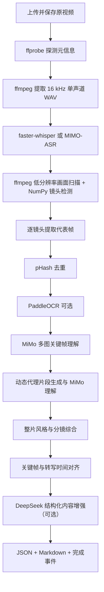

# SnapNote 音视频处理流水线技术方案 V1

> 文档状态：基于当前代码实现整理  
> 适用范围：`backend/app` 中的视频导入、音频转写、画面分析、图文对齐及笔记生成链路  
> 版本：V1.0  
> 更新日期：2026-08-15

> 实施说明：本文保留改造前的 V1 串行基线。2026-08-15 起，代码已按《SnapNote 音视频处理时效优化方案》升级为音频/本地视觉并行流水线，并增加分支进度状态；需要回看旧架构时仍以本文为准。

## 1. 结论摘要

当前单个 SnapNote 任务采用一条串行总控流水线，画面和音频并未作为两条独立 pipeline 并行执行。实际顺序是：

1. 探测视频元信息；
2. 提取完整音轨；
3. 完成 ASR；
4. 扫描视频画面并提取关键帧；
5. OCR、MiMo 关键帧理解、动态片段理解与整片风格分析；
6. 等音频与视觉结果都已就绪后进行时间线对齐和笔记生成。

两条处理链在工程上可以并行。`ffprobe` 得到统一时长后，音频分支和本地视觉分支之间不存在数据依赖；真正的汇合点是 MiMo 关键帧理解，因为其输入同时包含关键帧和相邻转写文本。当前实现已经具备分支内部的局部并发，但尚未实现音频分支与画面分支之间的任务级并行。

## 2. 系统范围与目标

V1 流水线接收 MP4、MOV 或 WebM 文件，目标是生成：

- 带起止时间的语音转写片段；
- 按镜头筛选、质量择优和去重后的画面关键帧；
- 关键帧 OCR、静态视觉语义和动态片段语义；
- 整片内容、叙事、风格和 storyboard 分析；
- 与时间轴绑定的图文笔记块和 Markdown 成品。

任务通过 FastAPI 接口创建，原视频和派生产物按任务 UUID 隔离存放，SQLite 保存任务状态及阶段结果，SSE 向前端推送处理进度。

## 3. 当前架构

总控入口为 `backend/app/pipeline.py::run_pipeline`。上传接口通过 FastAPI `BackgroundTasks` 在请求返回后调用它；当前没有独立任务队列、持久化 worker 或全局任务并发控制器。

## 4. 当前处理时序

| 顺序 | 阶段 | 主要实现 | 输入 | 输出 | 是否等待前序完成 |
|---:|---|---|---|---|---|
| 1 | `probing_video` | ffprobe | 原视频 | 时长、分辨率、编码 | 是 |
| 2 | `extracting_audio` | ffmpeg | 原视频、处理时长 | 16 kHz mono WAV | 是 |
| 3 | `transcribing` | faster-whisper / MIMO-ASR | WAV | 时间戳转写片段 | 是 |
| 4 | `detecting_frames` | ffmpeg rawvideo + NumPy | 原视频、处理时长 | 镜头候选及质量指标 | 是 |
| 5 | `selecting_frames` | ffmpeg | 镜头候选 | JPEG 代表帧 | 是 |
| 6 | `deduplicating_frames` | Pillow + ImageHash | JPEG 列表 | 去重关键帧 | 是 |
| 7 | `running_ocr` | PaddleOCR（可选） | 关键帧 | 画面文字 | 是 |
| 8 | `understanding_frames` | MiMo v2.5 | 图片、局部转写、画质指标 | 静态视觉语义 | 是 |
| 9 | `understanding_clips` | ffmpeg + MiMo v2.5 | 动态镜头、转写 | 动作、运镜、转场信息 | 是 |
| 10 | `analyzing_style` | MiMo v2.5 | 全部视觉结果、转写 | 整片画像与 storyboard | 是 |
| 11 | `aligning` | 本地时间窗口匹配 | 关键帧、转写 | 图文块 | 是 |
| 12 | `generating_blocks` | DeepSeek（可选） | 图文块 | 优化后的结构化内容 | 是 |
| 13 | `generating_note` | 本地模板 | 任务及图文块 | JSON、Markdown | 是 |

由于 `run_pipeline` 对上述函数逐一 `await`，ASR 没有结束时不会启动镜头扫描。因此当前单任务总耗时近似为各阶段耗时之和，而不是音频分支与视觉分支耗时的最大值。

## 5. 音频处理链

### 5.1 音频标准化

`_extract_audio` 使用 ffmpeg 将视频音轨截取到允许的最大处理时长，输出 PCM 16-bit、16 kHz、单声道 `audio.wav`。该阶段每个任务只启动一个 ffmpeg 子进程。

### 5.2 本地 Whisper 路径

- 默认模型为 `large-v3`；根据环境自动选择 CUDA/CPU 和计算精度。
- 推理由 `asyncio.to_thread` 放入线程执行，避免直接阻塞事件循环。
- 转写片段通过线程安全队列回传，持续发送阶段内进度。
- 单个音频仍是一次完整转写，没有按时间分片并行推理。

### 5.3 MIMO-ASR 路径

- 先将 WAV 切成默认 90 秒、32 kbps 的 MP3 分片；超出请求体限制时自动缩短分片。
- 使用 `asyncio.gather` 和信号量并发请求，默认 `MIMO_ASR_CONCURRENCY=3`。
- 可重试错误先并发执行；如启用 fallback，则失败分片按并发度 1 顺序重试。
- 分片结果按原时间顺序合并。

## 6. 画面处理链

### 6.1 镜头扫描与质量择优

`analyze_shots` 以默认 2 fps、320×320 灰度流读取视频，不落盘全部采样帧。NumPy 对每帧计算清晰度、亮度、对比度、稳定性、运动和转场分数，再按阈值与最大镜头时长形成镜头区间。

镜头数超过 `FRAME_MAX_COUNT`（默认 24）时，按全片时间桶保留覆盖度；扫描失败则降级为固定间隔抽帧。

### 6.2 关键帧提取与去重

- 每个镜头使用一次 ffmpeg seek，逐张、串行生成 JPEG；默认宽度 736。
- 使用 pHash 做近重复过滤；默认汉明距离阈值为 6。
- 提取和去重结果会写入任务的 `frames_json`，使处理中间态可被查询。

### 6.3 OCR 与多模态理解

- PaddleOCR 为可选增强，当前逐张串行识别；导入或识别失败会静默降级。
- MiMo 关键帧理解按默认每批 8 张组装请求，默认最多 2 批并发。
- 每张图会附带其镜头时间范围、局部质量指标和相邻转写，因此该步骤在当前语义设计上依赖 ASR 完成。
- 动态代理片段默认最多 4 段，ffmpeg 逐段串行生成静音 MP4，随后由 MiMo 补充动作、运镜、转场和节奏语义。
- 整片分析汇总关键帧、动态片段、转写和质量数据，生成整体摘要、叙事结构、视觉/剪辑风格及 storyboard。

## 7. 当前已有的并发能力

| 并发层级 | 当前状态 | 说明 |
|---|---|---|
| 音频分支 vs 画面分支 | 未并行 | ASR 完成后才开始镜头扫描 |
| 本地 Whisper 单任务内部 | 未分片并行 | 在线程中执行一次完整转写 |
| MIMO-ASR 分片 | 已并行 | 默认并发 3，可配置 |
| MiMo 关键帧批次 | 已并行 | 默认并发 2，可配置 |
| 关键帧 JPEG 提取 | 未并行 | 每个镜头串行启动 ffmpeg |
| PaddleOCR 多帧 | 未并行 | Python 循环逐帧处理 |
| 动态代理片段生成 | 未并行 | 每个片段串行启动 ffmpeg |
| 多个用户任务 | 无显式治理 | `BackgroundTasks` 可产生重叠执行，但没有全局 CPU/GPU/API 配额与排队策略 |

## 8. 数据、状态与进度模型

### 8.1 持久化

`snap_tasks` 保存任务主状态、音视频路径以及转写、关键帧、笔记、整片分析 JSON。`snap_stage_results` 保存阶段名、状态、结果和起止时间。

当前 `_set_stage` 在“开始”和“完成”时分别插入新行，而不是更新同一条阶段记录。因此表中虽有 `started_at` 和 `completed_at` 字段，但不能直接、稳定地计算每个阶段的真实耗时，需按任务和阶段配对或修改记录方式。

### 8.2 SSE 进度

主任务只有一个 `current_stage` 和一个整数 `progress`。MIMO-ASR 与 MiMo 图片理解另外在 SSE 事件中发送 `stage_progress`。该模型适合串行阶段；若直接并行两个分支，会发生后写入的阶段覆盖前一分支状态，以及总进度看似停滞或倒退的问题。

## 9. 失败与降级策略

- 无法读取有效视频时长或无法提取任何关键帧：任务失败。
- Whisper/MIMO-ASR 返回空结果：任务失败。
- 镜头扫描异常：降级为固定间隔镜头。
- OCR 不可用或单帧失败：保留无 OCR 的关键帧并继续。
- MiMo 视觉异常：`MIMO_VISION_REQUIRED=0` 时保留本地视觉与转写结果；严格模式下任务失败。
- DeepSeek 内容增强异常：保留本地生成的图文块并继续。
- 任一未被局部处理的异常：任务状态置为 `failed`，SSE 发送 `step_error`。

## 10. 当前主要时效瓶颈

1. **分支级串行**：ASR 与本地镜头扫描可独立执行，却被顺序等待，这是最大结构性等待。
2. **重复解码与进程启动**：音频提取、镜头扫描、每张关键帧、每段动态代理均单独读取视频或启动 ffmpeg。
3. **本地 CPU/GPU 竞争不可控**：Whisper、ffmpeg/NumPy 和 PaddleOCR 可能同时消耗计算资源，但系统没有资源预算器。
4. **逐帧/逐片段串行**：关键帧提取、OCR、代理视频生成存在可控的批处理或小并发空间。
5. **外部模型串行边界较多**：图片理解、动态理解、整片综合和 DeepSeek 增强按阶段串行。
6. **缺少可靠耗时基线**：现有阶段记录方式无法直接形成 P50/P95 阶段耗时、实时系数和关键路径报表。
7. **任务执行不持久**：FastAPI 进程重启会丢失后台执行上下文，也不利于全局限流、优先级和横向扩容。

## 11. 代码事实索引

| 事实 | 代码位置 |
|---|---|
| 上传后用 `BackgroundTasks` 启动任务 | `backend/app/main.py` |
| 串行总控及 13 个阶段 | `backend/app/pipeline.py` |
| Whisper 与 MIMO-ASR、分片并发 | `backend/app/asr.py` |
| 镜头扫描、关键帧和动态代理 | `backend/app/vision.py` |
| MiMo 图片批次并发及整片分析 | `backend/app/mimo_vision.py` |
| 并发度和画面采样参数 | `backend/app/config.py` |
| 任务与阶段数据模型 | `backend/app/database.py` |

## 12. V1 评估

V1 的优势是控制流直观、失败定位简单、阶段产物持续落库，并且视觉模型不可用时具有较完整的本地降级路径。其主要问题不是算法不能并行，而是总控 DAG 被实现成了线性序列。下一版本应首先并行音频与本地视觉两条独立分支，再基于监控数据优化分支内部并发，避免仅提高并发参数导致 CPU、GPU、磁盘或 API 限流成为新的瓶颈。
